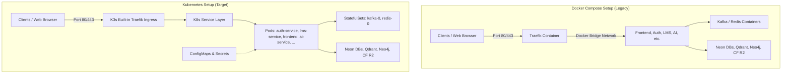

# Docker Compose to Kubernetes (K3s) Migration Guide

This document provides step-by-step instructions to migrate the **BDC Hub CoreApplication** from a **single-VM Docker Compose** environment to a **Kubernetes (K8s)** cluster. 

While the guide uses **K3s** (a lightweight, fully-certified Kubernetes distribution) for local/single-VM deployments, all manifests (Deployments, Services, ConfigMaps, Secrets, and Ingresses) are fully compatible with any standard Kubernetes cluster (e.g., EKS, GKE, AKS, or custom self-hosted K8s).

| Field | Value |
|---|---|
| Version | 1.0.0 |
| Status | Active |
| Date | 2026-07-20 |
| Authors | BDC DevOps Team |
| Target Audience | System Administrators, DevOps Engineers |

---

> [!IMPORTANT]
> **Serverless-Only Mode:**
> Currently, the system is designed and supported to run **exclusively in Serverless mode** (`overlays/serverless/`). In this setup, stateful databases and services (Neon Postgres, Qdrant Cloud, Neo4j Aura, Cloudflare R2) are fully delegated to external managed cloud providers. The cluster-hosted database overlay (`overlays/local-db/`) is **not supported** for production.

---

## 1. Architecture Comparison

Before executing the migration, review the system architecture transition:



### Key Differences:
* **Networking & Routing (Ingress)**: Instead of configuring Traefik via container labels in Docker Compose, Kubernetes uses custom `Ingress` and `Middlewares` (Traefik CRDs) resources to route traffic by path-prefix.
* **Configuration Management**: Sensitive credentials and non-sensitive configurations are cleanly decoupled into K8s `Secrets` (Base64 encoded) and `ConfigMaps`.
* **Resource Optimization**: CPU/Memory Requests and Limits are defined for each service. Specific thread-count constraints are configured (especially for ML services) to prevent kernel-level CPU thrashing on shared VM nodes.

---

## 2. Step-by-Step Migration Steps

### Step 1: Verify Host Server Specifications

Ensure the target server (or current VM) meets the following minimum requirements:
* **Operating System**: Ubuntu 20.04 LTS or newer.
* **CPU / RAM**: Minimum 4 cores / 8 GB RAM (Recommend **16 GB RAM** as the AI embedding service requires ~2–4 GB).
* **Disk Space**: At least 40 GB free space.
* **Network Connectivity**: Outbound HTTPS traffic permitted to external SaaS endpoints: Neon Postgres, Qdrant Cloud, Neo4j Aura, Cloudflare R2, Groq API.

---

### Step 2: Stop and Clean Up Legacy Docker Compose Stack

To prevent port conflicts and release VM resources, stop and remove the active Docker Compose services.

1. SSH into the server:
   ```bash
   ssh <user_name>@<server_ip>
   ```
2. Navigate to the deployment folder and stop the stack:
   ```bash
   cd ~/CoreApplication # Adjust path if different
   docker compose -f docker-compose.serverless.yml down --volumes --remove-orphans
   ```
3. Prune unused images and volumes to free disk space:
   ```bash
   docker image prune -af
   docker volume prune -f
   ```

---

### Step 3: Install K3s (Lightweight Kubernetes)

We use a lightweight K8s engine (K3s) for single-VM environments, which bundles the Traefik Ingress Controller and `kubectl` utility by default.

1. Run the installation script:
   ```bash
   curl -sfL https://get.k3s.io | sh -
   ```
2. Wait ~60 seconds and verify node status:
   ```bash
   sudo k3s kubectl get nodes
   # Expected output:
   # NAME         STATUS   ROLES                  AGE   VERSION
   # <your-node>  Ready    control-plane,master   30s   v1.x.x+k3s1
   ```

---

### Step 4: Configure Non-Root `kubectl` Access

Configure the shell to allow the `bdc_web` user (or your current active user) to run `kubectl` without requiring `sudo`.

1. Copy the configuration file and update permissions:
   ```bash
   mkdir -p ~/.kube
   sudo cp /etc/rancher/k3s/k3s.yaml ~/.kube/config
   sudo chown $USER:$USER ~/.kube/config
   chmod 600 ~/.kube/config
   ```
2. Validate access:
   ```bash
   kubectl get nodes
   # Should list the node as Ready without sudo
   ```

---

### Step 5: Copy K8s manifests to the Server

From your local machine (where the repository is checked out), transfer the K8s manifest files:

```bash
# Sync k8s manifests directory
scp -r /absolute/path/to/bdc/k8s bdc_web@10.1.8.133:/home/bdc_web/k8s

# (Optional) Sync performance-tests to run load tests later
scp -r /absolute/path/to/bdc/BDCHub---Monitoring/performance-tests bdc_web@10.1.8.133:/home/bdc_web/performance-tests
```

> [!NOTE]
> Run `ls ~/k8s/` on the server to verify that the `base/`, `overlays/`, and `monitoring/` directories are present.

---

### Step 6: Migrate Sensitive Configurations (From `.env` to K8s Secrets)

All sensitive variables (passwords, JWT keys, API tokens) must be Base64-encoded and populated in `secrets.yaml`.

> [!WARNING]
> Every key value under `secrets.yaml` must be Base64-encoded. Plain text values will fail to resolve and trigger Pod deployment errors.

1. Encode strings to Base64 using terminal:
   ```bash
   echo -n "your-plain-text-secret" | base64
   # Example output: eW91ci1wbGFpbi10ZXh0LXNlY3JldA==
   ```
2. Edit the secrets file on the server:
   ```bash
   nano ~/k8s/base/secrets.yaml
   ```
3. Replace the default placeholder `VE9ET19DSEFOR0VfTUU=` values with your Base64 encoded secrets.

#### Common Secret Mappings:

| `secrets.yaml` Key | Corresponding `.env` Variable |
|---|---|
| `POSTGRES_PASSWORD` | `POSTGRES_PASSWORD` (Auth Database) |
| `LMS_POSTGRES_PASSWORD` | `LMS_POSTGRES_PASSWORD` (LMS Database) |
| `MINIO_ROOT_PASSWORD` | `MINIO_ROOT_PASSWORD` (Cloudflare R2 Secret Key) |
| `REDIS_PASSWORD` | `REDIS_PASSWORD` |
| `JWT_SECRET` | `JWT_SECRET` |
| `GROQ_API_KEY` | `GROQ_API_KEY` |
| `GOOGLE_CLIENT_ID` | `GOOGLE_CLIENT_ID` |

---

### Step 7: Configure Database & Cloud SaaS Endpoints (Serverless Overlay)

Update the ConfigMap overlays to point the applications to your managed serverless cloud services (Neon, Qdrant, Neo4j, Cloudflare R2):

1. Open the serverless configmap:
   ```bash
   nano ~/k8s/overlays/serverless/configmap-serverless.yaml
   ```
2. Populate the following endpoints:
   * **POSTGRES_HOST / LMS_POSTGRES_HOST**: Retrieve from your Neon Postgres console.
   * **QDRANT_URL**: REST URL endpoint from Qdrant Cloud dashboard.
   * **NEO4J_URI**: Graph DB connection URL (typically `neo4j+s://...`).
   * **R2_ENDPOINT**: Cloudflare R2 S3-compatible API endpoint (typically `<account_id>.r2.cloudflarestorage.com`).

---

### Step 8: Deploy CoreApplication workloads (Serverless Mode)

Deploy the system in `serverless` mode using Kustomize (`kubectl apply -k`):

1. Execute a dry-run check to validate syntax:
   ```bash
   cd ~/k8s
   kubectl apply -k overlays/serverless/ --dry-run=client
   ```
2. Apply the configurations to launch the serverless workload:
   ```bash
   kubectl apply -k overlays/serverless/
   ```
3. Watch the Pod rollout progress:
   ```bash
   kubectl get pods -w
   ```

> [!IMPORTANT]
> **AI Service Startup Latency:**
> Upon first deployment, `ai-service` and `ai-worker` may take 3 to 5 minutes to shift to `Ready`. This is because they download the large embedding model (`BAAI/bge-m3` ~1.2 GB) from HuggingFace to the local cache. The configured `startupProbe` provides a 150-second window to accommodate this initialization delay.

---

### Step 9: Deploy Monitoring Stack

The Kubernetes configuration includes integrated Prometheus and Grafana instances configured to collect metrics from app workloads.

1. Apply the monitoring manifest:
   ```bash
   cd ~/k8s
   kubectl apply -k monitoring/
   ```
2. Verify monitoring deployments:
   ```bash
   kubectl get pods -n default -l app=prometheus
   kubectl get pods -n default -l app=grafana
   ```
3. Open Grafana Dashboard:
   Navigate to `https://bdc.hpcc.vn/monitor` in your browser. Log in with the default credentials: `admin` / `admin` (**Update your password immediately on first login**).

---

### Step 10: Update the CI/CD Pipeline (GitHub Actions)

To enable automatic continuous delivery to Kubernetes, you must modify your GitHub Actions deployment workflow located at `.github/workflows/cd-production.yml`.

Replace the legacy Docker Compose steps with a **Kubectl Rolling Update** flow.

Update the deployment steps as follows:

```yaml
      # Replace "Force stop stack" and "Deploy" steps with:
      - name: Checkout deployment configuration only
        uses: actions/checkout@v4
        with:
          ref: main
          clean: true
          sparse-checkout: |
            k8s

      - name: Synchronize configuration files
        run: |
          mkdir -p /home/bdc_web/k8s
          rsync -av --exclude='secrets.yaml' ./k8s/ /home/bdc_web/k8s/

      - name: Deploy to Kubernetes via Kustomize
        run: |
          cd /home/bdc_web/k8s
          # Apply serverless manifest updates (keeps local secrets.yaml unchanged on host)
          kubectl apply -k overlays/serverless/

      - name: Trigger Rolling Restart to pull new images
        run: |
          echo "🔄 Restarting deployments to apply latest images..."
          kubectl rollout restart deployment/auth-service
          kubectl rollout restart deployment/lms-service
          kubectl rollout restart deployment/lab-service
          kubectl rollout restart deployment/chat-service
          kubectl rollout restart deployment/ai-service
          kubectl rollout restart deployment/personalize-service
          kubectl rollout restart deployment/frontend

      - name: Verify Deployment Rollout Status
        run: |
          echo "⏳ Checking rollout status..."
          kubectl rollout status deployment/auth-service --timeout=120s
          kubectl rollout status deployment/lms-service --timeout=120s
          kubectl rollout status deployment/frontend --timeout=120s
```

---

## 3. Operational Cheatsheet

After migrating, use the following `kubectl` command mapping instead of `docker compose`:

| Action | Legacy Command (Docker Compose) | New Command (Kubernetes) |
|---|---|---|
| List containers/pods | `docker compose ps` | `kubectl get pods` |
| View real-time logs | `docker compose logs -f <service>` | `kubectl logs -f deploy/<deployment-name>` |
| View logs of crashed containers | Not supported natively | `kubectl logs <pod-name> --previous` |
| Restart a service | `docker compose restart <service>` | `kubectl rollout restart deploy/<deployment-name>` |
| Check resource consumption | `docker stats` | `kubectl top pods` |
| Inspect configuration errors | `docker inspect <container>` | `kubectl describe pod <pod-name>` |

---

## 4. Troubleshooting

### Pod Stuck in `Pending`
* **Common Cause**: VM lacks sufficient CPU or Memory resources.
* **Diagnosis**: Run `kubectl describe pod <pod-name>` and look at the `Events` section for an `Insufficient memory` error.
* **Resolution**: Terminate resource-heavy idle programs or upgrade the host VM's specs.

### Pod Stuck in `CrashLoopBackOff`
* **Common Cause**: Database connection failure, unencoded plain-text values in `secrets.yaml`, or incorrect SaaS endpoint hostnames.
* **Diagnosis**: Inspect previous crash logs:
  ```bash
  kubectl logs <pod-name> --previous
  ```

### Ingress / SSL Resolution issues
* If the domain is inaccessible externally, check Ingress resources:
  ```bash
  kubectl get ingress
  ```
* Verify that the Traefik Ingress controller Pods are running correctly:
  ```bash
  kubectl get pods -n kube-system | grep traefik
  ```
