# postgres

## Tables

| Name | Columns | Comment | Type |
| ---- | ------- | ------- | ---- |
| [public.knowledge_nodes](public.knowledge_nodes.md) | 14 |  | BASE TABLE |
| [public.knowledge_node_relations](public.knowledge_node_relations.md) | 8 |  | BASE TABLE |
| [public.document_chunks](public.document_chunks.md) | 15 |  | BASE TABLE |
| [public.ai_diagnoses](public.ai_diagnoses.md) | 16 |  | BASE TABLE |
| [public.content_index_status](public.content_index_status.md) | 7 |  | BASE TABLE |
| [public.student_knowledge_progress](public.student_knowledge_progress.md) | 10 |  | BASE TABLE |
| [public.spaced_repetitions](public.spaced_repetitions.md) | 13 |  | BASE TABLE |
| [public.ai_quiz_generations](public.ai_quiz_generations.md) | 20 |  | BASE TABLE |
| [public.flashcards](public.flashcards.md) | 10 |  | BASE TABLE |
| [public.flashcard_repetitions](public.flashcard_repetitions.md) | 12 |  | BASE TABLE |
| [public.embedding_reindex_jobs](public.embedding_reindex_jobs.md) | 11 |  | BASE TABLE |
| [public.v_reindex_progress](public.v_reindex_progress.md) | 8 |  | VIEW |
| [public.knowledge_graph_view](public.knowledge_graph_view.md) | 10 |  | VIEW |
| [public.agent_sessions](public.agent_sessions.md) | 9 |  | BASE TABLE |
| [public.agent_episodes](public.agent_episodes.md) | 7 |  | BASE TABLE |
| [public.agent_messages](public.agent_messages.md) | 6 |  | BASE TABLE |
| [public.llm_providers](public.llm_providers.md) | 9 |  | BASE TABLE |
| [public.llm_api_keys](public.llm_api_keys.md) | 18 |  | BASE TABLE |
| [public.llm_models](public.llm_models.md) | 18 |  | BASE TABLE |
| [public.task_model_bindings](public.task_model_bindings.md) | 12 |  | BASE TABLE |
| [public.llm_usage_log](public.llm_usage_log.md) | 17 |  | BASE TABLE |

## Stored procedures and functions

| Name | ReturnType | Arguments | Type |
| ---- | ------- | ------- | ---- |
| public.set_limit | float4 | real | FUNCTION |
| public.show_limit | float4 |  | FUNCTION |
| public.show_trgm | _text | text | FUNCTION |
| public.similarity | float4 | text, text | FUNCTION |
| public.similarity_op | bool | text, text | FUNCTION |
| public.word_similarity | float4 | text, text | FUNCTION |
| public.word_similarity_op | bool | text, text | FUNCTION |
| public.word_similarity_commutator_op | bool | text, text | FUNCTION |
| public.similarity_dist | float4 | text, text | FUNCTION |
| public.word_similarity_dist_op | float4 | text, text | FUNCTION |
| public.word_similarity_dist_commutator_op | float4 | text, text | FUNCTION |
| public.gtrgm_in | gtrgm | cstring | FUNCTION |
| public.gtrgm_out | cstring | gtrgm | FUNCTION |
| public.gtrgm_consistent | bool | internal, text, smallint, oid, internal | FUNCTION |
| public.gtrgm_distance | float8 | internal, text, smallint, oid, internal | FUNCTION |
| public.gtrgm_compress | internal | internal | FUNCTION |
| public.gtrgm_decompress | internal | internal | FUNCTION |
| public.gtrgm_penalty | internal | internal, internal, internal | FUNCTION |
| public.gtrgm_picksplit | internal | internal, internal | FUNCTION |
| public.gtrgm_union | gtrgm | internal, internal | FUNCTION |
| public.gtrgm_same | internal | gtrgm, gtrgm, internal | FUNCTION |
| public.gin_extract_value_trgm | internal | text, internal | FUNCTION |
| public.gin_extract_query_trgm | internal | text, internal, smallint, internal, internal, internal, internal | FUNCTION |
| public.gin_trgm_consistent | bool | internal, smallint, text, integer, internal, internal, internal, internal | FUNCTION |
| public.gin_trgm_triconsistent | char | internal, smallint, text, integer, internal, internal, internal | FUNCTION |
| public.strict_word_similarity | float4 | text, text | FUNCTION |
| public.strict_word_similarity_op | bool | text, text | FUNCTION |
| public.strict_word_similarity_commutator_op | bool | text, text | FUNCTION |
| public.strict_word_similarity_dist_op | float4 | text, text | FUNCTION |
| public.strict_word_similarity_dist_commutator_op | float4 | text, text | FUNCTION |
| public.gtrgm_options | void | internal | FUNCTION |
| public.update_updated_at_column | trigger |  | FUNCTION |
| public.trg_llm_touch_updated_at | trigger |  | FUNCTION |

## Relations

```mermaid
erDiagram

"public.knowledge_nodes" }o--o| "public.knowledge_nodes" : "FOREIGN KEY (parent_id) REFERENCES knowledge_nodes(id) ON DELETE SET NULL"
"public.knowledge_node_relations" }o--|| "public.knowledge_nodes" : "FOREIGN KEY (source_node_id) REFERENCES knowledge_nodes(id) ON DELETE CASCADE"
"public.knowledge_node_relations" }o--|| "public.knowledge_nodes" : "FOREIGN KEY (target_node_id) REFERENCES knowledge_nodes(id) ON DELETE CASCADE"
"public.document_chunks" }o--o| "public.knowledge_nodes" : "FOREIGN KEY (node_id) REFERENCES knowledge_nodes(id) ON DELETE SET NULL"
"public.ai_diagnoses" }o--o| "public.knowledge_nodes" : "FOREIGN KEY (node_id) REFERENCES knowledge_nodes(id) ON DELETE SET NULL"
"public.ai_diagnoses" }o--o| "public.document_chunks" : "FOREIGN KEY (source_chunk_id) REFERENCES document_chunks(id) ON DELETE SET NULL"
"public.student_knowledge_progress" }o--|| "public.knowledge_nodes" : "FOREIGN KEY (node_id) REFERENCES knowledge_nodes(id) ON DELETE CASCADE"
"public.spaced_repetitions" }o--o| "public.knowledge_nodes" : "FOREIGN KEY (node_id) REFERENCES knowledge_nodes(id) ON DELETE CASCADE"
"public.ai_quiz_generations" }o--o| "public.knowledge_nodes" : "FOREIGN KEY (node_id) REFERENCES knowledge_nodes(id) ON DELETE CASCADE"
"public.ai_quiz_generations" }o--o| "public.document_chunks" : "FOREIGN KEY (source_chunk_id) REFERENCES document_chunks(id) ON DELETE SET NULL"
"public.flashcards" }o--|| "public.knowledge_nodes" : "FOREIGN KEY (node_id) REFERENCES knowledge_nodes(id) ON DELETE CASCADE"
"public.flashcards" }o--o| "public.ai_diagnoses" : "FOREIGN KEY (source_diagnosis_id) REFERENCES ai_diagnoses(id) ON DELETE SET NULL"
"public.flashcard_repetitions" }o--|| "public.flashcards" : "FOREIGN KEY (flashcard_id) REFERENCES flashcards(id) ON DELETE CASCADE"
"public.agent_episodes" }o--o| "public.agent_sessions" : "FOREIGN KEY (session_id) REFERENCES agent_sessions(id) ON DELETE CASCADE"
"public.agent_messages" }o--|| "public.agent_sessions" : "FOREIGN KEY (session_id) REFERENCES agent_sessions(id) ON DELETE CASCADE"
"public.llm_api_keys" }o--|| "public.llm_providers" : "FOREIGN KEY (provider_id) REFERENCES llm_providers(id) ON DELETE CASCADE"
"public.llm_models" }o--|| "public.llm_providers" : "FOREIGN KEY (provider_id) REFERENCES llm_providers(id) ON DELETE CASCADE"
"public.task_model_bindings" }o--|| "public.llm_models" : "FOREIGN KEY (model_id) REFERENCES llm_models(id) ON DELETE CASCADE"
"public.llm_usage_log" }o--o| "public.llm_api_keys" : "FOREIGN KEY (api_key_id) REFERENCES llm_api_keys(id) ON DELETE SET NULL"
"public.llm_usage_log" }o--o| "public.llm_models" : "FOREIGN KEY (model_id) REFERENCES llm_models(id) ON DELETE SET NULL"

"public.knowledge_nodes" {
  bigint id
  bigint course_id
  bigint parent_id FK
  varchar_255_ name
  varchar_255_ name_vi
  varchar_255_ name_en
  text description
  integer level
  integer order_index
  bigint source_content_id
  text source_content_title
  boolean auto_generated
  timestamp_without_time_zone created_at
  timestamp_without_time_zone updated_at
}
"public.knowledge_node_relations" {
  bigint id
  bigint course_id
  bigint source_node_id FK
  bigint target_node_id FK
  varchar_30_ relation_type
  double_precision strength
  boolean auto_generated
  timestamp_without_time_zone created_at
}
"public.document_chunks" {
  bigint id
  bigint node_id FK
  bigint content_id
  bigint course_id
  text chunk_text
  integer chunk_index
  varchar_64_ chunk_hash
  varchar_64_ embedding_model
  varchar_20_ source_type
  integer page_number
  integer start_time_sec
  integer end_time_sec
  varchar_10_ language
  varchar_20_ status
  timestamp_without_time_zone created_at
}
"public.ai_diagnoses" {
  bigint id
  bigint student_id
  bigint attempt_id
  bigint question_id
  bigint node_id FK
  text wrong_answer
  text correct_answer
  text explanation
  varchar_50_ gap_type
  text knowledge_gap
  text study_suggestion
  jsonb suggested_docs_json
  double_precision confidence
  bigint source_chunk_id FK
  varchar_10_ language
  timestamp_without_time_zone created_at
}
"public.content_index_status" {
  bigint content_id
  bigint course_id
  text title
  varchar_20_ status
  text error
  timestamp_with_time_zone created_at
  timestamp_with_time_zone updated_at
}
"public.student_knowledge_progress" {
  bigint id
  bigint student_id
  bigint node_id FK
  bigint course_id
  integer total_attempts
  integer correct_count
  integer wrong_count
  double_precision mastery_level
  timestamp_without_time_zone last_tested_at
  timestamp_without_time_zone updated_at
}
"public.spaced_repetitions" {
  bigint id
  bigint student_id
  bigint question_id
  bigint node_id FK
  bigint course_id
  double_precision easiness_factor
  integer interval_days
  integer repetitions
  integer quality_last
  date next_review_date
  timestamp_without_time_zone last_reviewed_at
  timestamp_without_time_zone created_at
  timestamp_without_time_zone updated_at
}
"public.ai_quiz_generations" {
  bigint id
  bigint node_id FK
  bigint course_id
  bigint created_by
  varchar_20_ bloom_level
  text question_text
  varchar_50_ question_type
  jsonb answer_options
  text correct_answer
  text explanation
  text source_quote
  bigint source_chunk_id FK
  varchar_10_ language
  varchar_20_ status
  text review_note
  bigint reviewed_by
  timestamp_without_time_zone reviewed_at
  bigint quiz_question_id
  timestamp_without_time_zone created_at
  timestamp_without_time_zone updated_at
}
"public.flashcards" {
  bigint id
  bigint course_id
  bigint node_id FK
  bigint student_id
  text front_text
  text back_text
  bigint source_diagnosis_id FK
  varchar_20_ status
  timestamp_without_time_zone created_at
  timestamp_without_time_zone updated_at
}
"public.flashcard_repetitions" {
  bigint id
  bigint student_id
  bigint flashcard_id FK
  bigint course_id
  double_precision easiness_factor
  integer interval_days
  integer repetitions
  integer quality_last
  date next_review_date
  timestamp_without_time_zone last_reviewed_at
  timestamp_without_time_zone created_at
  timestamp_without_time_zone updated_at
}
"public.embedding_reindex_jobs" {
  bigint id
  bigint course_id
  bigint content_id
  varchar_20_ status
  integer chunks_total
  integer chunks_done
  text error_message
  timestamp_without_time_zone started_at
  timestamp_without_time_zone completed_at
  timestamp_without_time_zone created_at
  timestamp_without_time_zone updated_at
}
"public.v_reindex_progress" {
  bigint total_jobs
  bigint done
  bigint pending
  bigint processing
  bigint failed
  numeric pct_done
  bigint total_chunks
  bigint reindexed_chunks
}
"public.knowledge_graph_view" {
  bigint node_id
  bigint course_id
  varchar_255_ name
  varchar_255_ name_vi
  integer level
  boolean auto_generated
  bigint source_content_id
  bigint chunk_count
  bigint out_edges
  bigint in_edges
}
"public.agent_sessions" {
  uuid id
  bigint user_id
  varchar_20_ agent_type
  bigint course_id
  jsonb compressed_ctx
  integer turn_count
  timestamp_with_time_zone last_active_at
  timestamp_with_time_zone created_at
  varchar_200_ title
}
"public.agent_episodes" {
  uuid id
  uuid session_id FK
  bigint user_id
  varchar_20_ agent_type
  text summary
  bigint qdrant_point_id
  timestamp_with_time_zone created_at
}
"public.agent_messages" {
  bigint id
  uuid session_id FK
  varchar_20_ role
  text content
  jsonb metadata
  timestamp_with_time_zone created_at
}
"public.llm_providers" {
  bigint id
  varchar_40_ code
  varchar_120_ display_name
  varchar_40_ adapter_type
  varchar_255_ base_url
  boolean enabled
  jsonb config
  timestamp_with_time_zone created_at
  timestamp_with_time_zone updated_at
}
"public.llm_api_keys" {
  bigint id
  bigint provider_id FK
  varchar_80_ alias
  text encrypted_key
  varchar_32_ key_fingerprint
  varchar_20_ status
  integer rpm_limit
  integer tpm_limit
  bigint daily_token_limit
  bigint used_today_requests
  bigint used_today_tokens
  timestamp_with_time_zone used_window_start
  timestamp_with_time_zone cooldown_until
  integer consecutive_failures
  text last_error
  timestamp_with_time_zone last_used_at
  timestamp_with_time_zone created_at
  timestamp_with_time_zone updated_at
}
"public.llm_models" {
  bigint id
  bigint provider_id FK
  varchar_120_ model_name
  varchar_160_ display_name
  varchar_40_ family
  integer context_window
  boolean supports_json
  boolean supports_tools
  boolean supports_streaming
  boolean supports_vision
  numeric_10_6_ input_cost_per_1k
  numeric_10_6_ output_cost_per_1k
  numeric_4_3_ default_temperature
  integer default_max_tokens
  boolean enabled
  jsonb config
  timestamp_with_time_zone created_at
  timestamp_with_time_zone updated_at
}
"public.task_model_bindings" {
  bigint id
  varchar_80_ task_code
  bigint model_id FK
  integer priority
  numeric_4_3_ temperature
  integer max_tokens
  boolean json_mode
  boolean pinned
  boolean enabled
  text notes
  timestamp_with_time_zone created_at
  timestamp_with_time_zone updated_at
}
"public.llm_usage_log" {
  bigint id
  varchar_80_ task_code
  bigint model_id FK
  bigint api_key_id FK
  varchar_40_ provider_code
  varchar_120_ model_name
  integer prompt_tokens
  integer completion_tokens
  integer total_tokens
  integer latency_ms
  boolean success
  boolean fallback_used
  integer attempt_no
  varchar_60_ error_code
  text error_message
  varchar_120_ request_id
  timestamp_with_time_zone created_at
}
```

---

> Generated by [tbls](https://github.com/k1LoW/tbls)
