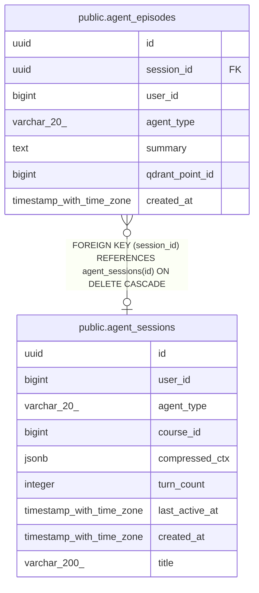

# public.agent_episodes

## Columns

| Name | Type | Default | Nullable | Children | Parents | Comment |
| ---- | ---- | ------- | -------- | -------- | ------- | ------- |
| id | uuid | gen_random_uuid() | false |  |  |  |
| session_id | uuid |  | true |  | [public.agent_sessions](public.agent_sessions.md) |  |
| user_id | bigint |  | false |  |  |  |
| agent_type | varchar(20) |  | false |  |  |  |
| summary | text |  | false |  |  |  |
| qdrant_point_id | bigint |  | true |  |  |  |
| created_at | timestamp with time zone | now() | true |  |  |  |

## Constraints

| Name | Type | Definition |
| ---- | ---- | ---------- |
| agent_episodes_agent_type_check | CHECK | CHECK (((agent_type)::text = ANY ((ARRAY['teacher'::character varying, 'mentor'::character varying])::text[]))) |
| agent_episodes_agent_type_not_null | n | NOT NULL agent_type |
| agent_episodes_id_not_null | n | NOT NULL id |
| agent_episodes_summary_not_null | n | NOT NULL summary |
| agent_episodes_user_id_not_null | n | NOT NULL user_id |
| agent_episodes_session_id_fkey | FOREIGN KEY | FOREIGN KEY (session_id) REFERENCES agent_sessions(id) ON DELETE CASCADE |
| agent_episodes_pkey | PRIMARY KEY | PRIMARY KEY (id) |

## Indexes

| Name | Definition |
| ---- | ---------- |
| agent_episodes_pkey | CREATE UNIQUE INDEX agent_episodes_pkey ON public.agent_episodes USING btree (id) |
| idx_ae_user | CREATE INDEX idx_ae_user ON public.agent_episodes USING btree (user_id, agent_type) |
| idx_ae_session | CREATE INDEX idx_ae_session ON public.agent_episodes USING btree (session_id) |

## Relations

---

> Generated by [tbls](https://github.com/k1LoW/tbls)
