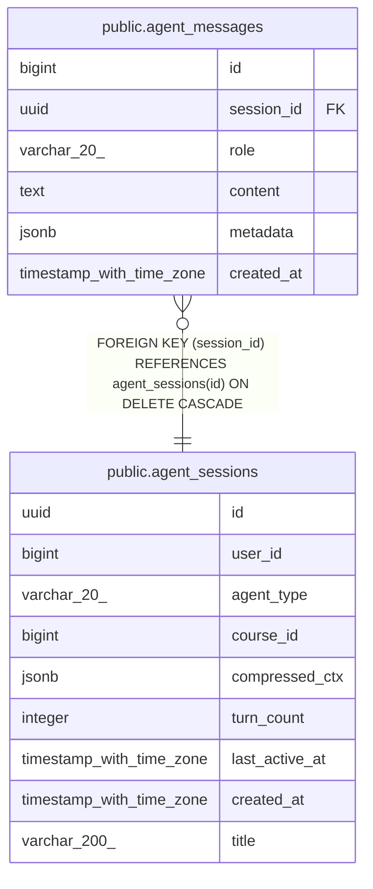

# public.agent_messages

## Columns

| Name | Type | Default | Nullable | Children | Parents | Comment |
| ---- | ---- | ------- | -------- | -------- | ------- | ------- |
| id | bigint | nextval('agent_messages_id_seq'::regclass) | false |  |  |  |
| session_id | uuid |  | false |  | [public.agent_sessions](public.agent_sessions.md) |  |
| role | varchar(20) |  | false |  |  |  |
| content | text | ''::text | false |  |  |  |
| metadata | jsonb | '{}'::jsonb | true |  |  |  |
| created_at | timestamp with time zone | now() | true |  |  |  |

## Constraints

| Name | Type | Definition |
| ---- | ---- | ---------- |
| agent_messages_content_not_null | n | NOT NULL content |
| agent_messages_id_not_null | n | NOT NULL id |
| agent_messages_role_check | CHECK | CHECK (((role)::text = ANY ((ARRAY['user'::character varying, 'assistant'::character varying, 'system'::character varying, 'tool'::character varying])::text[]))) |
| agent_messages_role_not_null | n | NOT NULL role |
| agent_messages_session_id_not_null | n | NOT NULL session_id |
| agent_messages_session_id_fkey | FOREIGN KEY | FOREIGN KEY (session_id) REFERENCES agent_sessions(id) ON DELETE CASCADE |
| agent_messages_pkey | PRIMARY KEY | PRIMARY KEY (id) |

## Indexes

| Name | Definition |
| ---- | ---------- |
| agent_messages_pkey | CREATE UNIQUE INDEX agent_messages_pkey ON public.agent_messages USING btree (id) |
| idx_am_session | CREATE INDEX idx_am_session ON public.agent_messages USING btree (session_id, created_at) |

## Relations

---

> Generated by [tbls](https://github.com/k1LoW/tbls)
