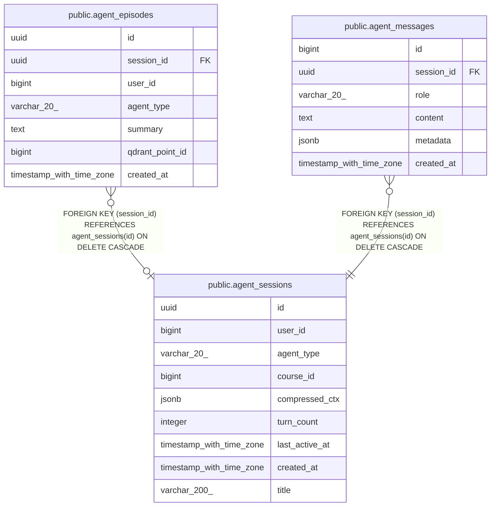

# public.agent_sessions

## Columns

| Name | Type | Default | Nullable | Children | Parents | Comment |
| ---- | ---- | ------- | -------- | -------- | ------- | ------- |
| id | uuid | gen_random_uuid() | false | [public.agent_episodes](public.agent_episodes.md) [public.agent_messages](public.agent_messages.md) |  |  |
| user_id | bigint |  | false |  |  |  |
| agent_type | varchar(20) |  | false |  |  |  |
| course_id | bigint |  | true |  |  |  |
| compressed_ctx | jsonb | '{}'::jsonb | false |  |  |  |
| turn_count | integer | 0 | true |  |  |  |
| last_active_at | timestamp with time zone | now() | true |  |  |  |
| created_at | timestamp with time zone | now() | true |  |  |  |
| title | varchar(200) |  | true |  |  |  |

## Constraints

| Name | Type | Definition |
| ---- | ---- | ---------- |
| agent_sessions_agent_type_check | CHECK | CHECK (((agent_type)::text = ANY ((ARRAY['teacher'::character varying, 'mentor'::character varying])::text[]))) |
| agent_sessions_agent_type_not_null | n | NOT NULL agent_type |
| agent_sessions_compressed_ctx_not_null | n | NOT NULL compressed_ctx |
| agent_sessions_id_not_null | n | NOT NULL id |
| agent_sessions_user_id_not_null | n | NOT NULL user_id |
| agent_sessions_pkey | PRIMARY KEY | PRIMARY KEY (id) |

## Indexes

| Name | Definition |
| ---- | ---------- |
| agent_sessions_pkey | CREATE UNIQUE INDEX agent_sessions_pkey ON public.agent_sessions USING btree (id) |
| idx_as_user | CREATE INDEX idx_as_user ON public.agent_sessions USING btree (user_id, agent_type) |
| idx_as_active | CREATE INDEX idx_as_active ON public.agent_sessions USING btree (last_active_at) |
| idx_as_course | CREATE INDEX idx_as_course ON public.agent_sessions USING btree (course_id) WHERE (course_id IS NOT NULL) |

## Relations

---

> Generated by [tbls](https://github.com/k1LoW/tbls)
