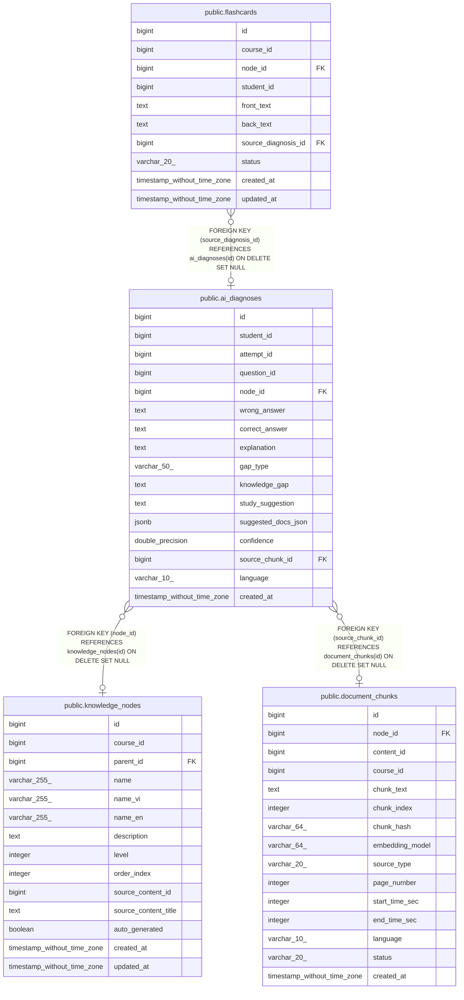

# public.ai_diagnoses

## Columns

| Name | Type | Default | Nullable | Children | Parents | Comment |
| ---- | ---- | ------- | -------- | -------- | ------- | ------- |
| id | bigint | nextval('ai_diagnoses_id_seq'::regclass) | false | [public.flashcards](public.flashcards.md) |  |  |
| student_id | bigint |  | false |  |  |  |
| attempt_id | bigint |  | true |  |  |  |
| question_id | bigint |  | true |  |  |  |
| node_id | bigint |  | true |  | [public.knowledge_nodes](public.knowledge_nodes.md) |  |
| wrong_answer | text |  | true |  |  |  |
| correct_answer | text |  | true |  |  |  |
| explanation | text |  | false |  |  |  |
| gap_type | varchar(50) |  | true |  |  |  |
| knowledge_gap | text |  | true |  |  |  |
| study_suggestion | text |  | true |  |  |  |
| suggested_docs_json | jsonb |  | true |  |  |  |
| confidence | double precision | 0.8 | true |  |  |  |
| source_chunk_id | bigint |  | true |  | [public.document_chunks](public.document_chunks.md) |  |
| language | varchar(10) | 'vi'::character varying | true |  |  |  |
| created_at | timestamp without time zone | CURRENT_TIMESTAMP | true |  |  |  |

## Constraints

| Name | Type | Definition |
| ---- | ---- | ---------- |
| ai_diagnoses_explanation_not_null | n | NOT NULL explanation |
| ai_diagnoses_id_not_null | n | NOT NULL id |
| ai_diagnoses_student_id_not_null | n | NOT NULL student_id |
| ai_diagnoses_node_id_fkey | FOREIGN KEY | FOREIGN KEY (node_id) REFERENCES knowledge_nodes(id) ON DELETE SET NULL |
| ai_diagnoses_source_chunk_id_fkey | FOREIGN KEY | FOREIGN KEY (source_chunk_id) REFERENCES document_chunks(id) ON DELETE SET NULL |
| ai_diagnoses_pkey | PRIMARY KEY | PRIMARY KEY (id) |

## Indexes

| Name | Definition |
| ---- | ---------- |
| ai_diagnoses_pkey | CREATE UNIQUE INDEX ai_diagnoses_pkey ON public.ai_diagnoses USING btree (id) |
| idx_ad_student | CREATE INDEX idx_ad_student ON public.ai_diagnoses USING btree (student_id) |
| idx_ad_question | CREATE INDEX idx_ad_question ON public.ai_diagnoses USING btree (question_id) |
| idx_ad_node | CREATE INDEX idx_ad_node ON public.ai_diagnoses USING btree (node_id) |
| idx_ad_cache_lookup | CREATE INDEX idx_ad_cache_lookup ON public.ai_diagnoses USING btree (question_id, md5(wrong_answer)) WHERE (question_id IS NOT NULL) |
| idx_ad_student_node | CREATE INDEX idx_ad_student_node ON public.ai_diagnoses USING btree (student_id, node_id, created_at DESC) WHERE (node_id IS NOT NULL) |

## Relations

---

> Generated by [tbls](https://github.com/k1LoW/tbls)
