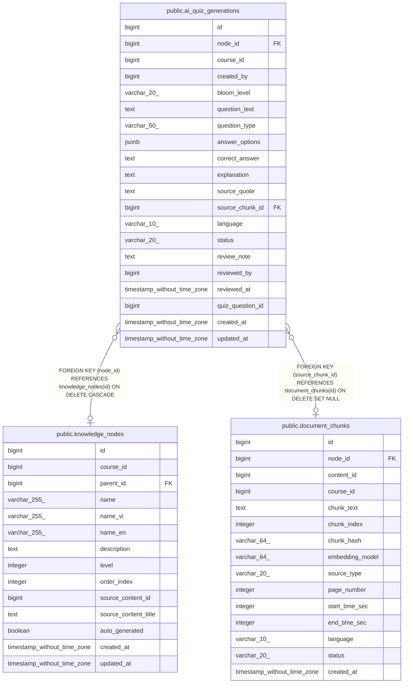

# public.ai_quiz_generations

## Columns

| Name | Type | Default | Nullable | Children | Parents | Comment |
| ---- | ---- | ------- | -------- | -------- | ------- | ------- |
| id | bigint | nextval('ai_quiz_generations_id_seq'::regclass) | false |  |  |  |
| node_id | bigint |  | true |  | [public.knowledge_nodes](public.knowledge_nodes.md) |  |
| course_id | bigint |  | false |  |  |  |
| created_by | bigint |  | false |  |  |  |
| bloom_level | varchar(20) |  | true |  |  |  |
| question_text | text |  | false |  |  |  |
| question_type | varchar(50) |  | false |  |  |  |
| answer_options | jsonb |  | true |  |  |  |
| correct_answer | text |  | true |  |  |  |
| explanation | text |  | true |  |  |  |
| source_quote | text |  | true |  |  |  |
| source_chunk_id | bigint |  | true |  | [public.document_chunks](public.document_chunks.md) |  |
| language | varchar(10) | 'vi'::character varying | true |  |  |  |
| status | varchar(20) | 'DRAFT'::character varying | true |  |  |  |
| review_note | text |  | true |  |  |  |
| reviewed_by | bigint |  | true |  |  |  |
| reviewed_at | timestamp without time zone |  | true |  |  |  |
| quiz_question_id | bigint |  | true |  |  |  |
| created_at | timestamp without time zone | CURRENT_TIMESTAMP | true |  |  |  |
| updated_at | timestamp without time zone | CURRENT_TIMESTAMP | true |  |  |  |

## Constraints

| Name | Type | Definition |
| ---- | ---- | ---------- |
| ai_quiz_generations_bloom_level_check | CHECK | CHECK (((bloom_level)::text = ANY ((ARRAY['remember'::character varying, 'understand'::character varying, 'apply'::character varying, 'analyze'::character varying, 'evaluate'::character varying, 'create'::character varying])::text[]))) |
| ai_quiz_generations_course_id_not_null | n | NOT NULL course_id |
| ai_quiz_generations_created_by_not_null | n | NOT NULL created_by |
| ai_quiz_generations_id_not_null | n | NOT NULL id |
| ai_quiz_generations_question_text_not_null | n | NOT NULL question_text |
| ai_quiz_generations_question_type_not_null | n | NOT NULL question_type |
| ai_quiz_generations_status_check | CHECK | CHECK (((status)::text = ANY ((ARRAY['DRAFT'::character varying, 'APPROVED'::character varying, 'REJECTED'::character varying, 'PUBLISHED'::character varying])::text[]))) |
| ai_quiz_generations_node_id_fkey | FOREIGN KEY | FOREIGN KEY (node_id) REFERENCES knowledge_nodes(id) ON DELETE CASCADE |
| ai_quiz_generations_source_chunk_id_fkey | FOREIGN KEY | FOREIGN KEY (source_chunk_id) REFERENCES document_chunks(id) ON DELETE SET NULL |
| ai_quiz_generations_pkey | PRIMARY KEY | PRIMARY KEY (id) |

## Indexes

| Name | Definition |
| ---- | ---------- |
| ai_quiz_generations_pkey | CREATE UNIQUE INDEX ai_quiz_generations_pkey ON public.ai_quiz_generations USING btree (id) |
| idx_aiqg_node | CREATE INDEX idx_aiqg_node ON public.ai_quiz_generations USING btree (node_id) |
| idx_aiqg_status | CREATE INDEX idx_aiqg_status ON public.ai_quiz_generations USING btree (status) |
| idx_aiqg_course | CREATE INDEX idx_aiqg_course ON public.ai_quiz_generations USING btree (course_id) |
| idx_aiqg_course_status_node | CREATE INDEX idx_aiqg_course_status_node ON public.ai_quiz_generations USING btree (course_id, status, node_id) |

## Triggers

| Name | Definition |
| ---- | ---------- |
| tr_aiqg_updated | CREATE TRIGGER tr_aiqg_updated BEFORE UPDATE ON public.ai_quiz_generations FOR EACH ROW EXECUTE FUNCTION update_updated_at_column() |

## Relations

---

> Generated by [tbls](https://github.com/k1LoW/tbls)
