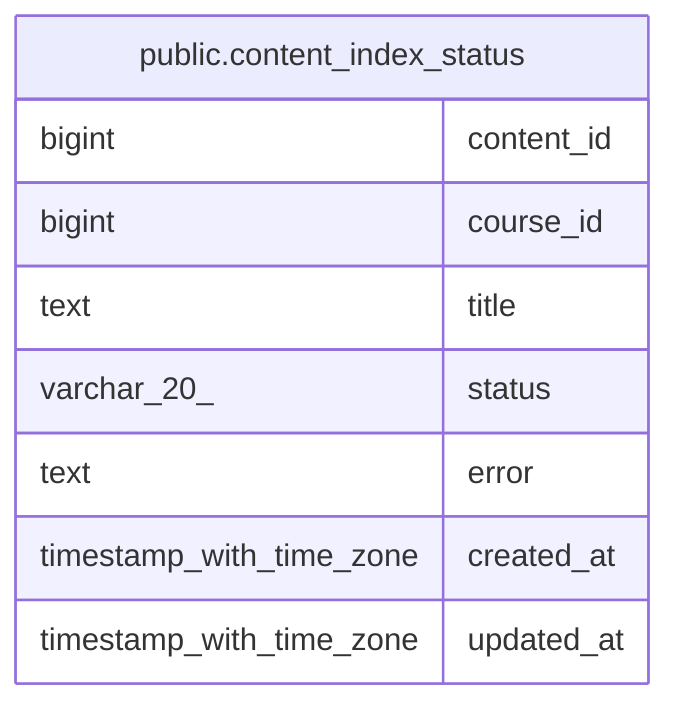

# public.content_index_status

## Columns

| Name | Type | Default | Nullable | Children | Parents | Comment |
| ---- | ---- | ------- | -------- | -------- | ------- | ------- |
| content_id | bigint |  | false |  |  |  |
| course_id | bigint |  | false |  |  |  |
| title | text | ''::text | true |  |  |  |
| status | varchar(20) | 'pending'::character varying | false |  |  |  |
| error | text |  | true |  |  |  |
| created_at | timestamp with time zone | now() | true |  |  |  |
| updated_at | timestamp with time zone | now() | true |  |  |  |

## Constraints

| Name | Type | Definition |
| ---- | ---- | ---------- |
| content_index_status_content_id_not_null | n | NOT NULL content_id |
| content_index_status_course_id_not_null | n | NOT NULL course_id |
| content_index_status_status_not_null | n | NOT NULL status |
| content_index_status_pkey | PRIMARY KEY | PRIMARY KEY (content_id) |

## Indexes

| Name | Definition |
| ---- | ---------- |
| content_index_status_pkey | CREATE UNIQUE INDEX content_index_status_pkey ON public.content_index_status USING btree (content_id) |
| idx_cis_course | CREATE INDEX idx_cis_course ON public.content_index_status USING btree (course_id) |
| idx_cis_status | CREATE INDEX idx_cis_status ON public.content_index_status USING btree (status) |
| idx_cis_course_status | CREATE INDEX idx_cis_course_status ON public.content_index_status USING btree (course_id, status) |

## Relations

---

> Generated by [tbls](https://github.com/k1LoW/tbls)
