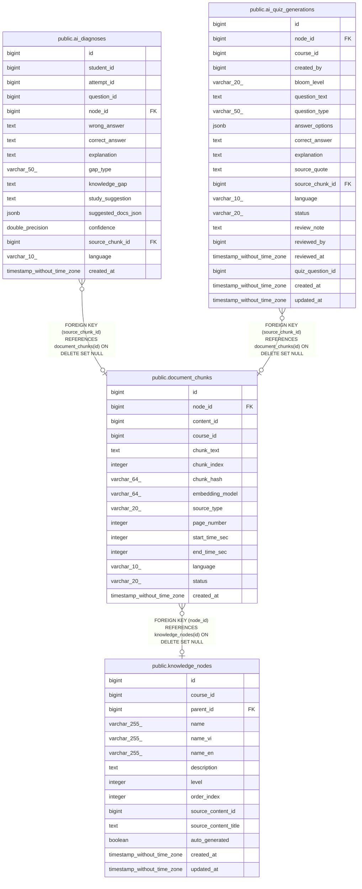

# public.document_chunks

## Columns

| Name | Type | Default | Nullable | Children | Parents | Comment |
| ---- | ---- | ------- | -------- | -------- | ------- | ------- |
| id | bigint | nextval('document_chunks_id_seq'::regclass) | false | [public.ai_diagnoses](public.ai_diagnoses.md) [public.ai_quiz_generations](public.ai_quiz_generations.md) |  |  |
| node_id | bigint |  | true |  | [public.knowledge_nodes](public.knowledge_nodes.md) |  |
| content_id | bigint |  | true |  |  |  |
| course_id | bigint |  | false |  |  |  |
| chunk_text | text |  | false |  |  |  |
| chunk_index | integer |  | false |  |  |  |
| chunk_hash | varchar(64) |  | true |  |  |  |
| embedding_model | varchar(64) | 'bge-m3'::character varying | true |  |  |  |
| source_type | varchar(20) | 'document'::character varying | true |  |  |  |
| page_number | integer |  | true |  |  |  |
| start_time_sec | integer |  | true |  |  |  |
| end_time_sec | integer |  | true |  |  |  |
| language | varchar(10) | 'vi'::character varying | true |  |  |  |
| status | varchar(20) | 'ready'::character varying | true |  |  |  |
| created_at | timestamp without time zone | CURRENT_TIMESTAMP | true |  |  |  |

## Constraints

| Name | Type | Definition |
| ---- | ---- | ---------- |
| document_chunks_chunk_index_not_null | n | NOT NULL chunk_index |
| document_chunks_chunk_text_not_null | n | NOT NULL chunk_text |
| document_chunks_course_id_not_null | n | NOT NULL course_id |
| document_chunks_id_not_null | n | NOT NULL id |
| document_chunks_source_type_check | CHECK | CHECK (((source_type)::text = ANY ((ARRAY['document'::character varying, 'video'::character varying])::text[]))) |
| document_chunks_status_check | CHECK | CHECK (((status)::text = ANY ((ARRAY['pending'::character varying, 'processing'::character varying, 'ready'::character varying, 'error'::character varying])::text[]))) |
| document_chunks_node_id_fkey | FOREIGN KEY | FOREIGN KEY (node_id) REFERENCES knowledge_nodes(id) ON DELETE SET NULL |
| document_chunks_pkey | PRIMARY KEY | PRIMARY KEY (id) |
| document_chunks_chunk_hash_key | UNIQUE | UNIQUE (chunk_hash) |

## Indexes

| Name | Definition |
| ---- | ---------- |
| document_chunks_pkey | CREATE UNIQUE INDEX document_chunks_pkey ON public.document_chunks USING btree (id) |
| document_chunks_chunk_hash_key | CREATE UNIQUE INDEX document_chunks_chunk_hash_key ON public.document_chunks USING btree (chunk_hash) |
| idx_dc_content | CREATE INDEX idx_dc_content ON public.document_chunks USING btree (content_id) |
| idx_dc_node | CREATE INDEX idx_dc_node ON public.document_chunks USING btree (node_id) |
| idx_dc_course | CREATE INDEX idx_dc_course ON public.document_chunks USING btree (course_id) |
| idx_dc_status | CREATE INDEX idx_dc_status ON public.document_chunks USING btree (status) |
| idx_dc_hash | CREATE INDEX idx_dc_hash ON public.document_chunks USING btree (chunk_hash) |
| idx_dc_content_status | CREATE INDEX idx_dc_content_status ON public.document_chunks USING btree (content_id, status) |
| idx_dc_node_status | CREATE INDEX idx_dc_node_status ON public.document_chunks USING btree (node_id, status) WHERE (node_id IS NOT NULL) |

## Relations

---

> Generated by [tbls](https://github.com/k1LoW/tbls)
