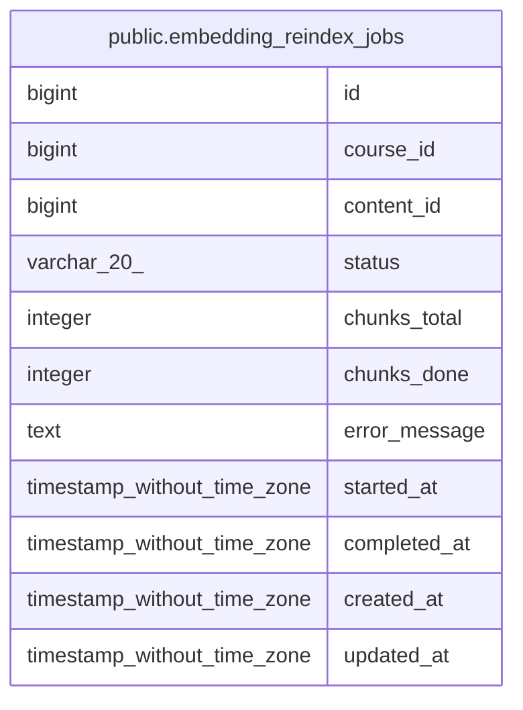

# public.embedding_reindex_jobs

## Columns

| Name | Type | Default | Nullable | Children | Parents | Comment |
| ---- | ---- | ------- | -------- | -------- | ------- | ------- |
| id | bigint | nextval('embedding_reindex_jobs_id_seq'::regclass) | false |  |  |  |
| course_id | bigint |  | true |  |  |  |
| content_id | bigint |  | true |  |  |  |
| status | varchar(20) | 'pending'::character varying | true |  |  |  |
| chunks_total | integer | 0 | true |  |  |  |
| chunks_done | integer | 0 | true |  |  |  |
| error_message | text |  | true |  |  |  |
| started_at | timestamp without time zone |  | true |  |  |  |
| completed_at | timestamp without time zone |  | true |  |  |  |
| created_at | timestamp without time zone | CURRENT_TIMESTAMP | true |  |  |  |
| updated_at | timestamp without time zone | CURRENT_TIMESTAMP | true |  |  |  |

## Constraints

| Name | Type | Definition |
| ---- | ---- | ---------- |
| embedding_reindex_jobs_id_not_null | n | NOT NULL id |
| embedding_reindex_jobs_status_check | CHECK | CHECK (((status)::text = ANY ((ARRAY['pending'::character varying, 'processing'::character varying, 'done'::character varying, 'failed'::character varying])::text[]))) |
| embedding_reindex_jobs_pkey | PRIMARY KEY | PRIMARY KEY (id) |

## Indexes

| Name | Definition |
| ---- | ---------- |
| embedding_reindex_jobs_pkey | CREATE UNIQUE INDEX embedding_reindex_jobs_pkey ON public.embedding_reindex_jobs USING btree (id) |
| idx_erj_status | CREATE INDEX idx_erj_status ON public.embedding_reindex_jobs USING btree (status) |
| idx_erj_course | CREATE INDEX idx_erj_course ON public.embedding_reindex_jobs USING btree (course_id) |
| idx_erj_content | CREATE INDEX idx_erj_content ON public.embedding_reindex_jobs USING btree (content_id) |

## Triggers

| Name | Definition |
| ---- | ---------- |
| tr_erj_updated | CREATE TRIGGER tr_erj_updated BEFORE UPDATE ON public.embedding_reindex_jobs FOR EACH ROW EXECUTE FUNCTION update_updated_at_column() |

## Relations

---

> Generated by [tbls](https://github.com/k1LoW/tbls)
