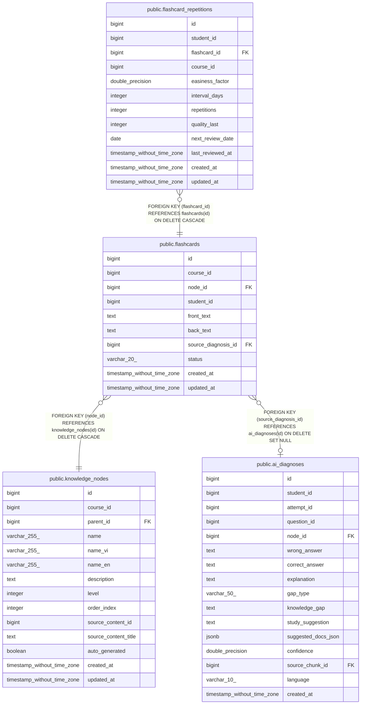

# public.flashcards

## Columns

| Name | Type | Default | Nullable | Children | Parents | Comment |
| ---- | ---- | ------- | -------- | -------- | ------- | ------- |
| id | bigint | nextval('flashcards_id_seq'::regclass) | false | [public.flashcard_repetitions](public.flashcard_repetitions.md) |  |  |
| course_id | bigint |  | false |  |  |  |
| node_id | bigint |  | false |  | [public.knowledge_nodes](public.knowledge_nodes.md) |  |
| student_id | bigint |  | false |  |  |  |
| front_text | text |  | false |  |  |  |
| back_text | text |  | false |  |  |  |
| source_diagnosis_id | bigint |  | true |  | [public.ai_diagnoses](public.ai_diagnoses.md) |  |
| status | varchar(20) | 'ACTIVE'::character varying | true |  |  |  |
| created_at | timestamp without time zone | CURRENT_TIMESTAMP | true |  |  |  |
| updated_at | timestamp without time zone | CURRENT_TIMESTAMP | true |  |  |  |

## Constraints

| Name | Type | Definition |
| ---- | ---- | ---------- |
| flashcards_back_text_not_null | n | NOT NULL back_text |
| flashcards_course_id_not_null | n | NOT NULL course_id |
| flashcards_front_text_not_null | n | NOT NULL front_text |
| flashcards_id_not_null | n | NOT NULL id |
| flashcards_node_id_not_null | n | NOT NULL node_id |
| flashcards_status_check | CHECK | CHECK (((status)::text = ANY ((ARRAY['ACTIVE'::character varying, 'INACTIVE'::character varying, 'ARCHIVED'::character varying])::text[]))) |
| flashcards_student_id_not_null | n | NOT NULL student_id |
| flashcards_node_id_fkey | FOREIGN KEY | FOREIGN KEY (node_id) REFERENCES knowledge_nodes(id) ON DELETE CASCADE |
| flashcards_source_diagnosis_id_fkey | FOREIGN KEY | FOREIGN KEY (source_diagnosis_id) REFERENCES ai_diagnoses(id) ON DELETE SET NULL |
| flashcards_pkey | PRIMARY KEY | PRIMARY KEY (id) |

## Indexes

| Name | Definition |
| ---- | ---------- |
| flashcards_pkey | CREATE UNIQUE INDEX flashcards_pkey ON public.flashcards USING btree (id) |
| idx_fc_student_node | CREATE INDEX idx_fc_student_node ON public.flashcards USING btree (student_id, node_id) |
| idx_fc_course | CREATE INDEX idx_fc_course ON public.flashcards USING btree (course_id) |
| idx_fc_student_course_node | CREATE INDEX idx_fc_student_course_node ON public.flashcards USING btree (student_id, course_id, node_id) WHERE ((status)::text = 'ACTIVE'::text) |

## Triggers

| Name | Definition |
| ---- | ---------- |
| tr_fc_updated | CREATE TRIGGER tr_fc_updated BEFORE UPDATE ON public.flashcards FOR EACH ROW EXECUTE FUNCTION update_updated_at_column() |

## Relations

---

> Generated by [tbls](https://github.com/k1LoW/tbls)
