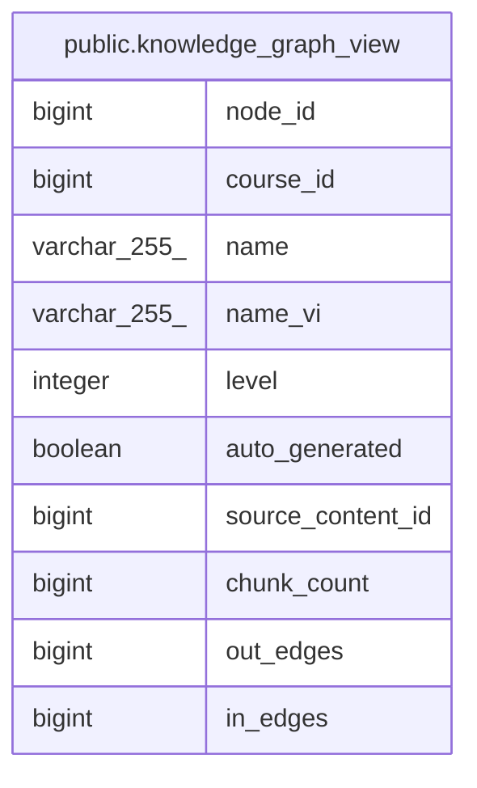

# public.knowledge_graph_view

## Description

<details>
<summary><strong>Table Definition</strong></summary>

```sql
CREATE VIEW knowledge_graph_view AS (
 SELECT kn.id AS node_id,
    kn.course_id,
    kn.name,
    kn.name_vi,
    kn.level,
    kn.auto_generated,
    kn.source_content_id,
    count(DISTINCT dc.id) AS chunk_count,
    count(DISTINCT knr_out.id) AS out_edges,
    count(DISTINCT knr_in.id) AS in_edges
   FROM (((knowledge_nodes kn
     LEFT JOIN document_chunks dc ON ((dc.node_id = kn.id)))
     LEFT JOIN knowledge_node_relations knr_out ON ((knr_out.source_node_id = kn.id)))
     LEFT JOIN knowledge_node_relations knr_in ON ((knr_in.target_node_id = kn.id)))
  GROUP BY kn.id, kn.course_id, kn.name, kn.name_vi, kn.level, kn.auto_generated, kn.source_content_id
)
```

</details>

## Columns

| Name | Type | Default | Nullable | Children | Parents | Comment |
| ---- | ---- | ------- | -------- | -------- | ------- | ------- |
| node_id | bigint |  | true |  |  |  |
| course_id | bigint |  | true |  |  |  |
| name | varchar(255) |  | true |  |  |  |
| name_vi | varchar(255) |  | true |  |  |  |
| level | integer |  | true |  |  |  |
| auto_generated | boolean |  | true |  |  |  |
| source_content_id | bigint |  | true |  |  |  |
| chunk_count | bigint |  | true |  |  |  |
| out_edges | bigint |  | true |  |  |  |
| in_edges | bigint |  | true |  |  |  |

## Referenced Tables

| Name | Columns | Comment | Type |
| ---- | ------- | ------- | ---- |
| [public.knowledge_nodes](public.knowledge_nodes.md) | 14 |  | BASE TABLE |
| [public.document_chunks](public.document_chunks.md) | 15 |  | BASE TABLE |
| [public.knowledge_node_relations](public.knowledge_node_relations.md) | 8 |  | BASE TABLE |

## Relations



---

> Generated by [tbls](https://github.com/k1LoW/tbls)
