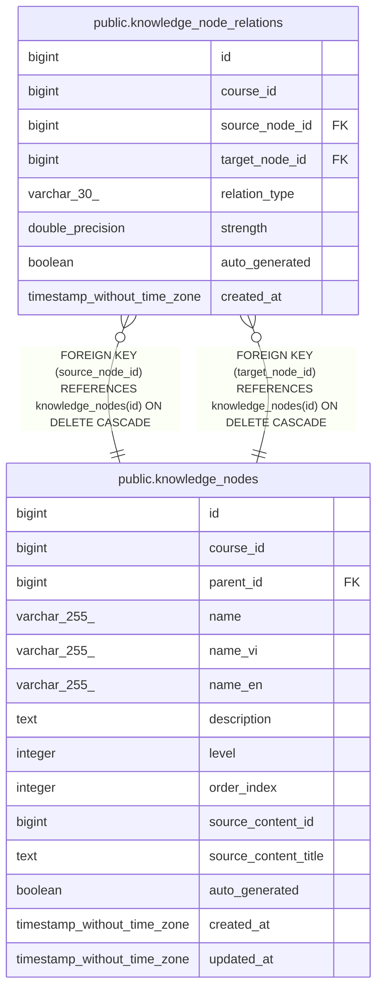

# public.knowledge_node_relations

## Columns

| Name | Type | Default | Nullable | Children | Parents | Comment |
| ---- | ---- | ------- | -------- | -------- | ------- | ------- |
| id | bigint | nextval('knowledge_node_relations_id_seq'::regclass) | false |  |  |  |
| course_id | bigint |  | false |  |  |  |
| source_node_id | bigint |  | false |  | [public.knowledge_nodes](public.knowledge_nodes.md) |  |
| target_node_id | bigint |  | false |  | [public.knowledge_nodes](public.knowledge_nodes.md) |  |
| relation_type | varchar(30) | 'related'::character varying | true |  |  |  |
| strength | double precision | 1.0 | true |  |  |  |
| auto_generated | boolean | true | true |  |  |  |
| created_at | timestamp without time zone | CURRENT_TIMESTAMP | true |  |  |  |

## Constraints

| Name | Type | Definition |
| ---- | ---- | ---------- |
| knowledge_node_relations_course_id_not_null | n | NOT NULL course_id |
| knowledge_node_relations_id_not_null | n | NOT NULL id |
| knowledge_node_relations_relation_type_check | CHECK | CHECK (((relation_type)::text = ANY ((ARRAY['prerequisite'::character varying, 'related'::character varying, 'extends'::character varying])::text[]))) |
| knowledge_node_relations_source_node_id_not_null | n | NOT NULL source_node_id |
| knowledge_node_relations_strength_check | CHECK | CHECK (((strength >= (0.0)::double precision) AND (strength <= (1.0)::double precision))) |
| knowledge_node_relations_target_node_id_not_null | n | NOT NULL target_node_id |
| knowledge_node_relations_source_node_id_fkey | FOREIGN KEY | FOREIGN KEY (source_node_id) REFERENCES knowledge_nodes(id) ON DELETE CASCADE |
| knowledge_node_relations_target_node_id_fkey | FOREIGN KEY | FOREIGN KEY (target_node_id) REFERENCES knowledge_nodes(id) ON DELETE CASCADE |
| knowledge_node_relations_pkey | PRIMARY KEY | PRIMARY KEY (id) |
| knowledge_node_relations_source_node_id_target_node_id_rela_key | UNIQUE | UNIQUE (source_node_id, target_node_id, relation_type) |

## Indexes

| Name | Definition |
| ---- | ---------- |
| knowledge_node_relations_pkey | CREATE UNIQUE INDEX knowledge_node_relations_pkey ON public.knowledge_node_relations USING btree (id) |
| knowledge_node_relations_source_node_id_target_node_id_rela_key | CREATE UNIQUE INDEX knowledge_node_relations_source_node_id_target_node_id_rela_key ON public.knowledge_node_relations USING btree (source_node_id, target_node_id, relation_type) |
| idx_knr_source | CREATE INDEX idx_knr_source ON public.knowledge_node_relations USING btree (source_node_id) |
| idx_knr_target | CREATE INDEX idx_knr_target ON public.knowledge_node_relations USING btree (target_node_id) |
| idx_knr_course | CREATE INDEX idx_knr_course ON public.knowledge_node_relations USING btree (course_id) |

## Relations

---

> Generated by [tbls](https://github.com/k1LoW/tbls)
