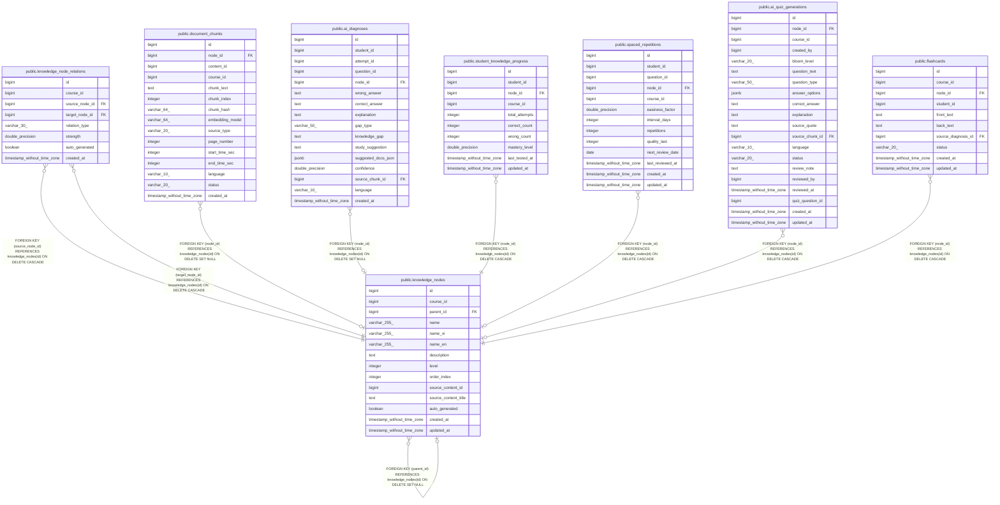

# public.knowledge_nodes

## Columns

| Name | Type | Default | Nullable | Children | Parents | Comment |
| ---- | ---- | ------- | -------- | -------- | ------- | ------- |
| id | bigint | nextval('knowledge_nodes_id_seq'::regclass) | false | [public.knowledge_nodes](public.knowledge_nodes.md) [public.knowledge_node_relations](public.knowledge_node_relations.md) [public.document_chunks](public.document_chunks.md) [public.ai_diagnoses](public.ai_diagnoses.md) [public.student_knowledge_progress](public.student_knowledge_progress.md) [public.spaced_repetitions](public.spaced_repetitions.md) [public.ai_quiz_generations](public.ai_quiz_generations.md) [public.flashcards](public.flashcards.md) |  |  |
| course_id | bigint |  | false |  |  |  |
| parent_id | bigint |  | true |  | [public.knowledge_nodes](public.knowledge_nodes.md) |  |
| name | varchar(255) |  | false |  |  |  |
| name_vi | varchar(255) |  | true |  |  |  |
| name_en | varchar(255) |  | true |  |  |  |
| description | text |  | true |  |  |  |
| level | integer | 0 | true |  |  |  |
| order_index | integer | 0 | true |  |  |  |
| source_content_id | bigint |  | true |  |  |  |
| source_content_title | text | ''::text | true |  |  |  |
| auto_generated | boolean | false | true |  |  |  |
| created_at | timestamp without time zone | CURRENT_TIMESTAMP | true |  |  |  |
| updated_at | timestamp without time zone | CURRENT_TIMESTAMP | true |  |  |  |

## Constraints

| Name | Type | Definition |
| ---- | ---- | ---------- |
| knowledge_nodes_course_id_not_null | n | NOT NULL course_id |
| knowledge_nodes_id_not_null | n | NOT NULL id |
| knowledge_nodes_name_not_null | n | NOT NULL name |
| knowledge_nodes_parent_id_fkey | FOREIGN KEY | FOREIGN KEY (parent_id) REFERENCES knowledge_nodes(id) ON DELETE SET NULL |
| knowledge_nodes_pkey | PRIMARY KEY | PRIMARY KEY (id) |

## Indexes

| Name | Definition |
| ---- | ---------- |
| knowledge_nodes_pkey | CREATE UNIQUE INDEX knowledge_nodes_pkey ON public.knowledge_nodes USING btree (id) |
| idx_kn_course | CREATE INDEX idx_kn_course ON public.knowledge_nodes USING btree (course_id) |
| idx_kn_parent | CREATE INDEX idx_kn_parent ON public.knowledge_nodes USING btree (parent_id) |
| idx_kn_level | CREATE INDEX idx_kn_level ON public.knowledge_nodes USING btree (course_id, level) |
| idx_kn_source | CREATE INDEX idx_kn_source ON public.knowledge_nodes USING btree (source_content_id) WHERE (source_content_id IS NOT NULL) |
| idx_kn_source_content | CREATE INDEX idx_kn_source_content ON public.knowledge_nodes USING btree (source_content_id, source_content_title) WHERE (source_content_id IS NOT NULL) |

## Triggers

| Name | Definition |
| ---- | ---------- |
| tr_kn_updated | CREATE TRIGGER tr_kn_updated BEFORE UPDATE ON public.knowledge_nodes FOR EACH ROW EXECUTE FUNCTION update_updated_at_column() |

## Relations

---

> Generated by [tbls](https://github.com/k1LoW/tbls)
