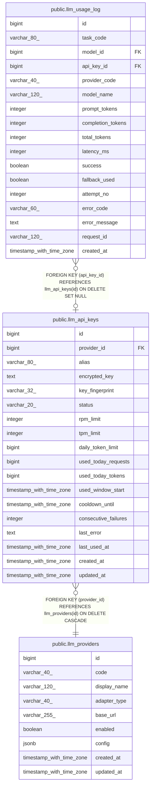

# public.llm_api_keys

## Columns

| Name | Type | Default | Nullable | Children | Parents | Comment |
| ---- | ---- | ------- | -------- | -------- | ------- | ------- |
| id | bigint | nextval('llm_api_keys_id_seq'::regclass) | false | [public.llm_usage_log](public.llm_usage_log.md) |  |  |
| provider_id | bigint |  | false |  | [public.llm_providers](public.llm_providers.md) |  |
| alias | varchar(80) |  | false |  |  |  |
| encrypted_key | text |  | false |  |  |  |
| key_fingerprint | varchar(32) |  | false |  |  |  |
| status | varchar(20) | 'active'::character varying | false |  |  |  |
| rpm_limit | integer |  | true |  |  |  |
| tpm_limit | integer |  | true |  |  |  |
| daily_token_limit | bigint |  | true |  |  |  |
| used_today_requests | bigint | 0 | false |  |  |  |
| used_today_tokens | bigint | 0 | false |  |  |  |
| used_window_start | timestamp with time zone | now() | false |  |  |  |
| cooldown_until | timestamp with time zone |  | true |  |  |  |
| consecutive_failures | integer | 0 | false |  |  |  |
| last_error | text |  | true |  |  |  |
| last_used_at | timestamp with time zone |  | true |  |  |  |
| created_at | timestamp with time zone | now() | false |  |  |  |
| updated_at | timestamp with time zone | now() | false |  |  |  |

## Constraints

| Name | Type | Definition |
| ---- | ---- | ---------- |
| llm_api_keys_alias_not_null | n | NOT NULL alias |
| llm_api_keys_consecutive_failures_not_null | n | NOT NULL consecutive_failures |
| llm_api_keys_created_at_not_null | n | NOT NULL created_at |
| llm_api_keys_encrypted_key_not_null | n | NOT NULL encrypted_key |
| llm_api_keys_id_not_null | n | NOT NULL id |
| llm_api_keys_key_fingerprint_not_null | n | NOT NULL key_fingerprint |
| llm_api_keys_provider_id_not_null | n | NOT NULL provider_id |
| llm_api_keys_status_check | CHECK | CHECK (((status)::text = ANY ((ARRAY['active'::character varying, 'cooldown'::character varying, 'disabled'::character varying, 'invalid'::character varying])::text[]))) |
| llm_api_keys_status_not_null | n | NOT NULL status |
| llm_api_keys_updated_at_not_null | n | NOT NULL updated_at |
| llm_api_keys_used_today_requests_not_null | n | NOT NULL used_today_requests |
| llm_api_keys_used_today_tokens_not_null | n | NOT NULL used_today_tokens |
| llm_api_keys_used_window_start_not_null | n | NOT NULL used_window_start |
| llm_api_keys_provider_id_fkey | FOREIGN KEY | FOREIGN KEY (provider_id) REFERENCES llm_providers(id) ON DELETE CASCADE |
| llm_api_keys_pkey | PRIMARY KEY | PRIMARY KEY (id) |
| llm_api_keys_provider_id_alias_key | UNIQUE | UNIQUE (provider_id, alias) |

## Indexes

| Name | Definition |
| ---- | ---------- |
| llm_api_keys_pkey | CREATE UNIQUE INDEX llm_api_keys_pkey ON public.llm_api_keys USING btree (id) |
| llm_api_keys_provider_id_alias_key | CREATE UNIQUE INDEX llm_api_keys_provider_id_alias_key ON public.llm_api_keys USING btree (provider_id, alias) |
| idx_llm_api_keys_pool | CREATE INDEX idx_llm_api_keys_pool ON public.llm_api_keys USING btree (provider_id, status, cooldown_until) |

## Triggers

| Name | Definition |
| ---- | ---------- |
| trg_llm_api_keys_updated | CREATE TRIGGER trg_llm_api_keys_updated BEFORE UPDATE ON public.llm_api_keys FOR EACH ROW EXECUTE FUNCTION trg_llm_touch_updated_at() |

## Relations

---

> Generated by [tbls](https://github.com/k1LoW/tbls)
