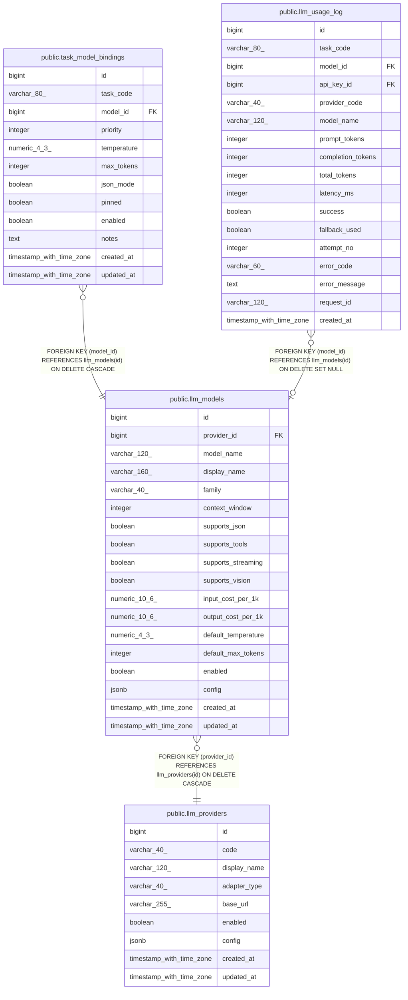

# public.llm_models

## Columns

| Name | Type | Default | Nullable | Children | Parents | Comment |
| ---- | ---- | ------- | -------- | -------- | ------- | ------- |
| id | bigint | nextval('llm_models_id_seq'::regclass) | false | [public.task_model_bindings](public.task_model_bindings.md) [public.llm_usage_log](public.llm_usage_log.md) |  |  |
| provider_id | bigint |  | false |  | [public.llm_providers](public.llm_providers.md) |  |
| model_name | varchar(120) |  | false |  |  |  |
| display_name | varchar(160) |  | true |  |  |  |
| family | varchar(40) |  | true |  |  |  |
| context_window | integer | 8192 | false |  |  |  |
| supports_json | boolean | true | false |  |  |  |
| supports_tools | boolean | false | false |  |  |  |
| supports_streaming | boolean | true | false |  |  |  |
| supports_vision | boolean | false | false |  |  |  |
| input_cost_per_1k | numeric(10,6) | 0 | false |  |  |  |
| output_cost_per_1k | numeric(10,6) | 0 | false |  |  |  |
| default_temperature | numeric(4,3) | 0.3 | false |  |  |  |
| default_max_tokens | integer | 1024 | false |  |  |  |
| enabled | boolean | true | false |  |  |  |
| config | jsonb | '{}'::jsonb | false |  |  |  |
| created_at | timestamp with time zone | now() | false |  |  |  |
| updated_at | timestamp with time zone | now() | false |  |  |  |

## Constraints

| Name | Type | Definition |
| ---- | ---- | ---------- |
| llm_models_config_not_null | n | NOT NULL config |
| llm_models_context_window_not_null | n | NOT NULL context_window |
| llm_models_created_at_not_null | n | NOT NULL created_at |
| llm_models_default_max_tokens_not_null | n | NOT NULL default_max_tokens |
| llm_models_default_temperature_not_null | n | NOT NULL default_temperature |
| llm_models_enabled_not_null | n | NOT NULL enabled |
| llm_models_id_not_null | n | NOT NULL id |
| llm_models_input_cost_per_1k_not_null | n | NOT NULL input_cost_per_1k |
| llm_models_model_name_not_null | n | NOT NULL model_name |
| llm_models_output_cost_per_1k_not_null | n | NOT NULL output_cost_per_1k |
| llm_models_provider_id_not_null | n | NOT NULL provider_id |
| llm_models_supports_json_not_null | n | NOT NULL supports_json |
| llm_models_supports_streaming_not_null | n | NOT NULL supports_streaming |
| llm_models_supports_tools_not_null | n | NOT NULL supports_tools |
| llm_models_supports_vision_not_null | n | NOT NULL supports_vision |
| llm_models_updated_at_not_null | n | NOT NULL updated_at |
| llm_models_provider_id_fkey | FOREIGN KEY | FOREIGN KEY (provider_id) REFERENCES llm_providers(id) ON DELETE CASCADE |
| llm_models_pkey | PRIMARY KEY | PRIMARY KEY (id) |
| llm_models_provider_id_model_name_key | UNIQUE | UNIQUE (provider_id, model_name) |

## Indexes

| Name | Definition |
| ---- | ---------- |
| llm_models_pkey | CREATE UNIQUE INDEX llm_models_pkey ON public.llm_models USING btree (id) |
| llm_models_provider_id_model_name_key | CREATE UNIQUE INDEX llm_models_provider_id_model_name_key ON public.llm_models USING btree (provider_id, model_name) |
| idx_llm_models_provider | CREATE INDEX idx_llm_models_provider ON public.llm_models USING btree (provider_id, enabled) |

## Triggers

| Name | Definition |
| ---- | ---------- |
| trg_llm_models_updated | CREATE TRIGGER trg_llm_models_updated BEFORE UPDATE ON public.llm_models FOR EACH ROW EXECUTE FUNCTION trg_llm_touch_updated_at() |

## Relations

---

> Generated by [tbls](https://github.com/k1LoW/tbls)
