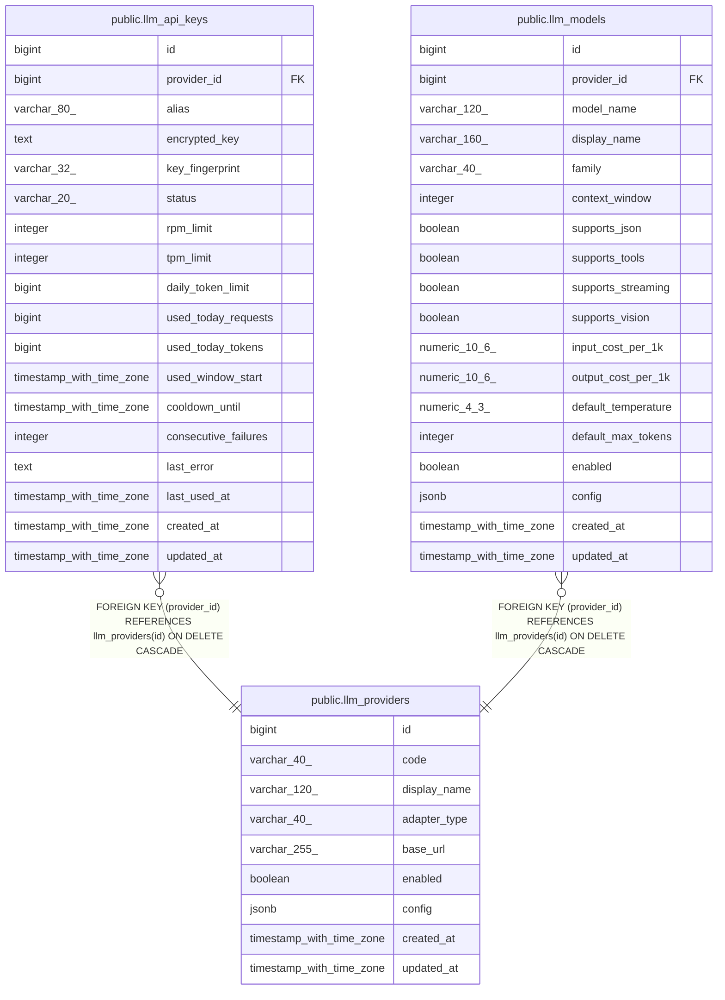

# public.llm_providers

## Columns

| Name | Type | Default | Nullable | Children | Parents | Comment |
| ---- | ---- | ------- | -------- | -------- | ------- | ------- |
| id | bigint | nextval('llm_providers_id_seq'::regclass) | false | [public.llm_api_keys](public.llm_api_keys.md) [public.llm_models](public.llm_models.md) |  |  |
| code | varchar(40) |  | false |  |  |  |
| display_name | varchar(120) |  | false |  |  |  |
| adapter_type | varchar(40) |  | false |  |  |  |
| base_url | varchar(255) |  | true |  |  |  |
| enabled | boolean | true | false |  |  |  |
| config | jsonb | '{}'::jsonb | false |  |  |  |
| created_at | timestamp with time zone | now() | false |  |  |  |
| updated_at | timestamp with time zone | now() | false |  |  |  |

## Constraints

| Name | Type | Definition |
| ---- | ---- | ---------- |
| llm_providers_adapter_type_not_null | n | NOT NULL adapter_type |
| llm_providers_code_not_null | n | NOT NULL code |
| llm_providers_config_not_null | n | NOT NULL config |
| llm_providers_created_at_not_null | n | NOT NULL created_at |
| llm_providers_display_name_not_null | n | NOT NULL display_name |
| llm_providers_enabled_not_null | n | NOT NULL enabled |
| llm_providers_id_not_null | n | NOT NULL id |
| llm_providers_updated_at_not_null | n | NOT NULL updated_at |
| llm_providers_pkey | PRIMARY KEY | PRIMARY KEY (id) |
| llm_providers_code_key | UNIQUE | UNIQUE (code) |

## Indexes

| Name | Definition |
| ---- | ---------- |
| llm_providers_pkey | CREATE UNIQUE INDEX llm_providers_pkey ON public.llm_providers USING btree (id) |
| llm_providers_code_key | CREATE UNIQUE INDEX llm_providers_code_key ON public.llm_providers USING btree (code) |

## Triggers

| Name | Definition |
| ---- | ---------- |
| trg_llm_providers_updated | CREATE TRIGGER trg_llm_providers_updated BEFORE UPDATE ON public.llm_providers FOR EACH ROW EXECUTE FUNCTION trg_llm_touch_updated_at() |

## Relations

---

> Generated by [tbls](https://github.com/k1LoW/tbls)
