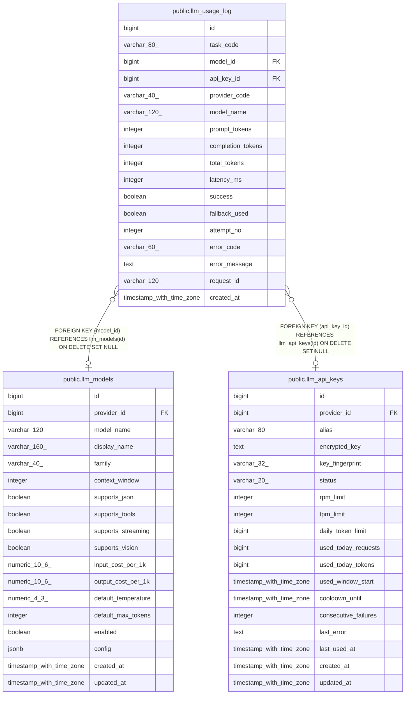

# public.llm_usage_log

## Columns

| Name | Type | Default | Nullable | Children | Parents | Comment |
| ---- | ---- | ------- | -------- | -------- | ------- | ------- |
| id | bigint | nextval('llm_usage_log_id_seq'::regclass) | false |  |  |  |
| task_code | varchar(80) |  | false |  |  |  |
| model_id | bigint |  | true |  | [public.llm_models](public.llm_models.md) |  |
| api_key_id | bigint |  | true |  | [public.llm_api_keys](public.llm_api_keys.md) |  |
| provider_code | varchar(40) |  | true |  |  |  |
| model_name | varchar(120) |  | true |  |  |  |
| prompt_tokens | integer | 0 | false |  |  |  |
| completion_tokens | integer | 0 | false |  |  |  |
| total_tokens | integer | 0 | false |  |  |  |
| latency_ms | integer | 0 | false |  |  |  |
| success | boolean |  | false |  |  |  |
| fallback_used | boolean | false | false |  |  |  |
| attempt_no | integer | 1 | false |  |  |  |
| error_code | varchar(60) |  | true |  |  |  |
| error_message | text |  | true |  |  |  |
| request_id | varchar(120) |  | true |  |  |  |
| created_at | timestamp with time zone | now() | false |  |  |  |

## Constraints

| Name | Type | Definition |
| ---- | ---- | ---------- |
| llm_usage_log_attempt_no_not_null | n | NOT NULL attempt_no |
| llm_usage_log_completion_tokens_not_null | n | NOT NULL completion_tokens |
| llm_usage_log_created_at_not_null | n | NOT NULL created_at |
| llm_usage_log_fallback_used_not_null | n | NOT NULL fallback_used |
| llm_usage_log_id_not_null | n | NOT NULL id |
| llm_usage_log_latency_ms_not_null | n | NOT NULL latency_ms |
| llm_usage_log_prompt_tokens_not_null | n | NOT NULL prompt_tokens |
| llm_usage_log_success_not_null | n | NOT NULL success |
| llm_usage_log_task_code_not_null | n | NOT NULL task_code |
| llm_usage_log_total_tokens_not_null | n | NOT NULL total_tokens |
| llm_usage_log_api_key_id_fkey | FOREIGN KEY | FOREIGN KEY (api_key_id) REFERENCES llm_api_keys(id) ON DELETE SET NULL |
| llm_usage_log_model_id_fkey | FOREIGN KEY | FOREIGN KEY (model_id) REFERENCES llm_models(id) ON DELETE SET NULL |
| llm_usage_log_pkey | PRIMARY KEY | PRIMARY KEY (id) |

## Indexes

| Name | Definition |
| ---- | ---------- |
| llm_usage_log_pkey | CREATE UNIQUE INDEX llm_usage_log_pkey ON public.llm_usage_log USING btree (id) |
| idx_usage_log_created | CREATE INDEX idx_usage_log_created ON public.llm_usage_log USING btree (created_at DESC) |
| idx_usage_log_task | CREATE INDEX idx_usage_log_task ON public.llm_usage_log USING btree (task_code, created_at DESC) |
| idx_usage_log_model | CREATE INDEX idx_usage_log_model ON public.llm_usage_log USING btree (model_id, created_at DESC) |
| idx_usage_log_key | CREATE INDEX idx_usage_log_key ON public.llm_usage_log USING btree (api_key_id, created_at DESC) |

## Relations

---

> Generated by [tbls](https://github.com/k1LoW/tbls)
