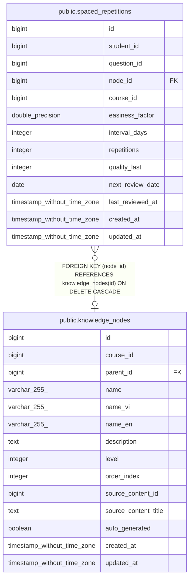

# public.spaced_repetitions

## Columns

| Name | Type | Default | Nullable | Children | Parents | Comment |
| ---- | ---- | ------- | -------- | -------- | ------- | ------- |
| id | bigint | nextval('spaced_repetitions_id_seq'::regclass) | false |  |  |  |
| student_id | bigint |  | false |  |  |  |
| question_id | bigint |  | true |  |  |  |
| node_id | bigint |  | true |  | [public.knowledge_nodes](public.knowledge_nodes.md) |  |
| course_id | bigint |  | false |  |  |  |
| easiness_factor | double precision | 2.5 | true |  |  |  |
| interval_days | integer | 1 | true |  |  |  |
| repetitions | integer | 0 | true |  |  |  |
| quality_last | integer | 0 | true |  |  |  |
| next_review_date | date | CURRENT_DATE | false |  |  |  |
| last_reviewed_at | timestamp without time zone |  | true |  |  |  |
| created_at | timestamp without time zone | CURRENT_TIMESTAMP | true |  |  |  |
| updated_at | timestamp without time zone | CURRENT_TIMESTAMP | true |  |  |  |

## Constraints

| Name | Type | Definition |
| ---- | ---- | ---------- |
| spaced_repetitions_course_id_not_null | n | NOT NULL course_id |
| spaced_repetitions_id_not_null | n | NOT NULL id |
| spaced_repetitions_next_review_date_not_null | n | NOT NULL next_review_date |
| spaced_repetitions_student_id_not_null | n | NOT NULL student_id |
| spaced_repetitions_node_id_fkey | FOREIGN KEY | FOREIGN KEY (node_id) REFERENCES knowledge_nodes(id) ON DELETE CASCADE |
| spaced_repetitions_pkey | PRIMARY KEY | PRIMARY KEY (id) |
| spaced_repetitions_student_id_question_id_key | UNIQUE | UNIQUE (student_id, question_id) |

## Indexes

| Name | Definition |
| ---- | ---------- |
| spaced_repetitions_pkey | CREATE UNIQUE INDEX spaced_repetitions_pkey ON public.spaced_repetitions USING btree (id) |
| spaced_repetitions_student_id_question_id_key | CREATE UNIQUE INDEX spaced_repetitions_student_id_question_id_key ON public.spaced_repetitions USING btree (student_id, question_id) |
| idx_sr_due | CREATE INDEX idx_sr_due ON public.spaced_repetitions USING btree (student_id, next_review_date) |
| idx_sr_course | CREATE INDEX idx_sr_course ON public.spaced_repetitions USING btree (student_id, course_id) |
| idx_sr_student_due_today | CREATE INDEX idx_sr_student_due_today ON public.spaced_repetitions USING btree (student_id, course_id, next_review_date) INCLUDE (question_id, easiness_factor, interval_days, repetitions) WHERE (next_review_date <= '2026-01-01'::date) |
| idx_sr_course_date | CREATE INDEX idx_sr_course_date ON public.spaced_repetitions USING btree (student_id, course_id, next_review_date) |

## Triggers

| Name | Definition |
| ---- | ---------- |
| tr_sr_updated | CREATE TRIGGER tr_sr_updated BEFORE UPDATE ON public.spaced_repetitions FOR EACH ROW EXECUTE FUNCTION update_updated_at_column() |

## Relations

---

> Generated by [tbls](https://github.com/k1LoW/tbls)
