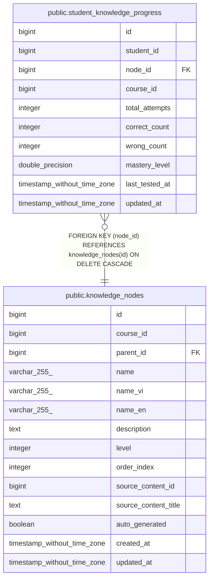

# public.student_knowledge_progress

## Columns

| Name | Type | Default | Nullable | Children | Parents | Comment |
| ---- | ---- | ------- | -------- | -------- | ------- | ------- |
| id | bigint | nextval('student_knowledge_progress_id_seq'::regclass) | false |  |  |  |
| student_id | bigint |  | false |  |  |  |
| node_id | bigint |  | false |  | [public.knowledge_nodes](public.knowledge_nodes.md) |  |
| course_id | bigint |  | false |  |  |  |
| total_attempts | integer | 0 | true |  |  |  |
| correct_count | integer | 0 | true |  |  |  |
| wrong_count | integer | 0 | true |  |  |  |
| mastery_level | double precision | 0.0 | true |  |  |  |
| last_tested_at | timestamp without time zone |  | true |  |  |  |
| updated_at | timestamp without time zone | CURRENT_TIMESTAMP | true |  |  |  |

## Constraints

| Name | Type | Definition |
| ---- | ---- | ---------- |
| student_knowledge_progress_course_id_not_null | n | NOT NULL course_id |
| student_knowledge_progress_id_not_null | n | NOT NULL id |
| student_knowledge_progress_node_id_not_null | n | NOT NULL node_id |
| student_knowledge_progress_student_id_not_null | n | NOT NULL student_id |
| student_knowledge_progress_node_id_fkey | FOREIGN KEY | FOREIGN KEY (node_id) REFERENCES knowledge_nodes(id) ON DELETE CASCADE |
| student_knowledge_progress_pkey | PRIMARY KEY | PRIMARY KEY (id) |
| student_knowledge_progress_student_id_node_id_key | UNIQUE | UNIQUE (student_id, node_id) |

## Indexes

| Name | Definition |
| ---- | ---------- |
| student_knowledge_progress_pkey | CREATE UNIQUE INDEX student_knowledge_progress_pkey ON public.student_knowledge_progress USING btree (id) |
| student_knowledge_progress_student_id_node_id_key | CREATE UNIQUE INDEX student_knowledge_progress_student_id_node_id_key ON public.student_knowledge_progress USING btree (student_id, node_id) |
| idx_skp_student_course | CREATE INDEX idx_skp_student_course ON public.student_knowledge_progress USING btree (student_id, course_id) |
| idx_skp_node | CREATE INDEX idx_skp_node ON public.student_knowledge_progress USING btree (node_id) |
| idx_skp_mastery | CREATE INDEX idx_skp_mastery ON public.student_knowledge_progress USING btree (mastery_level) |
| idx_skp_node_course | CREATE INDEX idx_skp_node_course ON public.student_knowledge_progress USING btree (node_id, course_id) |

## Triggers

| Name | Definition |
| ---- | ---------- |
| tr_skp_updated | CREATE TRIGGER tr_skp_updated BEFORE UPDATE ON public.student_knowledge_progress FOR EACH ROW EXECUTE FUNCTION update_updated_at_column() |

## Relations

---

> Generated by [tbls](https://github.com/k1LoW/tbls)
