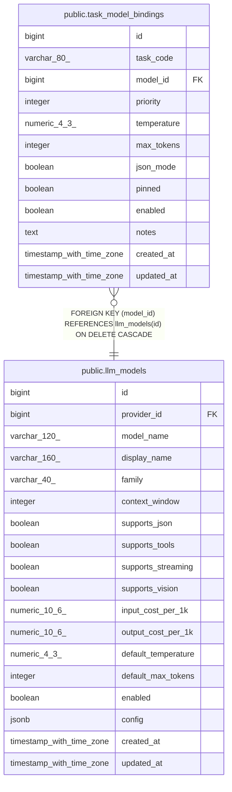

# public.task_model_bindings

## Columns

| Name | Type | Default | Nullable | Children | Parents | Comment |
| ---- | ---- | ------- | -------- | -------- | ------- | ------- |
| id | bigint | nextval('task_model_bindings_id_seq'::regclass) | false |  |  |  |
| task_code | varchar(80) |  | false |  |  |  |
| model_id | bigint |  | false |  | [public.llm_models](public.llm_models.md) |  |
| priority | integer | 100 | false |  |  |  |
| temperature | numeric(4,3) |  | true |  |  |  |
| max_tokens | integer |  | true |  |  |  |
| json_mode | boolean | false | false |  |  |  |
| pinned | boolean | false | false |  |  |  |
| enabled | boolean | true | false |  |  |  |
| notes | text |  | true |  |  |  |
| created_at | timestamp with time zone | now() | false |  |  |  |
| updated_at | timestamp with time zone | now() | false |  |  |  |

## Constraints

| Name | Type | Definition |
| ---- | ---- | ---------- |
| task_model_bindings_created_at_not_null | n | NOT NULL created_at |
| task_model_bindings_enabled_not_null | n | NOT NULL enabled |
| task_model_bindings_id_not_null | n | NOT NULL id |
| task_model_bindings_json_mode_not_null | n | NOT NULL json_mode |
| task_model_bindings_model_id_not_null | n | NOT NULL model_id |
| task_model_bindings_pinned_not_null | n | NOT NULL pinned |
| task_model_bindings_priority_not_null | n | NOT NULL priority |
| task_model_bindings_task_code_not_null | n | NOT NULL task_code |
| task_model_bindings_updated_at_not_null | n | NOT NULL updated_at |
| task_model_bindings_model_id_fkey | FOREIGN KEY | FOREIGN KEY (model_id) REFERENCES llm_models(id) ON DELETE CASCADE |
| task_model_bindings_pkey | PRIMARY KEY | PRIMARY KEY (id) |
| task_model_bindings_task_code_model_id_key | UNIQUE | UNIQUE (task_code, model_id) |

## Indexes

| Name | Definition |
| ---- | ---------- |
| task_model_bindings_pkey | CREATE UNIQUE INDEX task_model_bindings_pkey ON public.task_model_bindings USING btree (id) |
| task_model_bindings_task_code_model_id_key | CREATE UNIQUE INDEX task_model_bindings_task_code_model_id_key ON public.task_model_bindings USING btree (task_code, model_id) |
| idx_task_bindings_chain | CREATE INDEX idx_task_bindings_chain ON public.task_model_bindings USING btree (task_code, enabled, priority) |

## Triggers

| Name | Definition |
| ---- | ---------- |
| trg_task_bindings_updated | CREATE TRIGGER trg_task_bindings_updated BEFORE UPDATE ON public.task_model_bindings FOR EACH ROW EXECUTE FUNCTION trg_llm_touch_updated_at() |

## Relations

---

> Generated by [tbls](https://github.com/k1LoW/tbls)
