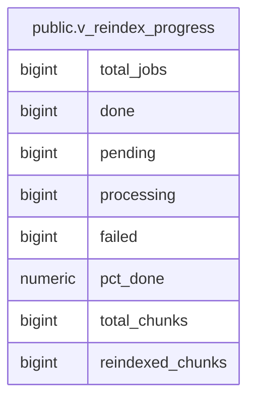

# public.v_reindex_progress

## Description

<details>
<summary><strong>Table Definition</strong></summary>

```sql
CREATE VIEW v_reindex_progress AS (
 SELECT count(*) AS total_jobs,
    count(*) FILTER (WHERE ((status)::text = 'done'::text)) AS done,
    count(*) FILTER (WHERE ((status)::text = 'pending'::text)) AS pending,
    count(*) FILTER (WHERE ((status)::text = 'processing'::text)) AS processing,
    count(*) FILTER (WHERE ((status)::text = 'failed'::text)) AS failed,
    round((((count(*) FILTER (WHERE ((status)::text = 'done'::text)))::numeric / (NULLIF(count(*), 0))::numeric) * (100)::numeric), 1) AS pct_done,
    sum(chunks_total) AS total_chunks,
    sum(chunks_done) AS reindexed_chunks
   FROM embedding_reindex_jobs
)
```

</details>

## Columns

| Name | Type | Default | Nullable | Children | Parents | Comment |
| ---- | ---- | ------- | -------- | -------- | ------- | ------- |
| total_jobs | bigint |  | true |  |  |  |
| done | bigint |  | true |  |  |  |
| pending | bigint |  | true |  |  |  |
| processing | bigint |  | true |  |  |  |
| failed | bigint |  | true |  |  |  |
| pct_done | numeric |  | true |  |  |  |
| total_chunks | bigint |  | true |  |  |  |
| reindexed_chunks | bigint |  | true |  |  |  |

## Referenced Tables

| Name | Columns | Comment | Type |
| ---- | ------- | ------- | ---- |
| [public.embedding_reindex_jobs](public.embedding_reindex_jobs.md) | 11 |  | BASE TABLE |

## Relations



---

> Generated by [tbls](https://github.com/k1LoW/tbls)
