# postgres

## Tables

| Name | Columns | Comment | Type |
| ---- | ------- | ------- | ---- |
| [public.users](public.users.md) | 5 |  | BASE TABLE |
| [public.user_roles](public.user_roles.md) | 4 |  | BASE TABLE |
| [public.courses](public.courses.md) | 11 |  | BASE TABLE |
| [public.course_sections](public.course_sections.md) | 8 |  | BASE TABLE |
| [public.section_content](public.section_content.md) | 19 |  | BASE TABLE |
| [public.enrollments](public.enrollments.md) | 9 |  | BASE TABLE |
| [public.bulk_enrollment_logs](public.bulk_enrollment_logs.md) | 10 |  | BASE TABLE |
| [public.quizzes](public.quizzes.md) | 22 |  | BASE TABLE |
| [public.quiz_questions](public.quiz_questions.md) | 15 |  | BASE TABLE |
| [public.quiz_answer_options](public.quiz_answer_options.md) | 9 |  | BASE TABLE |
| [public.quiz_correct_answers](public.quiz_correct_answers.md) | 8 |  | BASE TABLE |
| [public.quiz_attempts](public.quiz_attempts.md) | 19 |  | BASE TABLE |
| [public.quiz_student_answers](public.quiz_student_answers.md) | 13 |  | BASE TABLE |
| [public.quiz_analytics](public.quiz_analytics.md) | 9 |  | BASE TABLE |
| [public.content_progress](public.content_progress.md) | 4 |  | BASE TABLE |
| [public.quiz_summary_view](public.quiz_summary_view.md) | 29 |  | VIEW |
| [public.forum_posts](public.forum_posts.md) | 14 |  | BASE TABLE |
| [public.forum_comments](public.forum_comments.md) | 11 |  | BASE TABLE |
| [public.forum_votes](public.forum_votes.md) | 6 |  | BASE TABLE |
| [public.v_content_ai_status](public.v_content_ai_status.md) | 8 |  | VIEW |

## Stored procedures and functions

| Name | ReturnType | Arguments | Type |
| ---- | ------- | ------- | ---- |
| public.update_updated_at_column | trigger |  | FUNCTION |
| public.auto_accept_enrollment | trigger |  | FUNCTION |
| public.count_question_blanks | int4 | question_text text | FUNCTION |
| public.calculate_attempt_score | void | p_attempt_id bigint | FUNCTION |
| public.update_post_comment_count | trigger |  | FUNCTION |
| public.update_vote_counts | trigger |  | FUNCTION |
| public.reset_ai_index_timestamp | trigger |  | FUNCTION |

## Relations

```mermaid
erDiagram

"public.user_roles" }o--|| "public.users" : "FOREIGN KEY (user_id) REFERENCES users(id) ON DELETE CASCADE"
"public.courses" }o--|| "public.users" : "FOREIGN KEY (created_by) REFERENCES users(id)"
"public.course_sections" }o--|| "public.courses" : "FOREIGN KEY (course_id) REFERENCES courses(id) ON DELETE CASCADE"
"public.section_content" }o--|| "public.users" : "FOREIGN KEY (created_by) REFERENCES users(id)"
"public.section_content" }o--|| "public.course_sections" : "FOREIGN KEY (section_id) REFERENCES course_sections(id) ON DELETE CASCADE"
"public.enrollments" }o--|| "public.courses" : "FOREIGN KEY (course_id) REFERENCES courses(id) ON DELETE CASCADE"
"public.bulk_enrollment_logs" }o--|| "public.courses" : "FOREIGN KEY (course_id) REFERENCES courses(id) ON DELETE CASCADE"
"public.quizzes" }o--|| "public.users" : "FOREIGN KEY (created_by) REFERENCES users(id)"
"public.quizzes" }o--|| "public.section_content" : "FOREIGN KEY (content_id) REFERENCES section_content(id) ON DELETE CASCADE"
"public.quiz_questions" }o--|| "public.quizzes" : "FOREIGN KEY (quiz_id) REFERENCES quizzes(id) ON DELETE CASCADE"
"public.quiz_answer_options" }o--|| "public.quiz_questions" : "FOREIGN KEY (question_id) REFERENCES quiz_questions(id) ON DELETE CASCADE"
"public.quiz_correct_answers" }o--|| "public.quiz_questions" : "FOREIGN KEY (question_id) REFERENCES quiz_questions(id) ON DELETE CASCADE"
"public.quiz_attempts" }o--o| "public.users" : "FOREIGN KEY (graded_by) REFERENCES users(id)"
"public.quiz_attempts" }o--|| "public.users" : "FOREIGN KEY (student_id) REFERENCES users(id) ON DELETE CASCADE"
"public.quiz_attempts" }o--|| "public.quizzes" : "FOREIGN KEY (quiz_id) REFERENCES quizzes(id) ON DELETE CASCADE"
"public.quiz_student_answers" }o--o| "public.users" : "FOREIGN KEY (graded_by) REFERENCES users(id)"
"public.quiz_student_answers" }o--|| "public.quiz_questions" : "FOREIGN KEY (question_id) REFERENCES quiz_questions(id) ON DELETE CASCADE"
"public.quiz_student_answers" }o--|| "public.quiz_attempts" : "FOREIGN KEY (attempt_id) REFERENCES quiz_attempts(id) ON DELETE CASCADE"
"public.quiz_analytics" }o--|| "public.quizzes" : "FOREIGN KEY (quiz_id) REFERENCES quizzes(id) ON DELETE CASCADE"
"public.quiz_analytics" }o--o| "public.quiz_questions" : "FOREIGN KEY (question_id) REFERENCES quiz_questions(id) ON DELETE CASCADE"
"public.content_progress" }o--|| "public.users" : "FOREIGN KEY (student_id) REFERENCES users(id) ON DELETE CASCADE"
"public.content_progress" }o--|| "public.section_content" : "FOREIGN KEY (content_id) REFERENCES section_content(id) ON DELETE CASCADE"
"public.forum_posts" }o--|| "public.users" : "FOREIGN KEY (user_id) REFERENCES users(id) ON DELETE CASCADE"
"public.forum_posts" }o--|| "public.section_content" : "FOREIGN KEY (content_id) REFERENCES section_content(id) ON DELETE CASCADE"
"public.forum_comments" }o--|| "public.users" : "FOREIGN KEY (user_id) REFERENCES users(id) ON DELETE CASCADE"
"public.forum_comments" }o--|| "public.forum_posts" : "FOREIGN KEY (post_id) REFERENCES forum_posts(id) ON DELETE CASCADE"
"public.forum_comments" }o--o| "public.forum_comments" : "FOREIGN KEY (parent_comment_id) REFERENCES forum_comments(id) ON DELETE CASCADE"
"public.forum_votes" }o--|| "public.users" : "FOREIGN KEY (user_id) REFERENCES users(id) ON DELETE CASCADE"

"public.users" {
  bigint id
  varchar_255_ email
  varchar_255_ full_name
  timestamp_without_time_zone created_at
  timestamp_without_time_zone updated_at
}
"public.user_roles" {
  bigint id
  bigint user_id FK
  varchar_50_ role
  timestamp_without_time_zone created_at
}
"public.courses" {
  bigint id
  varchar_255_ title
  text description
  varchar_100_ category
  varchar_50_ level
  varchar_500_ thumbnail_url
  varchar_50_ status
  bigint created_by FK
  timestamp_without_time_zone created_at
  timestamp_without_time_zone updated_at
  timestamp_without_time_zone published_at
}
"public.course_sections" {
  bigint id
  bigint course_id FK
  varchar_255_ title
  text description
  integer order_index
  boolean is_published
  timestamp_without_time_zone created_at
  timestamp_without_time_zone updated_at
}
"public.section_content" {
  bigint id
  bigint section_id FK
  varchar_50_ type
  varchar_255_ title
  text description
  integer order_index
  jsonb metadata
  boolean is_published
  boolean is_mandatory
  varchar_1000_ file_path
  bigint file_size
  varchar_100_ file_type
  varchar_20_ ai_index_status
  bigint ai_index_job_id
  timestamp_without_time_zone ai_indexed_at
  varchar_64_ embedding_model
  bigint created_by FK
  timestamp_without_time_zone created_at
  timestamp_without_time_zone updated_at
}
"public.enrollments" {
  bigint id
  bigint course_id FK
  bigint student_id
  varchar_20_ status
  timestamp_without_time_zone enrolled_at
  timestamp_without_time_zone accepted_at
  timestamp_without_time_zone rejected_at
  timestamp_without_time_zone created_at
  timestamp_without_time_zone updated_at
}
"public.bulk_enrollment_logs" {
  bigint id
  bigint course_id FK
  bigint teacher_id
  integer total_count
  integer success_count
  integer failed_count
  varchar_20_ status
  text error_message
  timestamp_without_time_zone created_at
  timestamp_without_time_zone completed_at
}
"public.quizzes" {
  bigint id
  bigint content_id FK
  varchar_500_ title
  text description
  text instructions
  integer time_limit_minutes
  timestamp_without_time_zone available_from
  timestamp_without_time_zone available_until
  integer max_attempts
  boolean shuffle_questions
  boolean shuffle_answers
  numeric_5_2_ passing_score
  numeric_10_2_ total_points
  boolean auto_grade
  boolean show_results_immediately
  boolean show_correct_answers
  boolean allow_review
  boolean show_feedback
  boolean is_published
  bigint created_by FK
  timestamp_without_time_zone created_at
  timestamp_without_time_zone updated_at
}
"public.quiz_questions" {
  bigint id
  bigint quiz_id FK
  varchar_50_ question_type
  text question_text
  text question_html
  text explanation
  numeric_10_2_ points
  integer order_index
  jsonb settings
  boolean is_required
  bigint node_id
  varchar_20_ bloom_level
  bigint reference_chunk_id
  timestamp_without_time_zone created_at
  timestamp_without_time_zone updated_at
}
"public.quiz_answer_options" {
  bigint id
  bigint question_id FK
  text option_text
  text option_html
  boolean is_correct
  integer order_index
  integer blank_id
  jsonb settings
  timestamp_without_time_zone created_at
}
"public.quiz_correct_answers" {
  bigint id
  bigint question_id FK
  text answer_text
  integer blank_id
  integer blank_position
  boolean case_sensitive
  boolean exact_match
  timestamp_without_time_zone created_at
}
"public.quiz_attempts" {
  bigint id
  bigint quiz_id FK
  bigint student_id FK
  integer attempt_number
  timestamp_without_time_zone started_at
  timestamp_without_time_zone submitted_at
  integer time_spent_seconds
  numeric_10_2_ total_points
  numeric_10_2_ earned_points
  numeric_5_2_ percentage
  boolean is_passed
  varchar_20_ status
  timestamp_without_time_zone auto_graded_at
  timestamp_without_time_zone manually_graded_at
  bigint graded_by FK
  varchar_45_ ip_address
  text user_agent
  timestamp_without_time_zone created_at
  timestamp_without_time_zone updated_at
}
"public.quiz_student_answers" {
  bigint id
  bigint attempt_id FK
  bigint question_id FK
  jsonb answer_data
  numeric_10_2_ points_earned
  boolean is_correct
  text grader_feedback
  bigint graded_by FK
  timestamp_without_time_zone graded_at
  timestamp_without_time_zone answered_at
  integer time_spent_seconds
  timestamp_without_time_zone created_at
  timestamp_without_time_zone updated_at
}
"public.quiz_analytics" {
  bigint id
  bigint quiz_id FK
  bigint question_id FK
  integer total_attempts
  integer correct_count
  integer incorrect_count
  numeric_5_2_ average_score
  varchar_20_ difficulty_rating
  timestamp_without_time_zone updated_at
}
"public.content_progress" {
  bigint id
  bigint content_id FK
  bigint student_id FK
  timestamp_without_time_zone completed_at
}
"public.quiz_summary_view" {
  bigint id
  bigint content_id
  varchar_500_ title
  text description
  text instructions
  integer time_limit_minutes
  timestamp_without_time_zone available_from
  timestamp_without_time_zone available_until
  integer max_attempts
  boolean shuffle_questions
  boolean shuffle_answers
  numeric_5_2_ passing_score
  numeric_10_2_ total_points
  boolean auto_grade
  boolean show_results_immediately
  boolean show_correct_answers
  boolean allow_review
  boolean show_feedback
  boolean is_published
  bigint created_by
  timestamp_without_time_zone created_at
  timestamp_without_time_zone updated_at
  varchar_255_ creator_name
  varchar_255_ creator_email
  bigint question_count
  bigint attempt_count
  bigint student_count
  numeric average_score
  bigint passed_count
}
"public.forum_posts" {
  bigint id
  bigint content_id FK
  bigint user_id FK
  varchar_255_ title
  text body
  varchar_100___ tags
  integer upvotes
  integer downvotes
  integer comment_count
  integer view_count
  boolean is_pinned
  boolean is_locked
  timestamp_without_time_zone created_at
  timestamp_without_time_zone updated_at
}
"public.forum_comments" {
  bigint id
  bigint post_id FK
  bigint parent_comment_id FK
  bigint user_id FK
  text body
  integer upvotes
  integer downvotes
  boolean is_accepted
  integer depth
  timestamp_without_time_zone created_at
  timestamp_without_time_zone updated_at
}
"public.forum_votes" {
  bigint id
  bigint user_id FK
  varchar_20_ votable_type
  bigint votable_id
  varchar_10_ vote_type
  timestamp_without_time_zone created_at
}
"public.v_content_ai_status" {
  bigint content_id
  varchar_255_ title
  varchar_50_ type
  varchar_20_ ai_index_status
  timestamp_without_time_zone ai_indexed_at
  varchar_64_ embedding_model
  bigint course_id
  varchar_255_ course_title
}
```

---

> Generated by [tbls](https://github.com/k1LoW/tbls)
