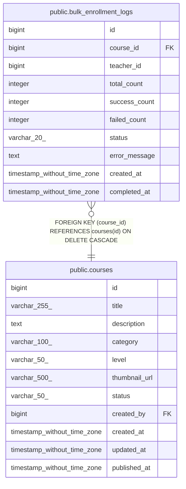

# public.bulk_enrollment_logs

## Columns

| Name | Type | Default | Nullable | Children | Parents | Comment |
| ---- | ---- | ------- | -------- | -------- | ------- | ------- |
| id | bigint | nextval('bulk_enrollment_logs_id_seq'::regclass) | false |  |  |  |
| course_id | bigint |  | false |  | [public.courses](public.courses.md) |  |
| teacher_id | bigint |  | false |  |  |  |
| total_count | integer |  | false |  |  |  |
| success_count | integer | 0 | true |  |  |  |
| failed_count | integer | 0 | true |  |  |  |
| status | varchar(20) | 'PROCESSING'::character varying | true |  |  |  |
| error_message | text |  | true |  |  |  |
| created_at | timestamp without time zone | CURRENT_TIMESTAMP | true |  |  |  |
| completed_at | timestamp without time zone |  | true |  |  |  |

## Constraints

| Name | Type | Definition |
| ---- | ---- | ---------- |
| bulk_enrollment_logs_course_id_not_null | n | NOT NULL course_id |
| bulk_enrollment_logs_id_not_null | n | NOT NULL id |
| bulk_enrollment_logs_teacher_id_not_null | n | NOT NULL teacher_id |
| bulk_enrollment_logs_total_count_not_null | n | NOT NULL total_count |
| bulk_enrollment_logs_course_id_fkey | FOREIGN KEY | FOREIGN KEY (course_id) REFERENCES courses(id) ON DELETE CASCADE |
| bulk_enrollment_logs_pkey | PRIMARY KEY | PRIMARY KEY (id) |

## Indexes

| Name | Definition |
| ---- | ---------- |
| bulk_enrollment_logs_pkey | CREATE UNIQUE INDEX bulk_enrollment_logs_pkey ON public.bulk_enrollment_logs USING btree (id) |
| idx_bulk_logs_course | CREATE INDEX idx_bulk_logs_course ON public.bulk_enrollment_logs USING btree (course_id) |
| idx_bulk_logs_teacher | CREATE INDEX idx_bulk_logs_teacher ON public.bulk_enrollment_logs USING btree (teacher_id) |
| idx_bulk_logs_status | CREATE INDEX idx_bulk_logs_status ON public.bulk_enrollment_logs USING btree (status) |

## Relations

---

> Generated by [tbls](https://github.com/k1LoW/tbls)
