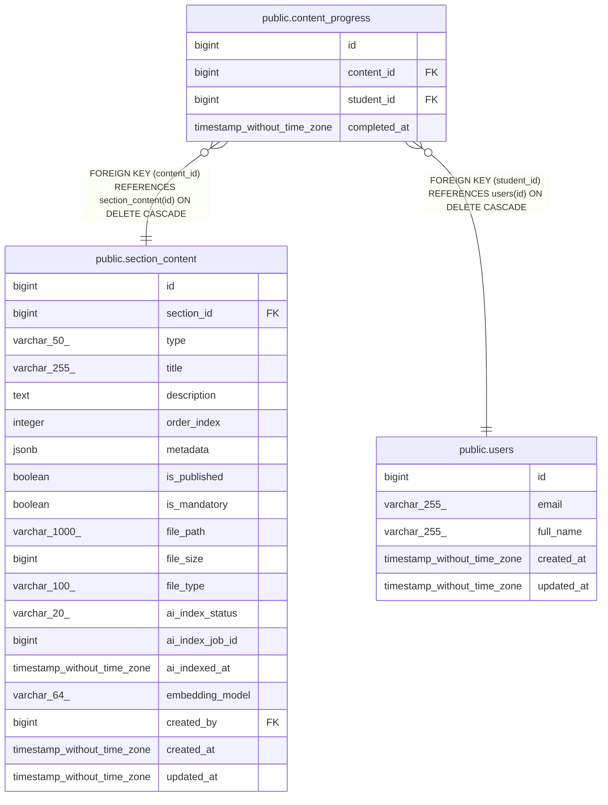

# public.content_progress

## Columns

| Name | Type | Default | Nullable | Children | Parents | Comment |
| ---- | ---- | ------- | -------- | -------- | ------- | ------- |
| id | bigint | nextval('content_progress_id_seq'::regclass) | false |  |  |  |
| content_id | bigint |  | false |  | [public.section_content](public.section_content.md) |  |
| student_id | bigint |  | false |  | [public.users](public.users.md) |  |
| completed_at | timestamp without time zone | CURRENT_TIMESTAMP | true |  |  |  |

## Constraints

| Name | Type | Definition |
| ---- | ---- | ---------- |
| content_progress_content_id_not_null | n | NOT NULL content_id |
| content_progress_id_not_null | n | NOT NULL id |
| content_progress_student_id_not_null | n | NOT NULL student_id |
| content_progress_student_id_fkey | FOREIGN KEY | FOREIGN KEY (student_id) REFERENCES users(id) ON DELETE CASCADE |
| content_progress_content_id_fkey | FOREIGN KEY | FOREIGN KEY (content_id) REFERENCES section_content(id) ON DELETE CASCADE |
| content_progress_pkey | PRIMARY KEY | PRIMARY KEY (id) |
| content_progress_content_id_student_id_key | UNIQUE | UNIQUE (content_id, student_id) |

## Indexes

| Name | Definition |
| ---- | ---------- |
| content_progress_pkey | CREATE UNIQUE INDEX content_progress_pkey ON public.content_progress USING btree (id) |
| content_progress_content_id_student_id_key | CREATE UNIQUE INDEX content_progress_content_id_student_id_key ON public.content_progress USING btree (content_id, student_id) |
| idx_content_progress_student | CREATE INDEX idx_content_progress_student ON public.content_progress USING btree (student_id) |
| idx_content_progress_content | CREATE INDEX idx_content_progress_content ON public.content_progress USING btree (content_id) |
| idx_content_progress_student_content | CREATE INDEX idx_content_progress_student_content ON public.content_progress USING btree (student_id, content_id) |
| idx_content_progress_content_student | CREATE INDEX idx_content_progress_content_student ON public.content_progress USING btree (content_id, student_id) INCLUDE (completed_at) |
| idx_content_progress_student_course | CREATE INDEX idx_content_progress_student_course ON public.content_progress USING btree (student_id, content_id) |

## Relations

---

> Generated by [tbls](https://github.com/k1LoW/tbls)
