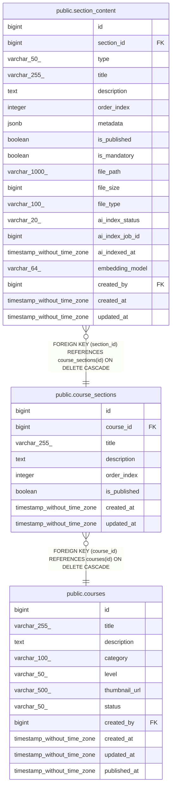

# public.course_sections

## Columns

| Name | Type | Default | Nullable | Children | Parents | Comment |
| ---- | ---- | ------- | -------- | -------- | ------- | ------- |
| id | bigint | nextval('course_sections_id_seq'::regclass) | false | [public.section_content](public.section_content.md) |  |  |
| course_id | bigint |  | false |  | [public.courses](public.courses.md) |  |
| title | varchar(255) |  | false |  |  |  |
| description | text |  | true |  |  |  |
| order_index | integer |  | false |  |  |  |
| is_published | boolean | false | true |  |  |  |
| created_at | timestamp without time zone | CURRENT_TIMESTAMP | true |  |  |  |
| updated_at | timestamp without time zone | CURRENT_TIMESTAMP | true |  |  |  |

## Constraints

| Name | Type | Definition |
| ---- | ---- | ---------- |
| course_sections_course_id_not_null | n | NOT NULL course_id |
| course_sections_id_not_null | n | NOT NULL id |
| course_sections_order_index_not_null | n | NOT NULL order_index |
| course_sections_title_not_null | n | NOT NULL title |
| course_sections_course_id_fkey | FOREIGN KEY | FOREIGN KEY (course_id) REFERENCES courses(id) ON DELETE CASCADE |
| course_sections_pkey | PRIMARY KEY | PRIMARY KEY (id) |

## Indexes

| Name | Definition |
| ---- | ---------- |
| course_sections_pkey | CREATE UNIQUE INDEX course_sections_pkey ON public.course_sections USING btree (id) |
| idx_sections_course | CREATE INDEX idx_sections_course ON public.course_sections USING btree (course_id) |
| idx_sections_order | CREATE INDEX idx_sections_order ON public.course_sections USING btree (course_id, order_index) |

## Triggers

| Name | Definition |
| ---- | ---------- |
| update_course_sections_updated_at | CREATE TRIGGER update_course_sections_updated_at BEFORE UPDATE ON public.course_sections FOR EACH ROW EXECUTE FUNCTION update_updated_at_column() |

## Relations

---

> Generated by [tbls](https://github.com/k1LoW/tbls)
