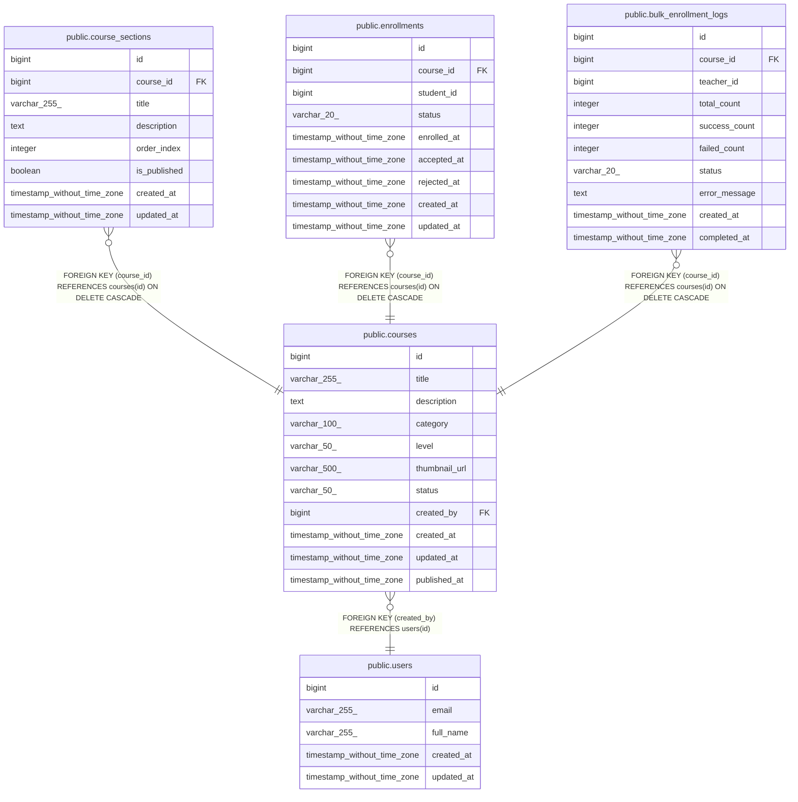

# public.courses

## Columns

| Name | Type | Default | Nullable | Children | Parents | Comment |
| ---- | ---- | ------- | -------- | -------- | ------- | ------- |
| id | bigint | nextval('courses_id_seq'::regclass) | false | [public.course_sections](public.course_sections.md) [public.enrollments](public.enrollments.md) [public.bulk_enrollment_logs](public.bulk_enrollment_logs.md) |  |  |
| title | varchar(255) |  | false |  |  |  |
| description | text |  | true |  |  |  |
| category | varchar(100) |  | true |  |  |  |
| level | varchar(50) |  | true |  |  |  |
| thumbnail_url | varchar(500) |  | true |  |  |  |
| status | varchar(50) | 'DRAFT'::character varying | true |  |  |  |
| created_by | bigint |  | false |  | [public.users](public.users.md) |  |
| created_at | timestamp without time zone | CURRENT_TIMESTAMP | true |  |  |  |
| updated_at | timestamp without time zone | CURRENT_TIMESTAMP | true |  |  |  |
| published_at | timestamp without time zone |  | true |  |  |  |

## Constraints

| Name | Type | Definition |
| ---- | ---- | ---------- |
| courses_created_by_not_null | n | NOT NULL created_by |
| courses_id_not_null | n | NOT NULL id |
| courses_level_check | CHECK | CHECK (((level)::text = ANY ((ARRAY['BEGINNER'::character varying, 'INTERMEDIATE'::character varying, 'ADVANCED'::character varying, 'ALL_LEVELS'::character varying])::text[]))) |
| courses_status_check | CHECK | CHECK (((status)::text = ANY ((ARRAY['DRAFT'::character varying, 'PUBLISHED'::character varying, 'ARCHIVED'::character varying])::text[]))) |
| courses_title_not_null | n | NOT NULL title |
| courses_created_by_fkey | FOREIGN KEY | FOREIGN KEY (created_by) REFERENCES users(id) |
| courses_pkey | PRIMARY KEY | PRIMARY KEY (id) |

## Indexes

| Name | Definition |
| ---- | ---------- |
| courses_pkey | CREATE UNIQUE INDEX courses_pkey ON public.courses USING btree (id) |
| idx_courses_status | CREATE INDEX idx_courses_status ON public.courses USING btree (status) |
| idx_courses_category | CREATE INDEX idx_courses_category ON public.courses USING btree (category) |
| idx_courses_created_by | CREATE INDEX idx_courses_created_by ON public.courses USING btree (created_by) |
| idx_courses_level | CREATE INDEX idx_courses_level ON public.courses USING btree (level) |

## Triggers

| Name | Definition |
| ---- | ---------- |
| update_courses_updated_at | CREATE TRIGGER update_courses_updated_at BEFORE UPDATE ON public.courses FOR EACH ROW EXECUTE FUNCTION update_updated_at_column() |

## Relations

---

> Generated by [tbls](https://github.com/k1LoW/tbls)
