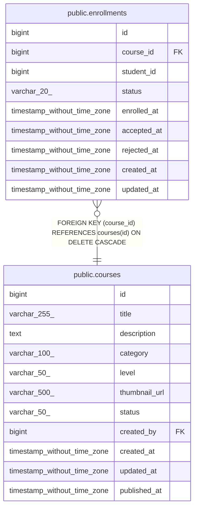

# public.enrollments

## Columns

| Name | Type | Default | Nullable | Children | Parents | Comment |
| ---- | ---- | ------- | -------- | -------- | ------- | ------- |
| id | bigint | nextval('enrollments_id_seq'::regclass) | false |  |  |  |
| course_id | bigint |  | false |  | [public.courses](public.courses.md) |  |
| student_id | bigint |  | false |  |  |  |
| status | varchar(20) | 'ACCEPTED'::character varying | false |  |  |  |
| enrolled_at | timestamp without time zone | CURRENT_TIMESTAMP | true |  |  |  |
| accepted_at | timestamp without time zone | CURRENT_TIMESTAMP | true |  |  |  |
| rejected_at | timestamp without time zone |  | true |  |  |  |
| created_at | timestamp without time zone | CURRENT_TIMESTAMP | true |  |  |  |
| updated_at | timestamp without time zone | CURRENT_TIMESTAMP | true |  |  |  |

## Constraints

| Name | Type | Definition |
| ---- | ---- | ---------- |
| enrollments_course_id_not_null | n | NOT NULL course_id |
| enrollments_id_not_null | n | NOT NULL id |
| enrollments_status_not_null | n | NOT NULL status |
| enrollments_student_id_not_null | n | NOT NULL student_id |
| enrollments_course_id_fkey | FOREIGN KEY | FOREIGN KEY (course_id) REFERENCES courses(id) ON DELETE CASCADE |
| enrollments_pkey | PRIMARY KEY | PRIMARY KEY (id) |
| enrollments_course_id_student_id_key | UNIQUE | UNIQUE (course_id, student_id) |

## Indexes

| Name | Definition |
| ---- | ---------- |
| enrollments_pkey | CREATE UNIQUE INDEX enrollments_pkey ON public.enrollments USING btree (id) |
| enrollments_course_id_student_id_key | CREATE UNIQUE INDEX enrollments_course_id_student_id_key ON public.enrollments USING btree (course_id, student_id) |
| idx_enrollments_course | CREATE INDEX idx_enrollments_course ON public.enrollments USING btree (course_id) |
| idx_enrollments_student | CREATE INDEX idx_enrollments_student ON public.enrollments USING btree (student_id) |
| idx_enrollments_status | CREATE INDEX idx_enrollments_status ON public.enrollments USING btree (status) |
| idx_enrollments_course_status | CREATE INDEX idx_enrollments_course_status ON public.enrollments USING btree (course_id, status) |
| idx_enrollments_student_status | CREATE INDEX idx_enrollments_student_status ON public.enrollments USING btree (student_id, status) |
| idx_enrollments_course_accepted | CREATE INDEX idx_enrollments_course_accepted ON public.enrollments USING btree (course_id, student_id) WHERE ((status)::text = 'ACCEPTED'::text) |

## Triggers

| Name | Definition |
| ---- | ---------- |
| update_enrollments_updated_at | CREATE TRIGGER update_enrollments_updated_at BEFORE UPDATE ON public.enrollments FOR EACH ROW EXECUTE FUNCTION update_updated_at_column() |
| trigger_auto_accept_enrollment | CREATE TRIGGER trigger_auto_accept_enrollment BEFORE INSERT ON public.enrollments FOR EACH ROW EXECUTE FUNCTION auto_accept_enrollment() |

## Relations

---

> Generated by [tbls](https://github.com/k1LoW/tbls)
