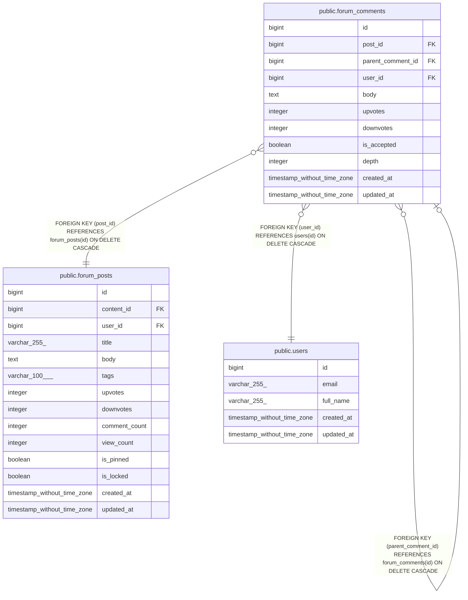

# public.forum_comments

## Columns

| Name | Type | Default | Nullable | Children | Parents | Comment |
| ---- | ---- | ------- | -------- | -------- | ------- | ------- |
| id | bigint | nextval('forum_comments_id_seq'::regclass) | false | [public.forum_comments](public.forum_comments.md) |  |  |
| post_id | bigint |  | false |  | [public.forum_posts](public.forum_posts.md) |  |
| parent_comment_id | bigint |  | true |  | [public.forum_comments](public.forum_comments.md) |  |
| user_id | bigint |  | false |  | [public.users](public.users.md) |  |
| body | text |  | false |  |  |  |
| upvotes | integer | 0 | true |  |  |  |
| downvotes | integer | 0 | true |  |  |  |
| is_accepted | boolean | false | true |  |  |  |
| depth | integer | 0 | true |  |  |  |
| created_at | timestamp without time zone | CURRENT_TIMESTAMP | true |  |  |  |
| updated_at | timestamp without time zone | CURRENT_TIMESTAMP | true |  |  |  |

## Constraints

| Name | Type | Definition |
| ---- | ---- | ---------- |
| forum_comments_body_not_null | n | NOT NULL body |
| forum_comments_id_not_null | n | NOT NULL id |
| forum_comments_post_id_not_null | n | NOT NULL post_id |
| forum_comments_user_id_not_null | n | NOT NULL user_id |
| forum_comments_user_id_fkey | FOREIGN KEY | FOREIGN KEY (user_id) REFERENCES users(id) ON DELETE CASCADE |
| forum_comments_post_id_fkey | FOREIGN KEY | FOREIGN KEY (post_id) REFERENCES forum_posts(id) ON DELETE CASCADE |
| forum_comments_parent_comment_id_fkey | FOREIGN KEY | FOREIGN KEY (parent_comment_id) REFERENCES forum_comments(id) ON DELETE CASCADE |
| forum_comments_pkey | PRIMARY KEY | PRIMARY KEY (id) |

## Indexes

| Name | Definition |
| ---- | ---------- |
| forum_comments_pkey | CREATE UNIQUE INDEX forum_comments_pkey ON public.forum_comments USING btree (id) |
| idx_forum_comments_post | CREATE INDEX idx_forum_comments_post ON public.forum_comments USING btree (post_id) |
| idx_forum_comments_parent | CREATE INDEX idx_forum_comments_parent ON public.forum_comments USING btree (parent_comment_id) |
| idx_forum_comments_user | CREATE INDEX idx_forum_comments_user ON public.forum_comments USING btree (user_id) |
| idx_forum_comments_accepted | CREATE INDEX idx_forum_comments_accepted ON public.forum_comments USING btree (post_id, is_accepted DESC) |

## Triggers

| Name | Definition |
| ---- | ---------- |
| update_forum_comments_updated_at | CREATE TRIGGER update_forum_comments_updated_at BEFORE UPDATE ON public.forum_comments FOR EACH ROW EXECUTE FUNCTION update_updated_at_column() |
| trigger_update_post_comment_count | CREATE TRIGGER trigger_update_post_comment_count AFTER INSERT OR DELETE ON public.forum_comments FOR EACH ROW EXECUTE FUNCTION update_post_comment_count() |

## Relations

---

> Generated by [tbls](https://github.com/k1LoW/tbls)
