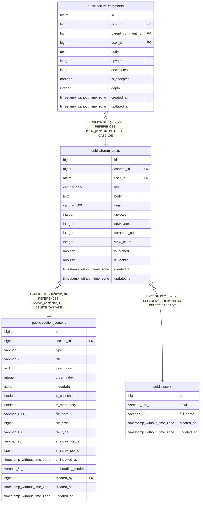

# public.forum_posts

## Columns

| Name | Type | Default | Nullable | Children | Parents | Comment |
| ---- | ---- | ------- | -------- | -------- | ------- | ------- |
| id | bigint | nextval('forum_posts_id_seq'::regclass) | false | [public.forum_comments](public.forum_comments.md) |  |  |
| content_id | bigint |  | false |  | [public.section_content](public.section_content.md) |  |
| user_id | bigint |  | false |  | [public.users](public.users.md) |  |
| title | varchar(255) |  | false |  |  |  |
| body | text |  | false |  |  |  |
| tags | varchar(100)[] | '{}'::character varying[] | true |  |  |  |
| upvotes | integer | 0 | true |  |  |  |
| downvotes | integer | 0 | true |  |  |  |
| comment_count | integer | 0 | true |  |  |  |
| view_count | integer | 0 | true |  |  |  |
| is_pinned | boolean | false | true |  |  |  |
| is_locked | boolean | false | true |  |  |  |
| created_at | timestamp without time zone | CURRENT_TIMESTAMP | true |  |  |  |
| updated_at | timestamp without time zone | CURRENT_TIMESTAMP | true |  |  |  |

## Constraints

| Name | Type | Definition |
| ---- | ---- | ---------- |
| forum_posts_body_not_null | n | NOT NULL body |
| forum_posts_content_id_not_null | n | NOT NULL content_id |
| forum_posts_id_not_null | n | NOT NULL id |
| forum_posts_title_not_null | n | NOT NULL title |
| forum_posts_user_id_not_null | n | NOT NULL user_id |
| forum_posts_user_id_fkey | FOREIGN KEY | FOREIGN KEY (user_id) REFERENCES users(id) ON DELETE CASCADE |
| forum_posts_content_id_fkey | FOREIGN KEY | FOREIGN KEY (content_id) REFERENCES section_content(id) ON DELETE CASCADE |
| forum_posts_pkey | PRIMARY KEY | PRIMARY KEY (id) |

## Indexes

| Name | Definition |
| ---- | ---------- |
| forum_posts_pkey | CREATE UNIQUE INDEX forum_posts_pkey ON public.forum_posts USING btree (id) |
| idx_forum_posts_content | CREATE INDEX idx_forum_posts_content ON public.forum_posts USING btree (content_id) |
| idx_forum_posts_user | CREATE INDEX idx_forum_posts_user ON public.forum_posts USING btree (user_id) |
| idx_forum_posts_created | CREATE INDEX idx_forum_posts_created ON public.forum_posts USING btree (content_id, created_at DESC) |
| idx_forum_posts_pinned | CREATE INDEX idx_forum_posts_pinned ON public.forum_posts USING btree (content_id, is_pinned DESC, created_at DESC) |
| idx_forum_posts_tags | CREATE INDEX idx_forum_posts_tags ON public.forum_posts USING gin (tags) |
| idx_forum_posts_search | CREATE INDEX idx_forum_posts_search ON public.forum_posts USING gin (to_tsvector('english'::regconfig, (((title)::text || ' '::text) || body))) |
| idx_forum_posts_score | CREATE INDEX idx_forum_posts_score ON public.forum_posts USING btree (content_id, ((upvotes - downvotes)) DESC, created_at DESC) WHERE (is_pinned = false) |

## Triggers

| Name | Definition |
| ---- | ---------- |
| update_forum_posts_updated_at | CREATE TRIGGER update_forum_posts_updated_at BEFORE UPDATE ON public.forum_posts FOR EACH ROW EXECUTE FUNCTION update_updated_at_column() |

## Relations

---

> Generated by [tbls](https://github.com/k1LoW/tbls)
