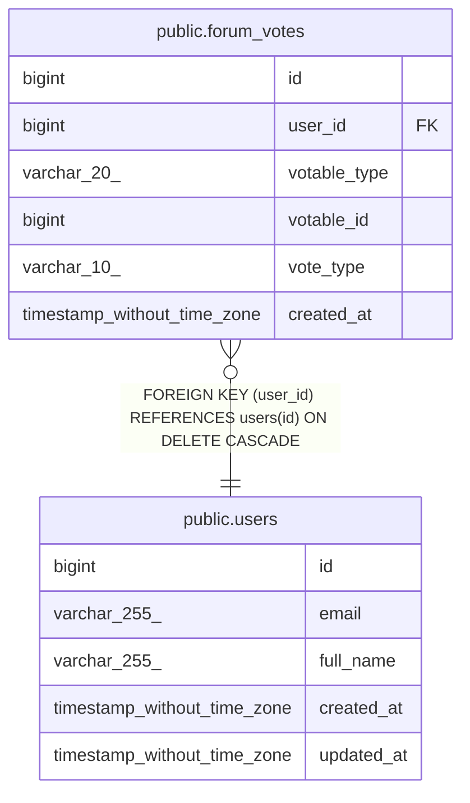

# public.forum_votes

## Columns

| Name | Type | Default | Nullable | Children | Parents | Comment |
| ---- | ---- | ------- | -------- | -------- | ------- | ------- |
| id | bigint | nextval('forum_votes_id_seq'::regclass) | false |  |  |  |
| user_id | bigint |  | false |  | [public.users](public.users.md) |  |
| votable_type | varchar(20) |  | false |  |  |  |
| votable_id | bigint |  | false |  |  |  |
| vote_type | varchar(10) |  | false |  |  |  |
| created_at | timestamp without time zone | CURRENT_TIMESTAMP | true |  |  |  |

## Constraints

| Name | Type | Definition |
| ---- | ---- | ---------- |
| forum_votes_id_not_null | n | NOT NULL id |
| forum_votes_user_id_not_null | n | NOT NULL user_id |
| forum_votes_votable_id_not_null | n | NOT NULL votable_id |
| forum_votes_votable_type_check | CHECK | CHECK (((votable_type)::text = ANY ((ARRAY['post'::character varying, 'comment'::character varying])::text[]))) |
| forum_votes_votable_type_not_null | n | NOT NULL votable_type |
| forum_votes_vote_type_check | CHECK | CHECK (((vote_type)::text = ANY ((ARRAY['upvote'::character varying, 'downvote'::character varying])::text[]))) |
| forum_votes_vote_type_not_null | n | NOT NULL vote_type |
| forum_votes_user_id_fkey | FOREIGN KEY | FOREIGN KEY (user_id) REFERENCES users(id) ON DELETE CASCADE |
| forum_votes_pkey | PRIMARY KEY | PRIMARY KEY (id) |
| forum_votes_user_id_votable_type_votable_id_key | UNIQUE | UNIQUE (user_id, votable_type, votable_id) |

## Indexes

| Name | Definition |
| ---- | ---------- |
| forum_votes_pkey | CREATE UNIQUE INDEX forum_votes_pkey ON public.forum_votes USING btree (id) |
| forum_votes_user_id_votable_type_votable_id_key | CREATE UNIQUE INDEX forum_votes_user_id_votable_type_votable_id_key ON public.forum_votes USING btree (user_id, votable_type, votable_id) |
| idx_forum_votes_votable | CREATE INDEX idx_forum_votes_votable ON public.forum_votes USING btree (votable_type, votable_id) |
| idx_forum_votes_user | CREATE INDEX idx_forum_votes_user ON public.forum_votes USING btree (user_id) |

## Triggers

| Name | Definition |
| ---- | ---------- |
| trigger_update_vote_counts | CREATE TRIGGER trigger_update_vote_counts AFTER INSERT OR DELETE OR UPDATE ON public.forum_votes FOR EACH ROW EXECUTE FUNCTION update_vote_counts() |

## Relations

---

> Generated by [tbls](https://github.com/k1LoW/tbls)
