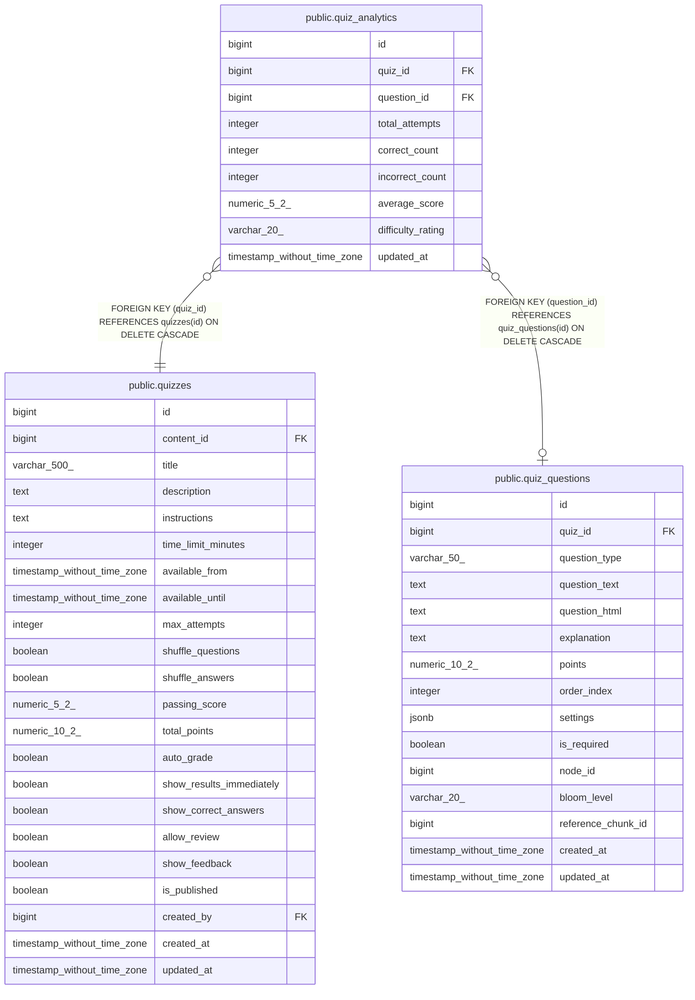

# public.quiz_analytics

## Columns

| Name | Type | Default | Nullable | Children | Parents | Comment |
| ---- | ---- | ------- | -------- | -------- | ------- | ------- |
| id | bigint | nextval('quiz_analytics_id_seq'::regclass) | false |  |  |  |
| quiz_id | bigint |  | false |  | [public.quizzes](public.quizzes.md) |  |
| question_id | bigint |  | true |  | [public.quiz_questions](public.quiz_questions.md) |  |
| total_attempts | integer | 0 | true |  |  |  |
| correct_count | integer | 0 | true |  |  |  |
| incorrect_count | integer | 0 | true |  |  |  |
| average_score | numeric(5,2) |  | true |  |  |  |
| difficulty_rating | varchar(20) |  | true |  |  |  |
| updated_at | timestamp without time zone | CURRENT_TIMESTAMP | true |  |  |  |

## Constraints

| Name | Type | Definition |
| ---- | ---- | ---------- |
| quiz_analytics_id_not_null | n | NOT NULL id |
| quiz_analytics_quiz_id_not_null | n | NOT NULL quiz_id |
| quiz_analytics_quiz_id_fkey | FOREIGN KEY | FOREIGN KEY (quiz_id) REFERENCES quizzes(id) ON DELETE CASCADE |
| quiz_analytics_question_id_fkey | FOREIGN KEY | FOREIGN KEY (question_id) REFERENCES quiz_questions(id) ON DELETE CASCADE |
| quiz_analytics_pkey | PRIMARY KEY | PRIMARY KEY (id) |
| quiz_analytics_quiz_id_question_id_key | UNIQUE | UNIQUE (quiz_id, question_id) |

## Indexes

| Name | Definition |
| ---- | ---------- |
| quiz_analytics_pkey | CREATE UNIQUE INDEX quiz_analytics_pkey ON public.quiz_analytics USING btree (id) |
| quiz_analytics_quiz_id_question_id_key | CREATE UNIQUE INDEX quiz_analytics_quiz_id_question_id_key ON public.quiz_analytics USING btree (quiz_id, question_id) |
| idx_quiz_analytics_quiz | CREATE INDEX idx_quiz_analytics_quiz ON public.quiz_analytics USING btree (quiz_id) |
| idx_quiz_analytics_question | CREATE INDEX idx_quiz_analytics_question ON public.quiz_analytics USING btree (question_id) |

## Relations

---

> Generated by [tbls](https://github.com/k1LoW/tbls)
