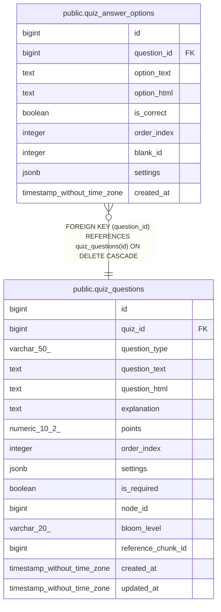

# public.quiz_answer_options

## Columns

| Name | Type | Default | Nullable | Children | Parents | Comment |
| ---- | ---- | ------- | -------- | -------- | ------- | ------- |
| id | bigint | nextval('quiz_answer_options_id_seq'::regclass) | false |  |  |  |
| question_id | bigint |  | false |  | [public.quiz_questions](public.quiz_questions.md) |  |
| option_text | text |  | false |  |  |  |
| option_html | text |  | true |  |  |  |
| is_correct | boolean | false | true |  |  |  |
| order_index | integer |  | false |  |  |  |
| blank_id | integer |  | true |  |  |  |
| settings | jsonb | '{}'::jsonb | true |  |  |  |
| created_at | timestamp without time zone | CURRENT_TIMESTAMP | true |  |  |  |

## Constraints

| Name | Type | Definition |
| ---- | ---- | ---------- |
| quiz_answer_options_id_not_null | n | NOT NULL id |
| quiz_answer_options_option_text_not_null | n | NOT NULL option_text |
| quiz_answer_options_order_index_not_null | n | NOT NULL order_index |
| quiz_answer_options_question_id_not_null | n | NOT NULL question_id |
| quiz_answer_options_question_id_fkey | FOREIGN KEY | FOREIGN KEY (question_id) REFERENCES quiz_questions(id) ON DELETE CASCADE |
| quiz_answer_options_pkey | PRIMARY KEY | PRIMARY KEY (id) |

## Indexes

| Name | Definition |
| ---- | ---------- |
| quiz_answer_options_pkey | CREATE UNIQUE INDEX quiz_answer_options_pkey ON public.quiz_answer_options USING btree (id) |
| idx_answer_options_question | CREATE INDEX idx_answer_options_question ON public.quiz_answer_options USING btree (question_id) |
| idx_answer_options_blank | CREATE INDEX idx_answer_options_blank ON public.quiz_answer_options USING btree (question_id, blank_id) |
| idx_answer_options_blank_id | CREATE INDEX idx_answer_options_blank_id ON public.quiz_answer_options USING btree (blank_id) WHERE (blank_id IS NOT NULL) |

## Relations

---

> Generated by [tbls](https://github.com/k1LoW/tbls)
