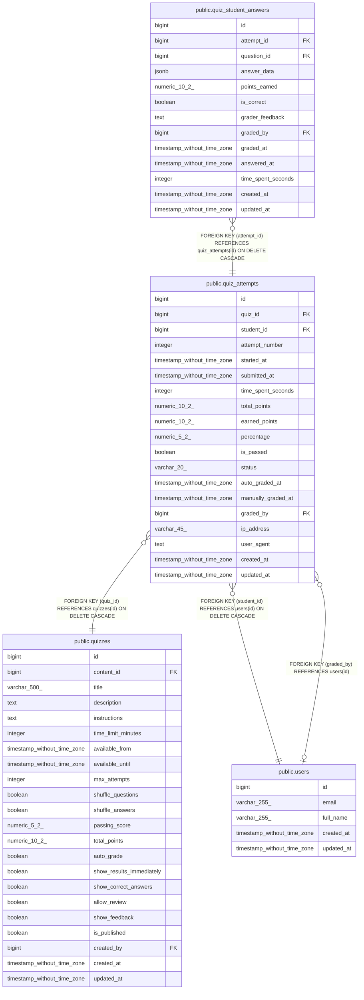

# public.quiz_attempts

## Columns

| Name | Type | Default | Nullable | Children | Parents | Comment |
| ---- | ---- | ------- | -------- | -------- | ------- | ------- |
| id | bigint | nextval('quiz_attempts_id_seq'::regclass) | false | [public.quiz_student_answers](public.quiz_student_answers.md) |  |  |
| quiz_id | bigint |  | false |  | [public.quizzes](public.quizzes.md) |  |
| student_id | bigint |  | false |  | [public.users](public.users.md) |  |
| attempt_number | integer | 1 | false |  |  |  |
| started_at | timestamp without time zone | CURRENT_TIMESTAMP | true |  |  |  |
| submitted_at | timestamp without time zone |  | true |  |  |  |
| time_spent_seconds | integer |  | true |  |  |  |
| total_points | numeric(10,2) |  | true |  |  |  |
| earned_points | numeric(10,2) |  | true |  |  |  |
| percentage | numeric(5,2) |  | true |  |  |  |
| is_passed | boolean |  | true |  |  |  |
| status | varchar(20) | 'IN_PROGRESS'::character varying | true |  |  |  |
| auto_graded_at | timestamp without time zone |  | true |  |  |  |
| manually_graded_at | timestamp without time zone |  | true |  |  |  |
| graded_by | bigint |  | true |  | [public.users](public.users.md) |  |
| ip_address | varchar(45) |  | true |  |  |  |
| user_agent | text |  | true |  |  |  |
| created_at | timestamp without time zone | CURRENT_TIMESTAMP | true |  |  |  |
| updated_at | timestamp without time zone | CURRENT_TIMESTAMP | true |  |  |  |

## Constraints

| Name | Type | Definition |
| ---- | ---- | ---------- |
| quiz_attempts_attempt_number_not_null | n | NOT NULL attempt_number |
| quiz_attempts_id_not_null | n | NOT NULL id |
| quiz_attempts_quiz_id_not_null | n | NOT NULL quiz_id |
| quiz_attempts_status_check | CHECK | CHECK (((status)::text = ANY ((ARRAY['IN_PROGRESS'::character varying, 'SUBMITTED'::character varying, 'GRADED'::character varying, 'ABANDONED'::character varying])::text[]))) |
| quiz_attempts_student_id_not_null | n | NOT NULL student_id |
| quiz_attempts_graded_by_fkey | FOREIGN KEY | FOREIGN KEY (graded_by) REFERENCES users(id) |
| quiz_attempts_student_id_fkey | FOREIGN KEY | FOREIGN KEY (student_id) REFERENCES users(id) ON DELETE CASCADE |
| quiz_attempts_quiz_id_fkey | FOREIGN KEY | FOREIGN KEY (quiz_id) REFERENCES quizzes(id) ON DELETE CASCADE |
| quiz_attempts_pkey | PRIMARY KEY | PRIMARY KEY (id) |
| quiz_attempts_quiz_id_student_id_attempt_number_key | UNIQUE | UNIQUE (quiz_id, student_id, attempt_number) |

## Indexes

| Name | Definition |
| ---- | ---------- |
| quiz_attempts_pkey | CREATE UNIQUE INDEX quiz_attempts_pkey ON public.quiz_attempts USING btree (id) |
| quiz_attempts_quiz_id_student_id_attempt_number_key | CREATE UNIQUE INDEX quiz_attempts_quiz_id_student_id_attempt_number_key ON public.quiz_attempts USING btree (quiz_id, student_id, attempt_number) |
| idx_quiz_attempts_quiz | CREATE INDEX idx_quiz_attempts_quiz ON public.quiz_attempts USING btree (quiz_id) |
| idx_quiz_attempts_student | CREATE INDEX idx_quiz_attempts_student ON public.quiz_attempts USING btree (student_id) |
| idx_quiz_attempts_status | CREATE INDEX idx_quiz_attempts_status ON public.quiz_attempts USING btree (status) |
| idx_quiz_attempts_quiz_student | CREATE INDEX idx_quiz_attempts_quiz_student ON public.quiz_attempts USING btree (quiz_id, student_id) |
| idx_quiz_attempts_analytics | CREATE INDEX idx_quiz_attempts_analytics ON public.quiz_attempts USING btree (quiz_id, student_id, status, percentage, is_passed) WHERE ((status)::text = ANY ((ARRAY['SUBMITTED'::character varying, 'GRADED'::character varying])::text[])) |
| idx_quiz_attempts_student_status | CREATE INDEX idx_quiz_attempts_student_status ON public.quiz_attempts USING btree (student_id, quiz_id, status, submitted_at) WHERE ((status)::text = ANY ((ARRAY['SUBMITTED'::character varying, 'GRADED'::character varying])::text[])) |

## Triggers

| Name | Definition |
| ---- | ---------- |
| update_quiz_attempts_updated_at | CREATE TRIGGER update_quiz_attempts_updated_at BEFORE UPDATE ON public.quiz_attempts FOR EACH ROW EXECUTE FUNCTION update_updated_at_column() |

## Relations

---

> Generated by [tbls](https://github.com/k1LoW/tbls)
