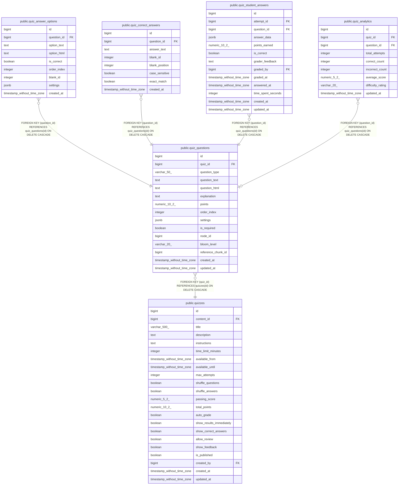

# public.quiz_questions

## Columns

| Name | Type | Default | Nullable | Children | Parents | Comment |
| ---- | ---- | ------- | -------- | -------- | ------- | ------- |
| id | bigint | nextval('quiz_questions_id_seq'::regclass) | false | [public.quiz_answer_options](public.quiz_answer_options.md) [public.quiz_correct_answers](public.quiz_correct_answers.md) [public.quiz_student_answers](public.quiz_student_answers.md) [public.quiz_analytics](public.quiz_analytics.md) |  |  |
| quiz_id | bigint |  | false |  | [public.quizzes](public.quizzes.md) |  |
| question_type | varchar(50) |  | false |  |  |  |
| question_text | text |  | false |  |  |  |
| question_html | text |  | true |  |  |  |
| explanation | text |  | true |  |  |  |
| points | numeric(10,2) | 10.00 | true |  |  |  |
| order_index | integer |  | false |  |  |  |
| settings | jsonb | '{}'::jsonb | true |  |  |  |
| is_required | boolean | true | true |  |  |  |
| node_id | bigint |  | true |  |  |  |
| bloom_level | varchar(20) |  | true |  |  |  |
| reference_chunk_id | bigint |  | true |  |  |  |
| created_at | timestamp without time zone | CURRENT_TIMESTAMP | true |  |  |  |
| updated_at | timestamp without time zone | CURRENT_TIMESTAMP | true |  |  |  |

## Constraints

| Name | Type | Definition |
| ---- | ---- | ---------- |
| quiz_questions_bloom_level_check | CHECK | CHECK (((bloom_level)::text = ANY ((ARRAY['remember'::character varying, 'understand'::character varying, 'apply'::character varying, 'analyze'::character varying, 'evaluate'::character varying, 'create'::character varying])::text[]))) |
| quiz_questions_id_not_null | n | NOT NULL id |
| quiz_questions_order_index_not_null | n | NOT NULL order_index |
| quiz_questions_question_text_not_null | n | NOT NULL question_text |
| quiz_questions_question_type_check | CHECK | CHECK (((question_type)::text = ANY ((ARRAY['SINGLE_CHOICE'::character varying, 'MULTIPLE_CHOICE'::character varying, 'SHORT_ANSWER'::character varying, 'ESSAY'::character varying, 'FILE_UPLOAD'::character varying, 'FILL_BLANK_TEXT'::character varying, 'FILL_BLANK_DROPDOWN'::character varying])::text[]))) |
| quiz_questions_question_type_not_null | n | NOT NULL question_type |
| quiz_questions_quiz_id_not_null | n | NOT NULL quiz_id |
| quiz_questions_quiz_id_fkey | FOREIGN KEY | FOREIGN KEY (quiz_id) REFERENCES quizzes(id) ON DELETE CASCADE |
| quiz_questions_pkey | PRIMARY KEY | PRIMARY KEY (id) |

## Indexes

| Name | Definition |
| ---- | ---------- |
| quiz_questions_pkey | CREATE UNIQUE INDEX quiz_questions_pkey ON public.quiz_questions USING btree (id) |
| idx_quiz_questions_quiz | CREATE INDEX idx_quiz_questions_quiz ON public.quiz_questions USING btree (quiz_id) |
| idx_quiz_questions_order | CREATE INDEX idx_quiz_questions_order ON public.quiz_questions USING btree (quiz_id, order_index) |
| idx_quiz_questions_type | CREATE INDEX idx_quiz_questions_type ON public.quiz_questions USING btree (question_type) |
| idx_quiz_questions_node | CREATE INDEX idx_quiz_questions_node ON public.quiz_questions USING btree (node_id) WHERE (node_id IS NOT NULL) |
| idx_quiz_questions_bloom | CREATE INDEX idx_quiz_questions_bloom ON public.quiz_questions USING btree (bloom_level) WHERE (bloom_level IS NOT NULL) |
| idx_quiz_questions_settings | CREATE INDEX idx_quiz_questions_settings ON public.quiz_questions USING gin (settings) |
| idx_quiz_questions_quiz_order | CREATE INDEX idx_quiz_questions_quiz_order ON public.quiz_questions USING btree (quiz_id, order_index) INCLUDE (points, question_type, node_id) |

## Triggers

| Name | Definition |
| ---- | ---------- |
| update_quiz_questions_updated_at | CREATE TRIGGER update_quiz_questions_updated_at BEFORE UPDATE ON public.quiz_questions FOR EACH ROW EXECUTE FUNCTION update_updated_at_column() |

## Relations

---

> Generated by [tbls](https://github.com/k1LoW/tbls)
