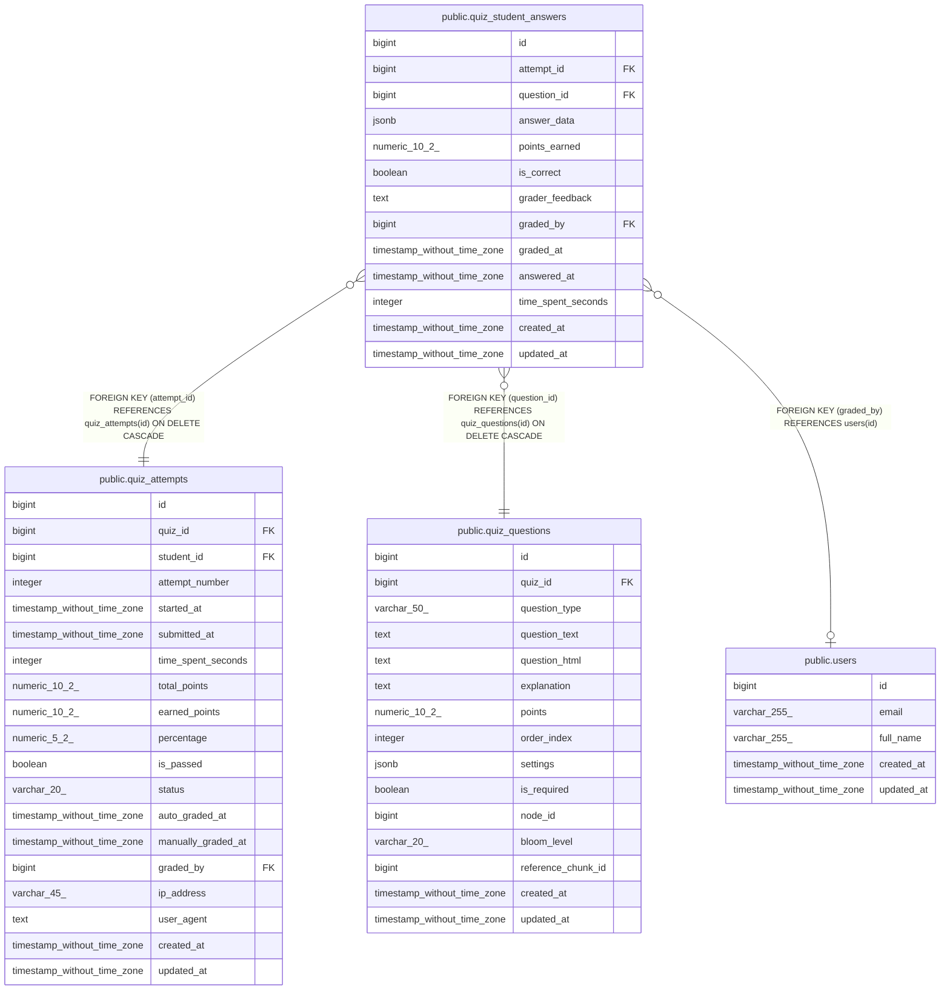

# public.quiz_student_answers

## Columns

| Name | Type | Default | Nullable | Children | Parents | Comment |
| ---- | ---- | ------- | -------- | -------- | ------- | ------- |
| id | bigint | nextval('quiz_student_answers_id_seq'::regclass) | false |  |  |  |
| attempt_id | bigint |  | false |  | [public.quiz_attempts](public.quiz_attempts.md) |  |
| question_id | bigint |  | false |  | [public.quiz_questions](public.quiz_questions.md) |  |
| answer_data | jsonb |  | false |  |  |  |
| points_earned | numeric(10,2) |  | true |  |  |  |
| is_correct | boolean |  | true |  |  |  |
| grader_feedback | text |  | true |  |  |  |
| graded_by | bigint |  | true |  | [public.users](public.users.md) |  |
| graded_at | timestamp without time zone |  | true |  |  |  |
| answered_at | timestamp without time zone | CURRENT_TIMESTAMP | true |  |  |  |
| time_spent_seconds | integer |  | true |  |  |  |
| created_at | timestamp without time zone | CURRENT_TIMESTAMP | true |  |  |  |
| updated_at | timestamp without time zone | CURRENT_TIMESTAMP | true |  |  |  |

## Constraints

| Name | Type | Definition |
| ---- | ---- | ---------- |
| quiz_student_answers_answer_data_not_null | n | NOT NULL answer_data |
| quiz_student_answers_attempt_id_not_null | n | NOT NULL attempt_id |
| quiz_student_answers_id_not_null | n | NOT NULL id |
| quiz_student_answers_question_id_not_null | n | NOT NULL question_id |
| quiz_student_answers_graded_by_fkey | FOREIGN KEY | FOREIGN KEY (graded_by) REFERENCES users(id) |
| quiz_student_answers_question_id_fkey | FOREIGN KEY | FOREIGN KEY (question_id) REFERENCES quiz_questions(id) ON DELETE CASCADE |
| quiz_student_answers_attempt_id_fkey | FOREIGN KEY | FOREIGN KEY (attempt_id) REFERENCES quiz_attempts(id) ON DELETE CASCADE |
| quiz_student_answers_pkey | PRIMARY KEY | PRIMARY KEY (id) |
| quiz_student_answers_attempt_id_question_id_key | UNIQUE | UNIQUE (attempt_id, question_id) |

## Indexes

| Name | Definition |
| ---- | ---------- |
| quiz_student_answers_pkey | CREATE UNIQUE INDEX quiz_student_answers_pkey ON public.quiz_student_answers USING btree (id) |
| quiz_student_answers_attempt_id_question_id_key | CREATE UNIQUE INDEX quiz_student_answers_attempt_id_question_id_key ON public.quiz_student_answers USING btree (attempt_id, question_id) |
| idx_student_answers_attempt | CREATE INDEX idx_student_answers_attempt ON public.quiz_student_answers USING btree (attempt_id) |
| idx_student_answers_question | CREATE INDEX idx_student_answers_question ON public.quiz_student_answers USING btree (question_id) |
| idx_student_answers_data | CREATE INDEX idx_student_answers_data ON public.quiz_student_answers USING gin (answer_data) |
| idx_student_answers_attempt_grading | CREATE INDEX idx_student_answers_attempt_grading ON public.quiz_student_answers USING btree (attempt_id, is_correct, points_earned) WHERE (is_correct IS NOT NULL) |
| idx_student_answers_ungraded | CREATE INDEX idx_student_answers_ungraded ON public.quiz_student_answers USING btree (attempt_id, question_id) WHERE (points_earned IS NULL) |

## Triggers

| Name | Definition |
| ---- | ---------- |
| update_quiz_student_answers_updated_at | CREATE TRIGGER update_quiz_student_answers_updated_at BEFORE UPDATE ON public.quiz_student_answers FOR EACH ROW EXECUTE FUNCTION update_updated_at_column() |

## Relations

---

> Generated by [tbls](https://github.com/k1LoW/tbls)
