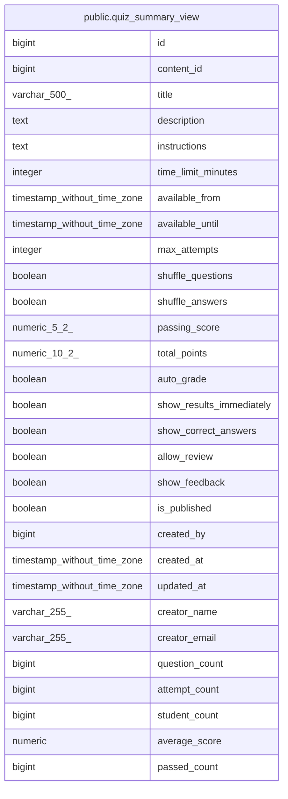

# public.quiz_summary_view

## Description

<details>
<summary><strong>Table Definition</strong></summary>

```sql
CREATE VIEW quiz_summary_view AS (
 SELECT q.id,
    q.content_id,
    q.title,
    q.description,
    q.instructions,
    q.time_limit_minutes,
    q.available_from,
    q.available_until,
    q.max_attempts,
    q.shuffle_questions,
    q.shuffle_answers,
    q.passing_score,
    q.total_points,
    q.auto_grade,
    q.show_results_immediately,
    q.show_correct_answers,
    q.allow_review,
    q.show_feedback,
    q.is_published,
    q.created_by,
    q.created_at,
    q.updated_at,
    u.full_name AS creator_name,
    u.email AS creator_email,
    count(DISTINCT qq.id) AS question_count,
    count(DISTINCT qa.id) AS attempt_count,
    count(DISTINCT qa.student_id) AS student_count,
    avg(qa.percentage) AS average_score,
    count(DISTINCT qa.id) FILTER (WHERE (qa.is_passed = true)) AS passed_count
   FROM (((quizzes q
     LEFT JOIN users u ON ((q.created_by = u.id)))
     LEFT JOIN quiz_questions qq ON ((q.id = qq.quiz_id)))
     LEFT JOIN quiz_attempts qa ON (((q.id = qa.quiz_id) AND ((qa.status)::text = 'GRADED'::text))))
  GROUP BY q.id, u.full_name, u.email
)
```

</details>

## Columns

| Name | Type | Default | Nullable | Children | Parents | Comment |
| ---- | ---- | ------- | -------- | -------- | ------- | ------- |
| id | bigint |  | true |  |  |  |
| content_id | bigint |  | true |  |  |  |
| title | varchar(500) |  | true |  |  |  |
| description | text |  | true |  |  |  |
| instructions | text |  | true |  |  |  |
| time_limit_minutes | integer |  | true |  |  |  |
| available_from | timestamp without time zone |  | true |  |  |  |
| available_until | timestamp without time zone |  | true |  |  |  |
| max_attempts | integer |  | true |  |  |  |
| shuffle_questions | boolean |  | true |  |  |  |
| shuffle_answers | boolean |  | true |  |  |  |
| passing_score | numeric(5,2) |  | true |  |  |  |
| total_points | numeric(10,2) |  | true |  |  |  |
| auto_grade | boolean |  | true |  |  |  |
| show_results_immediately | boolean |  | true |  |  |  |
| show_correct_answers | boolean |  | true |  |  |  |
| allow_review | boolean |  | true |  |  |  |
| show_feedback | boolean |  | true |  |  |  |
| is_published | boolean |  | true |  |  |  |
| created_by | bigint |  | true |  |  |  |
| created_at | timestamp without time zone |  | true |  |  |  |
| updated_at | timestamp without time zone |  | true |  |  |  |
| creator_name | varchar(255) |  | true |  |  |  |
| creator_email | varchar(255) |  | true |  |  |  |
| question_count | bigint |  | true |  |  |  |
| attempt_count | bigint |  | true |  |  |  |
| student_count | bigint |  | true |  |  |  |
| average_score | numeric |  | true |  |  |  |
| passed_count | bigint |  | true |  |  |  |

## Referenced Tables

| Name | Columns | Comment | Type |
| ---- | ------- | ------- | ---- |
| [public.quizzes](public.quizzes.md) | 22 |  | BASE TABLE |
| [public.users](public.users.md) | 5 |  | BASE TABLE |
| [public.quiz_questions](public.quiz_questions.md) | 15 |  | BASE TABLE |
| [public.quiz_attempts](public.quiz_attempts.md) | 19 |  | BASE TABLE |

## Relations



---

> Generated by [tbls](https://github.com/k1LoW/tbls)
