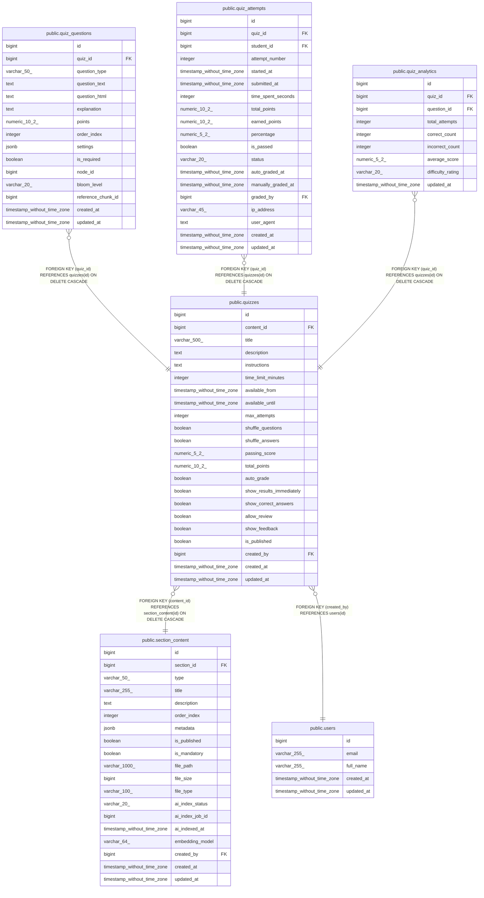

# public.quizzes

## Columns

| Name | Type | Default | Nullable | Children | Parents | Comment |
| ---- | ---- | ------- | -------- | -------- | ------- | ------- |
| id | bigint | nextval('quizzes_id_seq'::regclass) | false | [public.quiz_questions](public.quiz_questions.md) [public.quiz_attempts](public.quiz_attempts.md) [public.quiz_analytics](public.quiz_analytics.md) |  |  |
| content_id | bigint |  | false |  | [public.section_content](public.section_content.md) |  |
| title | varchar(500) |  | false |  |  |  |
| description | text |  | true |  |  |  |
| instructions | text |  | true |  |  |  |
| time_limit_minutes | integer |  | true |  |  |  |
| available_from | timestamp without time zone |  | true |  |  |  |
| available_until | timestamp without time zone |  | true |  |  |  |
| max_attempts | integer | 1 | true |  |  |  |
| shuffle_questions | boolean | false | true |  |  |  |
| shuffle_answers | boolean | false | true |  |  |  |
| passing_score | numeric(5,2) |  | true |  |  |  |
| total_points | numeric(10,2) | 100.00 | true |  |  |  |
| auto_grade | boolean | true | true |  |  |  |
| show_results_immediately | boolean | true | true |  |  |  |
| show_correct_answers | boolean | true | true |  |  |  |
| allow_review | boolean | true | true |  |  |  |
| show_feedback | boolean | true | true |  |  |  |
| is_published | boolean | false | true |  |  |  |
| created_by | bigint |  | false |  | [public.users](public.users.md) |  |
| created_at | timestamp without time zone | CURRENT_TIMESTAMP | true |  |  |  |
| updated_at | timestamp without time zone | CURRENT_TIMESTAMP | true |  |  |  |

## Constraints

| Name | Type | Definition |
| ---- | ---- | ---------- |
| quizzes_content_id_not_null | n | NOT NULL content_id |
| quizzes_created_by_not_null | n | NOT NULL created_by |
| quizzes_id_not_null | n | NOT NULL id |
| quizzes_title_not_null | n | NOT NULL title |
| quizzes_created_by_fkey | FOREIGN KEY | FOREIGN KEY (created_by) REFERENCES users(id) |
| quizzes_content_id_fkey | FOREIGN KEY | FOREIGN KEY (content_id) REFERENCES section_content(id) ON DELETE CASCADE |
| quizzes_pkey | PRIMARY KEY | PRIMARY KEY (id) |

## Indexes

| Name | Definition |
| ---- | ---------- |
| quizzes_pkey | CREATE UNIQUE INDEX quizzes_pkey ON public.quizzes USING btree (id) |
| idx_quizzes_content | CREATE INDEX idx_quizzes_content ON public.quizzes USING btree (content_id) |
| idx_quizzes_published | CREATE INDEX idx_quizzes_published ON public.quizzes USING btree (is_published) |
| idx_quizzes_available | CREATE INDEX idx_quizzes_available ON public.quizzes USING btree (available_from, available_until) |

## Triggers

| Name | Definition |
| ---- | ---------- |
| update_quizzes_updated_at | CREATE TRIGGER update_quizzes_updated_at BEFORE UPDATE ON public.quizzes FOR EACH ROW EXECUTE FUNCTION update_updated_at_column() |

## Relations

---

> Generated by [tbls](https://github.com/k1LoW/tbls)
