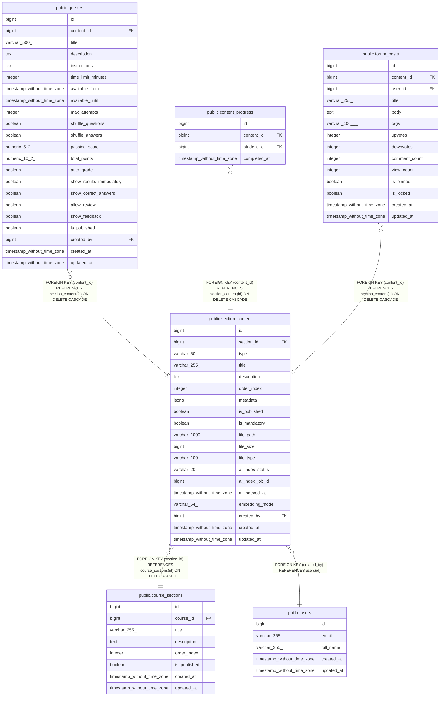

# public.section_content

## Columns

| Name | Type | Default | Nullable | Children | Parents | Comment |
| ---- | ---- | ------- | -------- | -------- | ------- | ------- |
| id | bigint | nextval('section_content_id_seq'::regclass) | false | [public.quizzes](public.quizzes.md) [public.content_progress](public.content_progress.md) [public.forum_posts](public.forum_posts.md) |  |  |
| section_id | bigint |  | false |  | [public.course_sections](public.course_sections.md) |  |
| type | varchar(50) |  | false |  |  |  |
| title | varchar(255) |  | false |  |  |  |
| description | text |  | true |  |  |  |
| order_index | integer |  | false |  |  |  |
| metadata | jsonb |  | true |  |  |  |
| is_published | boolean | false | true |  |  |  |
| is_mandatory | boolean | false | true |  |  |  |
| file_path | varchar(1000) |  | true |  |  |  |
| file_size | bigint |  | true |  |  |  |
| file_type | varchar(100) |  | true |  |  |  |
| ai_index_status | varchar(20) | 'not_indexed'::character varying | true |  |  |  |
| ai_index_job_id | bigint |  | true |  |  |  |
| ai_indexed_at | timestamp without time zone |  | true |  |  |  |
| embedding_model | varchar(64) | 'bge-m3'::character varying | true |  |  |  |
| created_by | bigint |  | false |  | [public.users](public.users.md) |  |
| created_at | timestamp without time zone | CURRENT_TIMESTAMP | true |  |  |  |
| updated_at | timestamp without time zone | CURRENT_TIMESTAMP | true |  |  |  |

## Constraints

| Name | Type | Definition |
| ---- | ---- | ---------- |
| section_content_ai_index_status_check | CHECK | CHECK (((ai_index_status)::text = ANY ((ARRAY['not_indexed'::character varying, 'processing'::character varying, 'indexed'::character varying, 'failed'::character varying])::text[]))) |
| section_content_created_by_not_null | n | NOT NULL created_by |
| section_content_id_not_null | n | NOT NULL id |
| section_content_order_index_not_null | n | NOT NULL order_index |
| section_content_section_id_not_null | n | NOT NULL section_id |
| section_content_title_not_null | n | NOT NULL title |
| section_content_type_check | CHECK | CHECK (((type)::text = ANY ((ARRAY['TEXT'::character varying, 'VIDEO'::character varying, 'DOCUMENT'::character varying, 'IMAGE'::character varying, 'QUIZ'::character varying, 'FORUM'::character varying, 'ANNOUNCEMENT'::character varying])::text[]))) |
| section_content_type_not_null | n | NOT NULL type |
| section_content_created_by_fkey | FOREIGN KEY | FOREIGN KEY (created_by) REFERENCES users(id) |
| section_content_section_id_fkey | FOREIGN KEY | FOREIGN KEY (section_id) REFERENCES course_sections(id) ON DELETE CASCADE |
| section_content_pkey | PRIMARY KEY | PRIMARY KEY (id) |

## Indexes

| Name | Definition |
| ---- | ---------- |
| section_content_pkey | CREATE UNIQUE INDEX section_content_pkey ON public.section_content USING btree (id) |
| idx_content_section | CREATE INDEX idx_content_section ON public.section_content USING btree (section_id) |
| idx_content_type | CREATE INDEX idx_content_type ON public.section_content USING btree (type) |
| idx_content_order | CREATE INDEX idx_content_order ON public.section_content USING btree (section_id, order_index) |
| idx_content_ai_status | CREATE INDEX idx_content_ai_status ON public.section_content USING btree (ai_index_status) WHERE ((ai_index_status)::text = ANY ((ARRAY['processing'::character varying, 'indexed'::character varying])::text[])) |
| idx_section_content_section_mandatory | CREATE INDEX idx_section_content_section_mandatory ON public.section_content USING btree (section_id, id, is_mandatory) WHERE (is_mandatory = true) |

## Triggers

| Name | Definition |
| ---- | ---------- |
| update_section_content_updated_at | CREATE TRIGGER update_section_content_updated_at BEFORE UPDATE ON public.section_content FOR EACH ROW EXECUTE FUNCTION update_updated_at_column() |
| trigger_reset_ai_index_timestamp | CREATE TRIGGER trigger_reset_ai_index_timestamp BEFORE UPDATE OF ai_index_status ON public.section_content FOR EACH ROW EXECUTE FUNCTION reset_ai_index_timestamp() |

## Relations

---

> Generated by [tbls](https://github.com/k1LoW/tbls)
