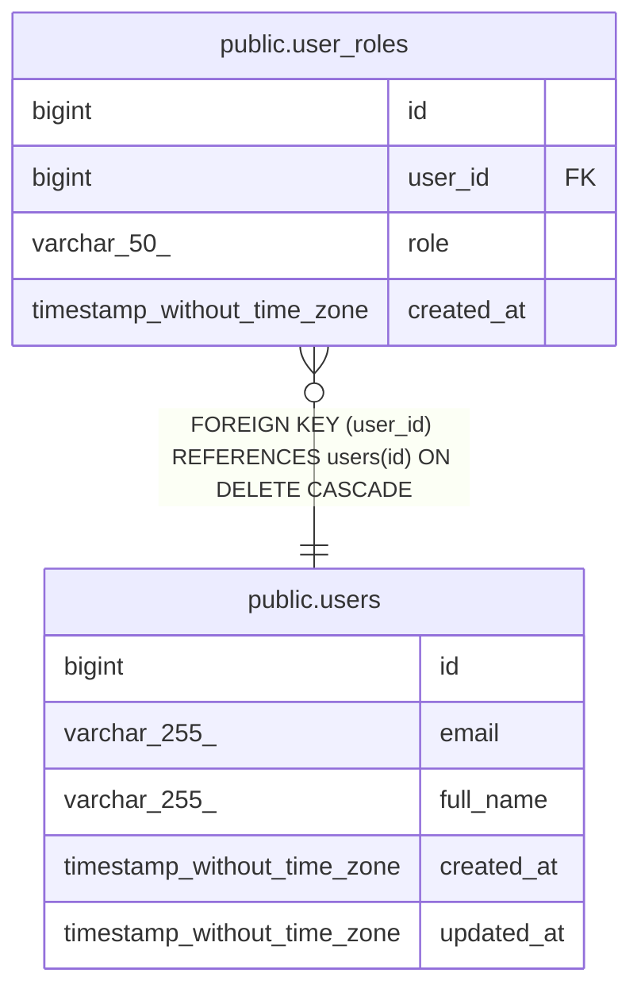

# public.user_roles

## Columns

| Name | Type | Default | Nullable | Children | Parents | Comment |
| ---- | ---- | ------- | -------- | -------- | ------- | ------- |
| id | bigint | nextval('user_roles_id_seq'::regclass) | false |  |  |  |
| user_id | bigint |  | false |  | [public.users](public.users.md) |  |
| role | varchar(50) |  | false |  |  |  |
| created_at | timestamp without time zone | CURRENT_TIMESTAMP | true |  |  |  |

## Constraints

| Name | Type | Definition |
| ---- | ---- | ---------- |
| user_roles_id_not_null | n | NOT NULL id |
| user_roles_role_check | CHECK | CHECK (((role)::text = ANY ((ARRAY['STUDENT'::character varying, 'TEACHER'::character varying, 'ADMIN'::character varying])::text[]))) |
| user_roles_role_not_null | n | NOT NULL role |
| user_roles_user_id_not_null | n | NOT NULL user_id |
| user_roles_user_id_fkey | FOREIGN KEY | FOREIGN KEY (user_id) REFERENCES users(id) ON DELETE CASCADE |
| user_roles_pkey | PRIMARY KEY | PRIMARY KEY (id) |
| user_roles_user_id_role_key | UNIQUE | UNIQUE (user_id, role) |

## Indexes

| Name | Definition |
| ---- | ---------- |
| user_roles_pkey | CREATE UNIQUE INDEX user_roles_pkey ON public.user_roles USING btree (id) |
| user_roles_user_id_role_key | CREATE UNIQUE INDEX user_roles_user_id_role_key ON public.user_roles USING btree (user_id, role) |
| idx_user_roles_user | CREATE INDEX idx_user_roles_user ON public.user_roles USING btree (user_id) |
| idx_user_roles_role | CREATE INDEX idx_user_roles_role ON public.user_roles USING btree (role) |

## Relations

---

> Generated by [tbls](https://github.com/k1LoW/tbls)
