# public.users

## Columns

| Name | Type | Default | Nullable | Children | Parents | Comment |
| ---- | ---- | ------- | -------- | -------- | ------- | ------- |
| id | bigint | nextval('users_id_seq'::regclass) | false | [public.user_roles](public.user_roles.md) [public.courses](public.courses.md) [public.section_content](public.section_content.md) [public.quizzes](public.quizzes.md) [public.quiz_attempts](public.quiz_attempts.md) [public.quiz_student_answers](public.quiz_student_answers.md) [public.content_progress](public.content_progress.md) [public.forum_posts](public.forum_posts.md) [public.forum_comments](public.forum_comments.md) [public.forum_votes](public.forum_votes.md) |  |  |
| email | varchar(255) |  | false |  |  |  |
| full_name | varchar(255) |  | true |  |  |  |
| created_at | timestamp without time zone | CURRENT_TIMESTAMP | true |  |  |  |
| updated_at | timestamp without time zone | CURRENT_TIMESTAMP | true |  |  |  |

## Constraints

| Name | Type | Definition |
| ---- | ---- | ---------- |
| users_email_not_null | n | NOT NULL email |
| users_id_not_null | n | NOT NULL id |
| users_pkey | PRIMARY KEY | PRIMARY KEY (id) |
| users_email_key | UNIQUE | UNIQUE (email) |

## Indexes

| Name | Definition |
| ---- | ---------- |
| users_pkey | CREATE UNIQUE INDEX users_pkey ON public.users USING btree (id) |
| users_email_key | CREATE UNIQUE INDEX users_email_key ON public.users USING btree (email) |
| idx_users_email | CREATE INDEX idx_users_email ON public.users USING btree (email) |

## Triggers

| Name | Definition |
| ---- | ---------- |
| update_users_updated_at | CREATE TRIGGER update_users_updated_at BEFORE UPDATE ON public.users FOR EACH ROW EXECUTE FUNCTION update_updated_at_column() |

## Relations

```mermaid
erDiagram

"public.user_roles" }o--|| "public.users" : "FOREIGN KEY (user_id) REFERENCES users(id) ON DELETE CASCADE"
"public.courses" }o--|| "public.users" : "FOREIGN KEY (created_by) REFERENCES users(id)"
"public.section_content" }o--|| "public.users" : "FOREIGN KEY (created_by) REFERENCES users(id)"
"public.quizzes" }o--|| "public.users" : "FOREIGN KEY (created_by) REFERENCES users(id)"
"public.quiz_attempts" }o--o| "public.users" : "FOREIGN KEY (graded_by) REFERENCES users(id)"
"public.quiz_attempts" }o--|| "public.users" : "FOREIGN KEY (student_id) REFERENCES users(id) ON DELETE CASCADE"
"public.quiz_student_answers" }o--o| "public.users" : "FOREIGN KEY (graded_by) REFERENCES users(id)"
"public.content_progress" }o--|| "public.users" : "FOREIGN KEY (student_id) REFERENCES users(id) ON DELETE CASCADE"
"public.forum_posts" }o--|| "public.users" : "FOREIGN KEY (user_id) REFERENCES users(id) ON DELETE CASCADE"
"public.forum_comments" }o--|| "public.users" : "FOREIGN KEY (user_id) REFERENCES users(id) ON DELETE CASCADE"
"public.forum_votes" }o--|| "public.users" : "FOREIGN KEY (user_id) REFERENCES users(id) ON DELETE CASCADE"

"public.users" {
  bigint id
  varchar_255_ email
  varchar_255_ full_name
  timestamp_without_time_zone created_at
  timestamp_without_time_zone updated_at
}
"public.user_roles" {
  bigint id
  bigint user_id FK
  varchar_50_ role
  timestamp_without_time_zone created_at
}
"public.courses" {
  bigint id
  varchar_255_ title
  text description
  varchar_100_ category
  varchar_50_ level
  varchar_500_ thumbnail_url
  varchar_50_ status
  bigint created_by FK
  timestamp_without_time_zone created_at
  timestamp_without_time_zone updated_at
  timestamp_without_time_zone published_at
}
"public.section_content" {
  bigint id
  bigint section_id FK
  varchar_50_ type
  varchar_255_ title
  text description
  integer order_index
  jsonb metadata
  boolean is_published
  boolean is_mandatory
  varchar_1000_ file_path
  bigint file_size
  varchar_100_ file_type
  varchar_20_ ai_index_status
  bigint ai_index_job_id
  timestamp_without_time_zone ai_indexed_at
  varchar_64_ embedding_model
  bigint created_by FK
  timestamp_without_time_zone created_at
  timestamp_without_time_zone updated_at
}
"public.quizzes" {
  bigint id
  bigint content_id FK
  varchar_500_ title
  text description
  text instructions
  integer time_limit_minutes
  timestamp_without_time_zone available_from
  timestamp_without_time_zone available_until
  integer max_attempts
  boolean shuffle_questions
  boolean shuffle_answers
  numeric_5_2_ passing_score
  numeric_10_2_ total_points
  boolean auto_grade
  boolean show_results_immediately
  boolean show_correct_answers
  boolean allow_review
  boolean show_feedback
  boolean is_published
  bigint created_by FK
  timestamp_without_time_zone created_at
  timestamp_without_time_zone updated_at
}
"public.quiz_attempts" {
  bigint id
  bigint quiz_id FK
  bigint student_id FK
  integer attempt_number
  timestamp_without_time_zone started_at
  timestamp_without_time_zone submitted_at
  integer time_spent_seconds
  numeric_10_2_ total_points
  numeric_10_2_ earned_points
  numeric_5_2_ percentage
  boolean is_passed
  varchar_20_ status
  timestamp_without_time_zone auto_graded_at
  timestamp_without_time_zone manually_graded_at
  bigint graded_by FK
  varchar_45_ ip_address
  text user_agent
  timestamp_without_time_zone created_at
  timestamp_without_time_zone updated_at
}
"public.quiz_student_answers" {
  bigint id
  bigint attempt_id FK
  bigint question_id FK
  jsonb answer_data
  numeric_10_2_ points_earned
  boolean is_correct
  text grader_feedback
  bigint graded_by FK
  timestamp_without_time_zone graded_at
  timestamp_without_time_zone answered_at
  integer time_spent_seconds
  timestamp_without_time_zone created_at
  timestamp_without_time_zone updated_at
}
"public.content_progress" {
  bigint id
  bigint content_id FK
  bigint student_id FK
  timestamp_without_time_zone completed_at
}
"public.forum_posts" {
  bigint id
  bigint content_id FK
  bigint user_id FK
  varchar_255_ title
  text body
  varchar_100___ tags
  integer upvotes
  integer downvotes
  integer comment_count
  integer view_count
  boolean is_pinned
  boolean is_locked
  timestamp_without_time_zone created_at
  timestamp_without_time_zone updated_at
}
"public.forum_comments" {
  bigint id
  bigint post_id FK
  bigint parent_comment_id FK
  bigint user_id FK
  text body
  integer upvotes
  integer downvotes
  boolean is_accepted
  integer depth
  timestamp_without_time_zone created_at
  timestamp_without_time_zone updated_at
}
"public.forum_votes" {
  bigint id
  bigint user_id FK
  varchar_20_ votable_type
  bigint votable_id
  varchar_10_ vote_type
  timestamp_without_time_zone created_at
}
```

---

> Generated by [tbls](https://github.com/k1LoW/tbls)
