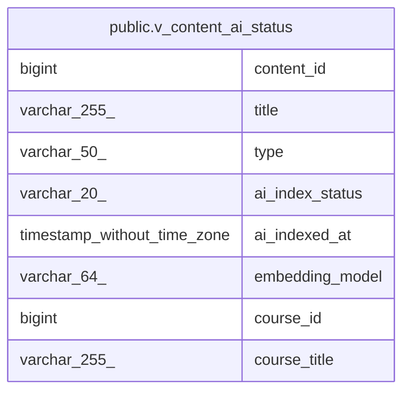

# public.v_content_ai_status

## Description

<details>
<summary><strong>Table Definition</strong></summary>

```sql
CREATE VIEW v_content_ai_status AS (
 SELECT sc.id AS content_id,
    sc.title,
    sc.type,
    sc.ai_index_status,
    sc.ai_indexed_at,
    sc.embedding_model,
    cs.course_id,
    c.title AS course_title
   FROM ((section_content sc
     JOIN course_sections cs ON ((cs.id = sc.section_id)))
     JOIN courses c ON ((c.id = cs.course_id)))
  WHERE ((sc.type)::text <> ALL ((ARRAY['QUIZ'::character varying, 'FORUM'::character varying, 'ANNOUNCEMENT'::character varying])::text[]))
  ORDER BY sc.ai_index_status, sc.updated_at DESC
)
```

</details>

## Columns

| Name | Type | Default | Nullable | Children | Parents | Comment |
| ---- | ---- | ------- | -------- | -------- | ------- | ------- |
| content_id | bigint |  | true |  |  |  |
| title | varchar(255) |  | true |  |  |  |
| type | varchar(50) |  | true |  |  |  |
| ai_index_status | varchar(20) |  | true |  |  |  |
| ai_indexed_at | timestamp without time zone |  | true |  |  |  |
| embedding_model | varchar(64) |  | true |  |  |  |
| course_id | bigint |  | true |  |  |  |
| course_title | varchar(255) |  | true |  |  |  |

## Referenced Tables

| Name | Columns | Comment | Type |
| ---- | ------- | ------- | ---- |
| [public.section_content](public.section_content.md) | 19 |  | BASE TABLE |
| [public.course_sections](public.course_sections.md) | 8 |  | BASE TABLE |
| [public.courses](public.courses.md) | 11 |  | BASE TABLE |

## Relations



---

> Generated by [tbls](https://github.com/k1LoW/tbls)
