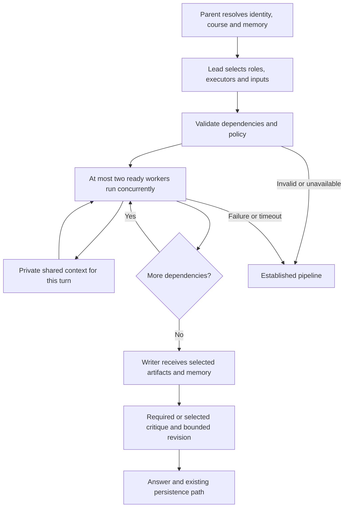

# ADR 7: Lead-planned collaboration with selective shared context

Status: Implemented; deployment configuration enables `AGENT_LEAD_MODE=active`.
The code fallback default is `off` when no environment configuration is supplied.

## Problem

The multi-agent path selected a small subset of a fixed retrieval, drafting,
critique pipeline. Capability names did not give a lead model the ability to
create task-specific roles, choose heterogeneous executors, or select each
worker's context. Forwarding the same memory everywhere also increased prompt
cost and made context-use reporting misleading.

## Decision

Add a bounded lead preparation stage within the existing Deep multi-agent
path. The lead uses the configured `agent_router` gateway binding to produce
a validated plan. Roles and objectives are task-specific descriptions;
executor names are a code-owned allowlist. Models, providers, keys and fallbacks
remain managed by the existing gateway. A generated role cannot select a raw
model endpoint, acquire a tool, change course scope, or grant permissions.

Supported executors:

| Executor | Responsibility | Output |
| --- | --- | --- |
| `retrieval` | Existing retrieval adapter, original query and parent-authorized course scope | Evidence and retained references |
| `llm` | Task-specific analysis of selected inputs through the chat binding | Analysis with uncertainty |
| `system_one` | A fixed boolean assessment of a supplied proposal against its objective through Jev | Decision score, never evidence or authorization |

The planner sees a bounded context catalog and the question. Assignments name
only the seeds or earlier artifacts they consume. Independent assignments run
in waves of at most two. TaskGroup cancels sibling work on failure or parent
cancellation. Results are immutable, bounded artifacts with producer, kind and
input provenance. Only the scheduler publishes artifacts; workers cannot
replace another artifact or modify persistent learner memory.

## Context and memory

The shared board exists only for one orchestration instance/turn. Seed keys
are `task`, `memory`, `history` and `page`. `memory` is the parent-prepared
snapshot of scoped durable memory and learning information; `history` is its
bounded dialogue. The board does not become a new global memory database.
Workers read selected excerpts, not the complete transcript or learner profile.
Intermediate analysis is not automatically promoted into durable memory.

The lead selects `answer_inputs` separately from worker inputs. The writer
gets only the chosen artifacts, and gets learner memory/history only when
selected. Prepared-context diagnostics are updated to reflect the final
writer's inputs. Plan topology and selections are recorded in existing message
metadata; raw shared-memory contents are not included in plan telemetry.

## Constraints and fallback

- At most four preparation assignments, including at most one retrieval task.
- Every assignment must contribute to the final answer, directly or through a
  dependency. Duplicate IDs, unknown inputs, cycles, unused nodes, arbitrary
  executors and extra model-generated fields are rejected.
- Evidence policy is inherited from the established pipeline: when required,
  retrieval must appear and its artifact must directly reach the writer.
- The established quality gate cannot be disabled by the lead. System One
  cannot substitute for the factual critique. Existing one-revision and Deep
  answer-continuation limits remain in force.
- Lead planning: 12-second timeout, one structured generation attempt (gateway
  transport/provider fallback still applies). Each worker: 30 seconds. Total
  preparation: 75 seconds. A System One call uses a smaller selected window
  and rejects a serialized state beyond its 4,000-character limit.
- Seeds are at most 1,600 estimated tokens each; worker artifacts at most
  1,200. A worker/final artifact read is at most 2,200; System One reads 600;
  final learner-memory selection is at most 1,200. Excerpts carry markers.
- Failed preparation falls back to the established pipeline before any answer
  text is emitted. Partial preparations are not forwarded as successful results.
  Cancellation propagates instead of triggering another expensive workflow.
- Writes, approvals, teacher actions and tool permissions remain in the parent
  path. This implementation does not introduce a general-purpose code runner,
  arbitrary tool delegation, recursive spawning or unbounded replanning.

## Rollout and validation

`AGENT_LEAD_MODE=off` preserves the established path. Deployment configuration selects `active`
at the user’s request; this is independent of `JEV_PLANNER_MODE`, which controls the separate
Standard-mode planner accelerator. `JEV_ENABLED` determines whether System One
is available to the lead. With Jev disabled, retrieval and LLM collaboration
still work. The existing Deep multi-agent eligibility gate remains unchanged.

Validate actual provider latency, cost, quality, context selection and fallback
frequency on representative requests before production activation. Automated
tests use mocked providers and cover graph validation, context isolation,
concurrency, dependency ordering, cancellation, invalid decisions, required
policy gates, handoff and fallback. They do not establish model quality gains.
