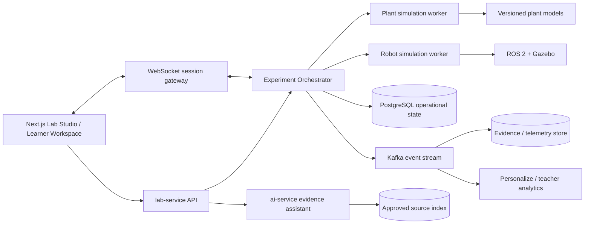

# Đề xuất kiến trúc Virtual STEM Lab

> Trạng thái: đề xuất sản phẩm và kỹ thuật, chưa được triển khai  
> Phạm vi đầu tiên: thí nghiệm trồng cây và robot di động cho học sinh, sinh viên  
> Nguyên tắc: học bằng điều tra và thiết kế, mô phỏng có giới hạn được công bố, mọi kết luận phải dựa trên dữ liệu

## Tiến độ triển khai

Lát cắt nền tảng đầu tiên đã được bắt đầu trong `lab-service`: migration `V003`, lab version bất biến, validator STEM tuyến tính, run/trial có seed, evidence append-only/idempotent, danh sách run cho giáo viên và API timeline. Contract chi tiết nằm tại `lab-service/docs/VIRTUAL_STEM_API.md`. Plant/Robot simulation worker, telemetry chunk, replay UI và visual authoring vẫn là các giai đoạn tiếp theo.

## 1. Kết luận thiết kế

Không nên xây Virtual STEM Lab như một cảnh 3D để người học chỉ xem. Sản phẩm nên là một **nền tảng thí nghiệm theo kịch bản** dùng chung cho nhiều lĩnh vực, kết hợp hai bộ máy mô phỏng riêng:

- `Plant Engine`: mô phỏng sinh trưởng theo bước thời gian giờ/ngày, dựa trên cân bằng nước, ánh sáng, nhiệt độ và dinh dưỡng.
- `Robot Engine`: mô phỏng vật lý, cơ cấu chấp hành và cảm biến theo thời gian thực; có thể chạy code điều khiển của người học.
- `Experiment Orchestrator`: quản lý quy trình học, điều kiện, checkpoint, nhánh quyết định, chấm điểm và quyền giáo viên.
- `Evidence Ledger`: ghi bất biến mọi thao tác, dữ liệu cảm biến, phiên bản code/mô hình và hỗ trợ phát lại.
- `Evidence-grounded AI`: trợ giảng tìm và giải thích nguồn, nhưng không được tự thay đổi kết quả mô phỏng hay chấm điểm thiếu căn cứ.

Độ chân thực cần đo bằng **độ đúng của hành vi, dữ liệu và sai số**, không phải chỉ bằng đồ họa đẹp. MVP nên dùng giao diện 2D/2.5D rõ ràng, biểu đồ tốt và mô hình được kiểm định; 3D nâng cao được tải theo nhu cầu cho robot.

## 2. Mục tiêu và điều kiện bắt buộc

### 2.1. Giáo viên/người tạo lab

Giáo viên phải có thể:

1. Tạo lab từ mẫu trong tối đa 5 bước mà không cần viết code.
2. Chọn mục tiêu học tập, biến độc lập/phụ thuộc/kiểm soát, giả thuyết mẫu và rubric.
3. Kéo thả các bước, checkpoint và điều kiện rẽ nhánh trên một sơ đồ quy trình.
4. Chọn mức tự do: `STRUCTURED`, `GUIDED`, hoặc `OPEN_INQUIRY`.
5. Đặt giới hạn an toàn, số lần thử, thời gian, ngân sách tài nguyên và mức hỗ trợ AI.
6. Chạy thử bằng tài khoản học sinh trước khi xuất bản và xem lỗi cấu hình.
7. Theo dõi lớp theo thời gian gần thực, mở từng học sinh để xem dòng thời gian chi tiết.
8. Phát lại phiên thí nghiệm tại bất kỳ thời điểm nào, bao gồm trạng thái mô phỏng và code lúc đó.
9. Xem bằng chứng gắn với từng tiêu chí rubric, chỉnh điểm và ghi phản hồi.
10. So sánh các lần thử, nhóm đối chứng và xuất báo cáo CSV/PDF.

### 2.2. Học sinh/sinh viên

Người học bắt buộc phải thực hiện chu trình STEM, không được chỉ bấm “chạy”:

1. `QUESTION`: xác định câu hỏi/vấn đề.
2. `PREDICT`: đưa ra dự đoán và lý do.
3. `DESIGN`: chọn biến, nhóm đối chứng, số lần lặp và tiêu chí thành công.
4. `BUILD`: lắp robot hoặc cấu hình môi trường cây.
5. `RUN`: chạy thí nghiệm, quan sát hiện tượng và thu dữ liệu.
6. `ANALYZE`: chọn biểu đồ, tính chỉ số, xem độ không chắc chắn/sai số.
7. `EXPLAIN`: viết kết luận theo cấu trúc Claim–Evidence–Reasoning.
8. `ITERATE`: thay đổi đúng một hoặc một nhóm biến có chủ đích và thử lại.
9. `REFLECT`: giải thích thất bại, giới hạn của mô hình và liên hệ thí nghiệm thật.

Mỗi bước có `required evidence`; hệ thống chỉ mở bước tiếp theo khi điều kiện đạt. Giáo viên có thể cho phép bỏ qua với lý do được ghi vào nhật ký.

## 3. Hai trải nghiệm chính

### 3.1. Studio của giáo viên

Studio dùng bố cục ba vùng:

- Trái: thư viện block (`Instruction`, `Prediction`, `Configure`, `Build`, `Run`, `Measure`, `Checkpoint`, `Analyze`, `CER`, `Reflection`).
- Giữa: sơ đồ quy trình có nhánh điều kiện, ví dụ `độ ẩm < ngưỡng -> yêu cầu giải thích trước khi tưới`.
- Phải: thuộc tính block, rubric, trợ giúp AI và cảnh báo kiểm định.

Thanh trên luôn hiển thị `Draft -> Validated -> Published`, phiên bản lab, nút “Xem như học sinh” và “Kiểm tra lab”.

Trước khi xuất bản, validator phải kiểm tra tối thiểu:

- Có mục tiêu học tập và tiêu chí thành công đo được.
- Có dự đoán trước lần chạy đầu tiên.
- Có ít nhất một biến độc lập, một biến phụ thuộc và biến kiểm soát.
- Có phép đo/telemetry liên kết với câu hỏi.
- Có bước phân tích và kết luận dựa trên bằng chứng.
- Rubric đủ 100%, không có nhánh cụt, checkpoint không thể đạt hoặc tài nguyên vượt quota.
- Mọi tham số khoa học có đơn vị, khoảng hợp lệ, nguồn và phiên bản mô hình.
- Nội dung AI sinh ra đã được giáo viên duyệt.

### 3.2. Workspace của người học

Workspace dùng bố cục bốn vùng có thể thu gọn:

- `Mission`: câu hỏi, bước hiện tại, checklist và giới hạn.
- `Model`: vườn/cây hoặc thế giới robot; có pause, step, tốc độ và reset.
- `Controls`: cấu hình biến, block coding/code editor, thiết bị đo.
- `Data & Notebook`: bảng dữ liệu, biểu đồ, ảnh chụp, giả thuyết, CER và nguồn.

Giao diện luôn phân biệt:

- `Observed`: điều người học đo/nhìn thấy.
- `Calculated`: giá trị hệ thống tính từ dữ liệu.
- `Assumed`: giả định của mô hình.
- `AI suggestion`: gợi ý chưa được kiểm chứng.

Reset không xóa lịch sử. Mỗi lần reset tạo một `trial` mới để giáo viên thấy toàn bộ quá trình, kể cả thất bại.

## 4. Kiến trúc mục tiêu trong CoreApplication



### 4.1. Trách nhiệm dịch vụ

| Thành phần | Trách nhiệm | Không được làm |
|---|---|---|
| `lab-service` | Lab definition, version, enrollment, run/trial, permission, rubric, evidence index | Tự tính vật lý/cây trong HTTP handler |
| `plant-sim-worker` | Chạy mô hình cây xác định theo seed và model version | Gọi LLM để sinh dữ liệu sinh trưởng |
| `robot-sim-worker` | Cấp phát ROS 2/Gazebo, chạy controller, stream sensor | Cho container người học truy cập mạng tùy ý |
| `ai-service` | Tìm nguồn, giải thích, gợi ý Socratic, kiểm tra claim–evidence | Sửa telemetry, tự chấm điểm cuối hoặc che giấu độ không chắc chắn |
| `personalize-service` | Dẫn xuất chỉ số học tập từ event đã chuẩn hóa | Trở thành nguồn dữ liệu giao dịch chính |
| Frontend | Authoring, mô phỏng tương tác, notebook, dashboard/replay | Tự quyết định trạng thái hoàn thành chỉ ở client |

### 4.2. Quyết định tích hợp

- Mở rộng `labs.lab_type` bằng `PLANT` và `ROBOT`; không dùng `CUSTOM` cho hai loại chính vì sẽ mất validation theo miền.
- Giữ `lab_sections` cho nội dung đọc; thêm mô hình `experiment_definition` cho đồ thị quy trình. Không nhồi toàn bộ workflow vào `runtime_config` JSONB.
- Mỗi lần publish tạo một `lab_version` bất biến. Phiên đang chạy luôn gắn với phiên bản cụ thể.
- Lệnh bắt đầu/dừng/chạy mô phỏng đi qua orchestrator; job dài chạy bất đồng bộ theo pattern Kafka hiện hữu.
- WebSocket chỉ dùng cho control/telemetry thời gian thực; trạng thái quan trọng vẫn được ghi bền vững bằng event có số thứ tự.
- Robot MVP dùng ROS 2 + Gazebo trong worker cô lập. Trình duyệt nhận scene/telemetry tối ưu hóa, không chạy cả Gazebo server trong browser.
- Plant MVP là mô hình số có thể tái lập; tốc độ thời gian `1x`, `60x`, `1440x` nhưng mọi phép đo dùng simulation time.

## 5. Mô hình dữ liệu đề xuất

### 5.1. Thực thể cốt lõi

```text
labs
  └── lab_versions
       ├── experiment_definitions
       │    ├── workflow_nodes
       │    ├── workflow_edges
       │    ├── variable_definitions
       │    ├── model_bindings
       │    └── rubric_criteria
       └── lab_runs
            └── trials
                 ├── evidence_events (append-only)
                 ├── telemetry_chunks
                 ├── artifacts
                 ├── checkpoints
                 └── criterion_results
```

Các bảng cần thêm:

| Bảng | Trường chính |
|---|---|
| `lab_versions` | `id`, `lab_id`, `version`, `definition_hash`, `published_by`, `published_at` |
| `experiment_definitions` | `lab_version_id`, `domain`, `inquiry_level`, `workflow_schema_version`, `model_version` |
| `workflow_nodes` | `id`, `type`, `config`, `required_evidence`, `order_hint` |
| `workflow_edges` | `from_node`, `to_node`, `condition_expression`, `priority` |
| `variable_definitions` | `key`, `role`, `data_type`, `unit`, `min`, `max`, `default`, `source_id` |
| `lab_runs` | `user_id/group_id`, `lab_version_id`, `status`, `current_node`, `started_at`, `ended_at` |
| `trials` | `run_id`, `trial_no`, `seed`, `config_snapshot`, `model_version`, `status` |
| `evidence_events` | `event_id`, `run_id`, `trial_id`, `seq_no`, `actor_id`, `verb`, `object`, `payload`, `sim_time`, `occurred_at` |
| `telemetry_chunks` | `trial_id`, `stream`, `from_seq`, `to_seq`, `sample_rate`, `unit_schema`, `object_key`, `checksum` |
| `artifacts` | `type`, `content/object_key`, `version`, `parent_artifact_id`, `created_at` |
| `rubric_criteria` | `criterion`, `max_score`, `evidence_rule`, `auto_score_policy`, `teacher_required` |
| `source_catalog` | `title`, `url/doi`, `publisher`, `published_at`, `retrieved_at`, `license`, `review_status` |

`evidence_events` là append-only. Nội dung văn bản/code lớn được lưu thành artifact có phiên bản; event chỉ giữ ID, hash và diff nhỏ. Telemetry tần số cao được gom theo chunk ở object storage để không làm PostgreSQL phình nhanh.

### 5.2. Event chuẩn

Event dùng ngữ nghĩa gần Caliper/xAPI (`actor–verb–object–result–context`) nhưng thêm thứ tự và simulation time:

```json
{
  "event_id": "019...uuidv7",
  "schema_version": 1,
  "run_id": 821,
  "trial_id": 1452,
  "seq_no": 184,
  "actor": { "type": "learner", "id": 81 },
  "verb": "changed_variable",
  "object": { "type": "plant_parameter", "id": "irrigation_ml_day" },
  "result": { "before": 40, "after": 70, "unit": "mL/day" },
  "context": { "workflow_node": "design-3", "model_version": "plant-lite-1.0.0" },
  "sim_time": "P12D",
  "occurred_at": "2026-08-13T08:15:30.123Z"
}
```

Yêu cầu chất lượng:

- Unique `(run_id, seq_no)` và `event_id` để chống ghi trùng.
- Client gửi `client_event_id`; server cấp `seq_no` và thời gian chuẩn.
- Partition Kafka theo `run_id` để giữ thứ tự trong một phiên.
- Có idempotency, dead-letter, kiểm thử duplicate/late/out-of-order và chính sách retention.
- Sự kiện sửa/xóa notebook tạo phiên bản mới, không ghi đè lịch sử đã dùng để chấm.

### 5.3. Phát lại phiên học

Không quay video liên tục làm nguồn chính. Replay được dựng từ:

1. Snapshot trạng thái định kỳ hoặc tại checkpoint.
2. Event tuần tự sau snapshot.
3. Model version, seed, code artifact và simulation clock.
4. Telemetry chunk đã checksum.

Video/screenshot chỉ là artifact bổ sung. Với cùng model version + seed + input event, engine phải tái lập kết quả trong tolerance đã công bố.

## 6. Mô hình khoa học

### 6.1. Plant Engine

MVP không nên tuyên bố dự báo chính xác mọi loài cây. Chọn 1–2 cây tăng trưởng nhanh (ví dụ cải xanh/đậu) và một bộ tham số đã hiệu chỉnh. Trạng thái tối thiểu:

- Biomass, chiều cao, diện tích lá, giai đoạn phát triển.
- Nước trong vùng rễ và lượng thoát hơi.
- Ánh sáng/PAR hoặc DLI, quang chu kỳ.
- Nhiệt độ không khí/đất và growing degree days.
- N/P/K khả dụng ở mức mô hình giáo dục.
- Stress do thiếu/thừa nước, ánh sáng, nhiệt độ và dinh dưỡng.

Chuỗi tính theo mỗi bước thời gian:

```text
weather/light inputs
  -> reference evapotranspiration
  -> soil/root-zone water balance
  -> temperature and light-limited potential growth
  -> water/nutrient stress multipliers
  -> biomass allocation and observable morphology
  -> noisy virtual sensor readings
```

Nguyên tắc bắt buộc:

- Dùng đơn vị SI và hiển thị chuyển đổi rõ ràng.
- Giá trị sensor = trạng thái thật của mô hình + bias + noise + resolution; giáo viên có thể cấu hình trong khoảng an toàn.
- Mọi model package có `model_card`: công thức, tham số, loài cây, nguồn, miền hiệu lực, calibration dataset, sai số và giới hạn.
- Công bố rằng màu/mesh cây chỉ là trực quan hóa; biểu đồ và số đo mới là bằng chứng.
- Kiểm định bằng mass-balance invariants, golden datasets, sensitivity tests và so sánh dữ liệu trồng thật nhỏ trước khi gọi là “validated”.

Nguồn nền tảng ban đầu: FAO-56 cho evapotranspiration/cân bằng nước và tài liệu USDA OPUS cho cách tổ chức mô hình sinh trưởng, stress nước–dinh dưỡng–nhiệt độ. Đây là điểm xuất phát; tham số từng cây vẫn cần chuyên gia nông học và dữ liệu hiệu chỉnh địa phương.

### 6.2. Robot Engine

MVP nên là robot hai bánh với motor encoder, IMU, cảm biến khoảng cách hoặc lidar và một camera tùy chọn. Người học có thể:

- Lắp cảm biến vào vị trí cho phép.
- Điều chỉnh khối lượng, ma sát, tải và điện áp trong giới hạn.
- Lập trình bằng block, Python hoặc ROS 2 node theo cấp độ.
- Xem sensor topics, pose, quỹ đạo, collision và năng lượng.
- Chạy cùng một controller qua nhiều seed/noise và so sánh độ bền vững.

ROS 2 + Gazebo cung cấp mô hình vật lý, sensor, actuator và bridge message phù hợp cho backend mô phỏng robot. Mỗi robot/world phải khóa phiên bản URDF/SDF, plugin và engine image.

Kiểm định:

- Unit test động học thẳng/quay và chuyển đổi đơn vị.
- Golden trajectory trong điều kiện không noise.
- Test phân bố sensor noise và bias.
- Conservation/sanity checks: tốc độ, gia tốc, pin, joint limit, collision.
- Sim-to-real lab nhỏ: chạy cùng controller trên robot thật, công bố sai khác thay vì hứa “giống 100%”.

### 6.3. Các mức độ chân thực

| Mức | Dùng cho | Đặc điểm |
|---|---|---|
| `CONCEPT` | THCS/nhập môn | Ít biến, quan hệ rõ, giải thích trực tiếp |
| `CALIBRATED` | THPT/đại học cơ sở | Noise, sai số đo, tham số hiệu chỉnh, nhiều lần lặp |
| `RESEARCH` | Đại học nâng cao | Model package/version, tự cấu hình, notebook và đánh giá uncertainty |

Không tăng số lượng biến chỉ để tạo cảm giác khó. Mỗi biến phải gắn với một mục tiêu học tập hoặc nguồn khoa học.

## 7. AI có căn cứ, an toàn và hữu ích

AI gồm bốn chế độ tách biệt:

1. `Author Copilot`: tạo draft workflow/rubric từ mục tiêu, kiểm tra thiếu biến đối chứng hoặc bước phân tích.
2. `Evidence Search`: tìm trong nguồn giáo viên duyệt và nguồn tin cậy, trả lời kèm citation, ngày truy cập và đoạn bằng chứng ngắn.
3. `Socratic Mentor`: hỏi gợi mở dựa trên bước hiện tại; không đưa đáp án đầy đủ trước checkpoint.
4. `Evidence Checker`: chỉ ra kết luận nào chưa được dữ liệu của chính người học hỗ trợ.

Mỗi câu trả lời AI phải trả về cấu trúc:

```json
{
  "answer": "...",
  "claims": [
    {
      "text": "...",
      "source_ids": ["fao56"],
      "confidence": "supported"
    }
  ],
  "limitations": ["Mô hình hiện chỉ được hiệu chỉnh cho ..."],
  "suggested_next_action": "Đo lại độ ẩm với ba lần lặp"
}
```

Guardrails:

- Ưu tiên RAG trên `source_catalog` đã duyệt; tìm web là luồng riêng và phải hiển thị “chưa được giáo viên duyệt”.
- Không cho LLM sinh telemetry, thay số đo, hoặc bịa citation.
- Citation resolver phải kiểm tra URL/DOI tồn tại và claim có đoạn nguồn hỗ trợ.
- Giáo viên định cấu hình mức AI: `OFF`, `HINT_ONLY`, `SOURCE_HELP`, `FULL_TUTOR`.
- Toàn bộ prompt/response liên quan chấm hoặc gợi ý được log với model/version; không gửi tên, email hoặc dữ liệu nhạy cảm không cần thiết.
- Với người chưa thành niên: không hội thoại mở độc lập nếu chính sách tổ chức chưa cho phép; cần thông báo, đồng thuận phù hợp và kiểm soát dữ liệu.

## 8. Dashboard và chấm điểm

### 8.1. Dashboard lớp

Mỗi học sinh/nhóm là một hàng:

| Tên | Bước | Thời gian hoạt động | Số trial | Checkpoint | Cảnh báo | Tiến độ |
|---|---:|---:|---:|---:|---|---:|

Cảnh báo chỉ là tín hiệu hỗ trợ, không phải kết luận:

- Chạy nhiều lần nhưng không thay đổi thiết kế.
- Thay nhiều biến cùng lúc dù yêu cầu thí nghiệm kiểm soát.
- Kết luận không tham chiếu dữ liệu.
- Sensor bão hòa hoặc dữ liệu thiếu.
- Copy code/artifact giống bất thường; luôn yêu cầu giáo viên xem bằng chứng trước khi kết luận.

### 8.2. Chi tiết một người học

Màn hình gồm timeline lọc theo loại event, replay đồng bộ, phiên bản notebook/code, biểu đồ telemetry và rubric. Giáo viên bấm vào một tiêu chí để xem đúng những event/artifact được dùng làm bằng chứng.

### 8.3. Rubric khuyến nghị

| Tiêu chí | Tỷ trọng gợi ý | Tự động được phép |
|---|---:|---|
| Câu hỏi và giả thuyết có thể kiểm tra | 10% | Kiểm tra cấu trúc, giáo viên xác nhận chất lượng |
| Thiết kế biến/đối chứng/lặp | 20% | Có |
| Thao tác và an toàn | 10% | Có, từ event/rule |
| Chất lượng dữ liệu | 15% | Có, từ completeness/range/replication |
| Phân tích và uncertainty | 20% | Một phần |
| Claim–Evidence–Reasoning | 20% | AI gợi ý, giáo viên duyệt |
| Phản tư và cải tiến | 5% | Giáo viên duyệt |

Không chấm dựa trên “cây cao nhất” hoặc “robot nhanh nhất” vì sẽ khuyến khích đoán tham số. Chấm chất lượng quy trình, bằng chứng và khả năng cải tiến.

## 9. Quyền, riêng tư, an toàn và khả năng tiếp cận

- RBAC: `lab.owner`, `lab.co_teacher`, `lab.reviewer`, `lab.learner`, `lab.observer`; kiểm tra quyền ở service, không chỉ ẩn nút UI.
- Giáo viên chỉ xem người học thuộc lab/lớp họ quản lý; truy cập replay và export phải có audit log.
- Mã hóa truyền/lưu, signed object URLs thời hạn ngắn, secret không đưa vào container người học.
- Sandbox robot code: non-root, read-only base filesystem, seccomp/AppArmor, CPU/RAM/PID/time quota, network deny-by-default và kill switch.
- Tách PII khỏi event analytics; retention theo tổ chức, ví dụ raw telemetry ngắn hơn kết quả/rubric. Có luồng export và xóa dữ liệu hợp lệ.
- Đạt WCAG 2.2 AA: mọi thao tác kéo thả có phương án bằng bàn phím; đồ thị có bảng dữ liệu/mô tả; màu không phải tín hiệu duy nhất; hỗ trợ giảm chuyển động.
- Có chế độ low-bandwidth: 2D, giảm sample rate, tải telemetry theo chunk, không stream video mặc định.

## 10. API tối thiểu

```text
POST   /labs/{labId}/versions
POST   /lab-versions/{versionId}/validate
POST   /lab-versions/{versionId}/publish
GET    /lab-versions/{versionId}/definition

POST   /lab-versions/{versionId}/runs
GET    /runs/{runId}
POST   /runs/{runId}/trials
POST   /trials/{trialId}/commands
POST   /runs/{runId}/evidence
GET    /runs/{runId}/events?after_seq=...
GET    /runs/{runId}/replay-manifest
WS     /runs/{runId}/stream

GET    /labs/{labId}/monitor
GET    /runs/{runId}/rubric-evidence
PUT    /runs/{runId}/criterion-results/{criterionId}

POST   /ai/lab-author/check
POST   /ai/lab-mentor/hint
POST   /ai/evidence/search
POST   /ai/evidence/check-claim
```

Command bắt buộc có `command_id`, `expected_state_version` và `idempotency_key`; server trả conflict nếu client điều khiển dựa trên state cũ.

## 11. Mẫu lab đầu tiên

### 11.1. Cây: “Nước ảnh hưởng sinh trưởng như thế nào?”

- Đối tượng: cải xanh, 3 nhóm tưới, mỗi nhóm 3 mẫu ảo.
- Biến độc lập: lượng nước mỗi ngày.
- Biến phụ thuộc: biomass, chiều cao, diện tích lá.
- Biến kiểm soát: giống, ánh sáng, nhiệt độ, giá thể, thời gian.
- Quy trình: dự đoán -> thiết kế nhóm -> chạy 21 ngày mô phỏng -> đo mỗi ngày -> vẽ mean + spread -> CER -> thử lại.
- Bẫy học tập hợp lệ: tưới nhiều không luôn tốt; sensor có noise; một lần đo không đủ kết luận.

### 11.2. Robot: “Đi theo vạch ổn định dưới nhiễu cảm biến”

- Robot hai bánh, 3 cảm biến phản xạ hoặc camera đơn giản.
- Biến độc lập: controller gains/tốc độ/sensor arrangement.
- Chỉ số: thời gian hoàn thành, độ lệch RMS, số lần rời vạch, năng lượng.
- Quy trình: dự đoán -> thiết kế controller -> chạy baseline -> phân tích đồ thị -> thêm noise/ma sát -> cải tiến -> CER.
- Chấm theo độ bền vững qua nhiều seed, không theo lượt may mắn tốt nhất.

Hai lab mẫu này kiểm tra gần như toàn bộ nền tảng mà chưa cần hỗ trợ mọi loại cây/robot.

## 12. Lộ trình triển khai theo cổng chất lượng

### Giai đoạn 0 — Prototype có thể kiểm chứng

- Workflow runner tuyến tính, prediction, trial, event log, notebook và dashboard một học sinh.
- Plant Engine đơn giản cho một cây; robot kinematic 2D cho một thế giới.
- Không AI web search, không 3D, không chấm tự động bài viết.

**Cổng:** cùng seed tái lập được; giáo viên replay đúng; dữ liệu không mất khi refresh/reconnect.

### Giai đoạn 1 — MVP lớp học

- Visual authoring + validator, lab versioning, nhóm, rubric, class monitor.
- Plant model calibrated; ROS 2/Gazebo robot worker; telemetry chunking.
- AI chỉ dùng nguồn duyệt, trả citation; sandbox và quota đầy đủ.

**Cổng:** pilot với giáo viên thật; hoàn thành hai lab mẫu; đo usability, learning gain, lỗi mô hình và chi phí/session.

### Giai đoạn 2 — Mở rộng có kiểm soát

- Workflow có nhánh, block coding, collaboration nhóm, source review workflow.
- Thêm species/model package và robot/world package qua registry có validation.
- Learning analytics, phát hiện khó khăn và gợi ý can thiệp có human review.

**Cổng:** mỗi model mới có model card, test suite và người duyệt chuyên môn.

### Giai đoạn 3 — Hybrid/remote lab

- Gắn cảm biến/camera của cây thật và robot thật qua device gateway.
- So sánh virtual–physical và hiệu chỉnh mô hình.

**Cổng:** an toàn thiết bị, consent, network isolation và quy trình dừng khẩn cấp được kiểm thử.

## 13. Chỉ số thành công và tiêu chí nghiệm thu

### Sản phẩm

- Giáo viên mới tạo và xuất bản lab từ mẫu mà không cần hỗ trợ kỹ thuật.
- 100% lab được publish đã qua validator và có model/source version.
- Giáo viên truy từ điểm rubric về event/artifact gốc trong tối đa 3 thao tác.
- Replay dựng lại đúng checkpoint và telemetry hash của phiên gốc.
- Người học hoàn thành đủ prediction–design–run–analyze–explain–iterate.

### Kỹ thuật

- Event không mất và xử lý trùng an toàn; thứ tự đúng trong một run.
- Reconnect không tạo trial/session trùng.
- P95 command acknowledgement dưới 250 ms; telemetry UI mượt ở sample rate đã cấu hình.
- Worker bị kill không làm mất trạng thái đã checkpoint; quota và network policy được test.
- Mỗi model có deterministic, range, unit, conservation/sanity và golden-data tests.

### Học tập

- Đo pre/post concept test, chất lượng experimental design, CER và transfer task; không chỉ đo thời gian dùng app.
- So sánh virtual-only với blended khi kỹ năng thao tác vật lý là mục tiêu. Nghiên cứu hiện có cho thấy virtual lab có thể tương đương về kiến thức khái niệm, nhưng chưa đủ để thay thế mọi kỹ năng kỹ thuật/thao tác.

## 14. Những điều không nên làm

- Không xây thế giới 3D lớn trước event ledger, workflow và mô hình kiểm định.
- Không dùng LLM làm simulation engine hoặc “điền” dữ liệu còn thiếu.
- Không lưu lab definition đang publish trong một JSON có thể sửa tại chỗ.
- Không chỉ lưu kết quả cuối; thất bại và các lần sửa mới là bằng chứng học tập quan trọng.
- Không biến dashboard cảnh báo thành máy kết luận gian lận.
- Không tuyên bố digital twin hoặc chính xác thực tế nếu chưa calibration và validation.
- Không cho AI trả nguồn không mở được hoặc không gắn được claim cụ thể.

## 15. Nguồn nền tảng

- FAO, *Crop evapotranspiration — Guidelines for computing crop water requirements (FAO-56)*: https://www.fao.org/4/X0490E/X0490E00.htm
- USDA ARS, *OPUS: An Integrated Simulation Model for Transport of Nonpoint-Source Pollutants at the Field Scale*, phần mô phỏng sinh trưởng và stress: https://www.ars.usda.gov/ARSUserFiles/30121500/OPUS/OPUSDocumentation.pdf
- ROS 2, *Setting up a robot simulation (Gazebo)*: https://docs.ros.org/en/humble/Tutorials/Advanced/Simulators/Gazebo.html
- Next Generation Science Standards, *Science and Engineering Practices*: https://www.nextgenscience.org/sites/default/files/resource/files/Appendix%20F%20%20Science%20and%20Engineering%20Practices%20in%20the%20NGSS%20-%20FINAL%20060513.pdf
- 1EdTech, *Caliper Analytics*: https://www.1edtech.org/standards/caliper
- Zhang, Al-Mekhled & Choate (2021), systematic review về virtual physiology laboratories: https://doi.org/10.1152/advan.00016.2021
- Wörner et al. (2023), meta-analysis về physical và virtual investigation: https://doi.org/10.3389/feduc.2023.1163024
- UNESCO, *Guidance for generative AI in education and research*: https://www.unesco.org/en/articles/guidance-generative-ai-education-and-research
- W3C, *Web Content Accessibility Guidelines 2.2*: https://www.w3.org/TR/WCAG22/

Các nguồn trên định hướng kiến trúc và phương pháp; chúng không tự động xác nhận mọi công thức hoặc tham số cụ thể trong model package. Mỗi model triển khai vẫn phải có review chuyên môn, calibration data và báo cáo validation riêng.

## 16. Thứ tự thay đổi repository khi bắt đầu code

1. Viết ADR cho versioned experiment definition, event ledger và simulation worker boundary.
2. Thêm migration `V003` cho lab version/workflow/run/trial/evidence; cập nhật event contract trong `docs/DATA_PLATFORM.md`.
3. Viết deterministic reference Plant Engine và contract tests trước UI 3D.
4. Thêm API run/trial/event/replay vào `lab-service` với authorization tests.
5. Xây learner workspace 2D và teacher timeline/replay.
6. Xây visual authoring + publish validator.
7. Tích hợp robot worker, sandbox và streaming.
8. Tích hợp AI source catalog/RAG sau khi evidence model ổn định.
9. Pilot hai lab mẫu, hiệu chỉnh mô hình và usability rồi mới mở registry cho model mới.
